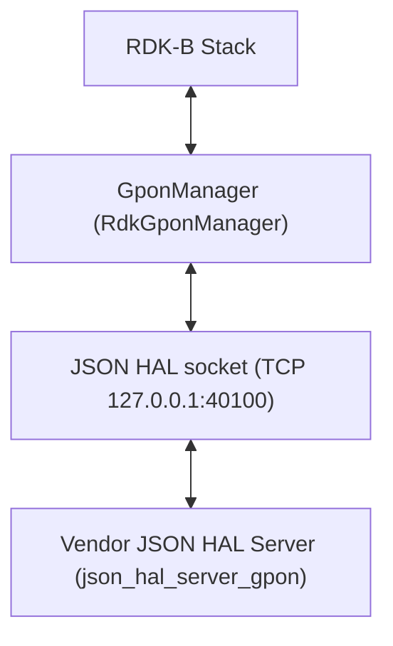
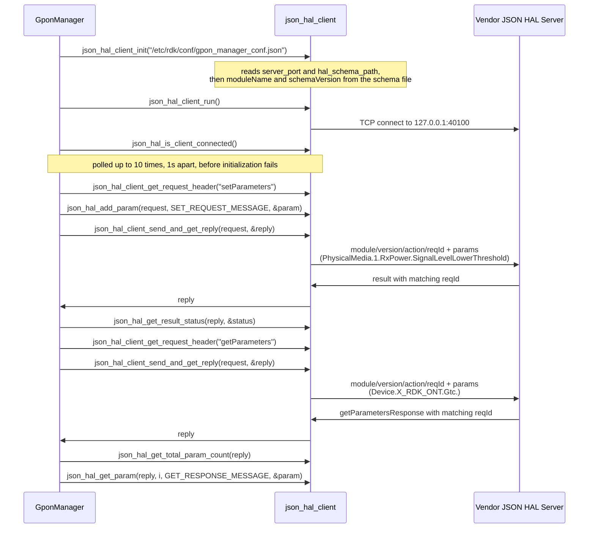

# GPON HAL Documentation

## Version History

| Date | Comment | Version |
| --- | --- | --- |
| 2026-08-24 | Initial release. Specifies the GPON `JSON` HAL contract carried by `hal_schema/gpon_hal_schema.json` and by its build-selected variant `hal_schema/gpon_wan_unify_hal_schema.json`, recorded as an `Unreleased` entry in [CHANGELOG.md](https://github.com/rdkcentral/gpon-manager/blob/a55601f2183e4a494cccccfbf3777a5663ef298a/CHANGELOG.md). | 1.0.0 |

The `Version` column above is the revision of **this document** and of nothing else. Four distinct
version identities apply to this component, and conflating them is the easiest way to misread it.
They are listed separately here, each with the artefact that establishes it.

| Identity | Value | Established by |
| --- | --- | --- |
| Document revision | `1.0.0` | The table above. Applies to this specification only, and is advanced when this document changes. |
| HAL schema version | `0.0.1` | `definitions.schemaVersion.const`, identical in both shipped schemas. This is the value that travels in every message's `version` field, and it is the only version a caller's messages carry. |
| Release tag | `v1.7.0` | The repository's most recent tag, dated 2025-11-06 in [CHANGELOG.md](https://github.com/rdkcentral/gpon-manager/blob/a55601f2183e4a494cccccfbf3777a5663ef298a/CHANGELOG.md), which also records `v1.6.0` through `v1.0.0`. This is the release the document describes. |
| Generated-site version string | The `git describe --tags` output at build time | `docs/generate_docs.sh` passes it to the documentation generator as `PROJECT_VERSION`. It is recomputed on every build and is not a version. |

Two consequences follow, and both are places a reader goes wrong. The interface is **not** at
`v1.7.0`: that is the repository release, while the contract this document specifies declares
`0.0.1`. And the generated-site string takes the form `v1.7.0-<n>-g<abbrev-sha>` whenever the
checked-out commit is not exactly a tag — the `-<n>-g<sha>` suffix means *n* commits past the named
tag at that commit, so a string of that shape denotes a position in history rather than a release,
and it never appears as a release heading in [CHANGELOG.md](https://github.com/rdkcentral/gpon-manager/blob/a55601f2183e4a494cccccfbf3777a5663ef298a/CHANGELOG.md).

*Derived from [CHANGELOG.md](https://github.com/rdkcentral/gpon-manager/blob/a55601f2183e4a494cccccfbf3777a5663ef298a/CHANGELOG.md), the repository's tag list, and `definitions.schemaVersion` in both
files under `hal_schema/`.*

## Acronyms

- `ACS` \- Auto Configuration Server, the remote management server a `TR-069` agent contacts
- `DML` \- Data Model Layer, the `TR-181` parameter surface the manager exposes to the rest of `RDK-B`
- `FEC` \- Forward Error Correction
- `GEM` \- `GPON` Encapsulation Method, the frame format carrying user traffic over the `PON`
- `GPON` \- Gigabit-capable Passive Optical Network
- `GTC` \- `GPON` Transmission Convergence, the framing sub-layer between the `PON` and `GEM`
- `HAL` \- Hardware Abstraction Layer
- `IPC` \- Inter-Process Communication
- `JSON` \- JavaScript Object Notation
- `JSON-RPC` \- The remote procedure call convention carried over `JSON`, used by this HAL's transport
- `MIC` \- Message Integrity Check, the integrity field on an `OMCI` message
- `OMCI` \- `ONT` Management and Control Interface
- `ONT` \- Optical Network Termination, the subscriber-side endpoint this interface models
- `ONU` \- Optical Network Unit, the term the `ITU-T` recommendations use for the same endpoint
- `PLOAM` \- Physical Layer Operations, Administration and Maintenance
- `PON` \- Passive Optical Network
- `RDK-B` \- Reference Design Kit for Broadband Devices
- `TCP` \- Transmission Control Protocol
- `TR-069` \- Broadband Forum Technical Report 069, the CPE WAN management protocol
- `TR-181` \- Broadband Forum Technical Report 181, which defines the `Device:2` root data model
- `VEIP` \- Virtual Ethernet Interface Point, the `OMCI` managed entity bridging `PON` to Ethernet
- `VLAN` \- Virtual Local Area Network
- `ITU-T` \- International Telecommunication Union Telecommunication Standardization Sector

Only terms used in this document are listed. The optical and `PON` terms are those the shipped
schemas use to name the objects they model; the `ITU-T` recommendations that define them are cited
in `Description`.

*Derived from the object and parameter names in `hal_schema/gpon_hal_schema.json`.*

## Description

The diagram below describes a high-level software architecture of the GPON HAL module stack.



Every diagram in this document is authored as a fenced `mermaid` block. Such blocks render as
diagrams on GitHub, which is the primary surface for a developer reading this repository. The
documentation generator used here does **not** render them; it displays their source text instead.
That limitation is stated rather than worked around, because the only available workaround would
fix the generated site at the cost of the surface most readers actually use.

**Three further limitations of the generated site, for the same reason.** Each was measured against
the site this repository's `docs/generate_docs.sh` produces, and each originates in the generator's
own page template and emitted navigation assets rather than in this document. Read this document on
GitHub where any of them matters.

- **The generated site does not adapt to a narrow viewport.** Its navigation pane is a fixed 500
  pixels wide plus a 6-pixel splitter and does not shrink, so at a 1280-pixel viewport 774 pixels are
  left for content, and below roughly 768 pixels the content column has no usable width at all. The
  same content reflows normally on GitHub.
- **Wide tables scroll inside the content column rather than reflowing.** The generator's table style
  sets no wrapping rule, so a long unbroken identifier or pattern widens its table beyond the column
  and is reached by a horizontal scrollbar. What could be fixed from this side has been: the values
  too long for a table cell are stated in their own sections rather than inline, which is why several
  rows in [halSpecDetailed.md](halSpecDetailed.md) name a value and point to it instead of quoting it.
  The residual width comes from ordinary `TR-181` identifiers, which cannot be shortened.
- **The generated page does not declare its language, and renders in limited-quirks mode.** The root
  element carries an unsubstituted template placeholder in place of a language code, so assistive
  technology cannot determine the document language, and the transitional doctype the generator emits
  puts the browser into limited-quirks layout.

These are recorded rather than repaired because the files that produce them are not part of this
repository: the generator is cloned at build time into `docs/build`, which `docs/.gitignore` excludes,
and the documentation plan for this work places the generator and the Doxygen toolchain out of scope.
Changing them would alter the generated output of every `RDK-B` HAL repository that uses the same
generator, which is a separate change with its own compatibility analysis.

The GPON HAL is the interface between `RDK-B` middleware and a vendor's `GPON` implementation. It
differs from most HALs in `RDK-B` in one structural respect that governs everything else in this
document: **it is not a C header, and no library is linked across the HAL boundary.** The contract
is a `JSON` Schema, the two participants are separate processes, and they exchange messages over a
`TCP` socket. There is consequently no header from which to generate an inline API reference, and
the per-parameter detail that inline documentation would carry for a C HAL is carried instead by
[halSpecDetailed.md](halSpecDetailed.md) in this folder. This is also why the workspace has no
`rdkb-halif-gpon` repository: the contract lives here, beside the manager that speaks it
[the superproject README, line 27].

GponManager is the `RDK-B` middleware that owns `GPON` state, and it is the **client** of this
interface; the vendor supplies the **server**. The manager presents `ONT` configuration and status
to the rest of `RDK-B` as a `TR-181` `DML` surface under `Device.X_RDK_ONT`, and translates reads
and writes on that surface into `JSON` HAL requests
[`source/TR-181/middle_layer_src/gponmgr_dml_hal.c`]. No separate middleware service sits between
the `RDK-B` stack and this interface — the superproject inventory records `GPON` as having no
service dependency [the superproject README, line 102] — because the manager in this repository is
itself the owning service. That is what the second box in the diagram above represents.

**The object tree is a vendor extension, not a Broadband Forum model, and that decides where its
semantics come from.** Every parameter lives under `Device.X_RDK_ONT`, and the `X_` prefix marks an
extension to the `TR-181` `Device:2` root data model rather than a branch the Broadband Forum
defines. The published model this repository was checked against is <b>`Device:2.21`</b> — the
Broadband Forum `Device:2` root data model at release `2.21`, published as
[`TR-181 Device:2, release 2.21`](https://cwmp-data-models.broadband-forum.org/tr-181-2-21-0-cwmp.html) —
which defines the interface-object conventions the schema borrows and contains no occurrence of
`X_RDK_ONT`; no `Device:2` release specifies that branch, so no data-model version is cited as its
authority. The meaning of the parameters comes from the optical standards the schema's own
descriptions reference — `ITU-T G.988` for the `OMCI` managed entities and their counters, cited by
clause in seven parameter descriptions, and `ITU-T G.9807`, cited in three `GTC` error-counter
descriptions — together with the manager's `DML` description [`config/RdkGponManager.xml`]. The five `PhysicalMedia` sub-objects that mirror `TR-181` interface
conventions, `Alias`, `Enable`, `LastChange`, `LowerLayers` and `Upstream`, exist only in the
variant schema and are the subject of `Optional Components`.

What the interface covers, in the terms the segments use: the optical transceiver and its alarms
(`PhysicalMedia`), `GEM` port and Ethernet flow mapping including `VLAN` tag handling (`Gem`), the
`VEIP` interface and its Ethernet flows (`Veip`), the `PLOAM` registration state and its timers
(`Ploam`), `GTC` framing and `FEC` counters (`Gtc`), `OMCI` message and `MIC` error counts (`Omci`),
and the `ACS` address and associated tag handed from the `OMCI` domain to the `TR-069` domain
(`TR69`). `API Surface` names all seven segments with their parameter counts.

**How to read the rest of this document.** It is arranged in two tiers. The overview tier is this
topic plus `Component Runtime Execution Requirements`, which together answer what this interface is
and how to call it — initialization order, threading, memory, timeouts and error handling. The
protocol tier is `Non functional requirements` and `Interface API Documentation`, which answer what
the wire actually looks like, what varies by build, and what happens when a call fails. Within that
second tier `API Surface` is the index: it names every action and every object segment, and marks
the point past which the detail continues into [halSpecDetailed.md](halSpecDetailed.md).

**One verification limit applies to this whole document.** `GPON` is not available on the `HUB6` or
`XER10` reference platforms [the superproject README, lines 102-103], so no statement here has been
confirmed by running the HAL. Everything asserted is derived from the shipped schemas, the client
configuration, the manager source and the pinned transport library, and each claim carries the
locator that establishes it. Where none of those establishes a behaviour, this document says so
instead of filling the gap.

*Derived from `hal_schema/gpon_hal_schema.json`, `source/TR-181/middle_layer_src/gponmgr_dml_hal.c`,
`config/RdkGponManager.xml` and the superproject README.*

## Optional Components

**Two schema variants ship, and which one a deployment uses is a compile-time decision.** This is
the only optionality in the interface, and it is resolved inside this repository — unlike some HALs
in this bundle, nothing here is left to a runtime lookup or to an undocumented deployment step.

| Build | Configuration file the manager reads | Schema the configuration names | Server port |
| --- | --- | --- | --- |
| Default | `/etc/rdk/conf/gpon_manager_conf.json` | `/etc/rdk/schemas/gpon_hal_schema.json` | `40100` |
| `WAN_MANAGER_UNIFICATION_ENABLED` defined | `/etc/rdk/conf/gpon_manager_wan_unify_conf.json` | `/etc/rdk/schemas/gpon_wan_unify_hal_schema.json` | `40100` |

The two rows differ in exactly one field: the schema path. The port is `40100` in both
[`config/gpon_manager_conf.json`, `config/gpon_manager_wan_unify_conf.json`], so a vendor server
listens on the same port either way and cannot infer the variant from the port it was given.
`Variability Management` sets out the two-step selection that produces this table, and
`Platform or Product Customization` sets out what the variant changes in the contract.

**What the variant adds.** The `wan_unify` schema is a superset: it removes nothing and adds five
`PhysicalMedia` parameter definitions, taking the total from 90 to 95. Three of the five are
writable, which takes the writable surface from 8 parameters to 11, and two of them introduce the
`boolean` datatype, which does not appear anywhere in the default schema. The complete comparison,
per parameter, is in [halSpecDetailed.md](halSpecDetailed.md).

**A second effect of the same flag, which is easy to miss because it is not in either schema.** In
the `WAN_MANAGER_UNIFICATION_ENABLED` build the manager itself launches the vendor server before
initializing its client, running `/bin/json_hal_server_gpon` if that path exists and
`/usr/bin/json_hal_server_gpon` otherwise, in both cases passing the `wan_unify` configuration file
[`source/TR-181/middle_layer_src/gponmgr_dml_hal.c:100-108`]. In the default build the manager
launches nothing and expects the server to be started by the platform. A vendor packaging a server
for a unified-WAN build must therefore install it under one of those two names, and must tolerate
being started with that configuration path as its only argument.

**There is no optional transport, no optional action and no optional notification type.** Both
schemas declare the same eleven actions, the same nine enumerations and the same eighteen entries in
`subscribeEventSupportedList`. The only list the schemas mark as optional is
`getParameterOptionalList`, which holds 24 read paths — the 21 `Gem` Ethernet-flow entries and the
three `TR69` entries — and it is a read-scoping list rather than a build option: a vendor that does
not implement one of those paths answers `Not Supported`, as `Internal Error Handling` describes.
The companion `setParameterOptionalList` is empty in both schemas, which is a defect in the shipped
contract rather than an option; [halSpecDetailed.md](halSpecDetailed.md) records it.

*Derived from `config/gpon_manager_conf.json`, `config/gpon_manager_wan_unify_conf.json`,
`source/TR-181/middle_layer_src/gponmgr_dml_hal.c:57-61,100-108` and both files under
`hal_schema/`.*

## Component Runtime Execution Requirements

The client side of this interface is a library linked into the calling process; the server side is a
separate process. What follows applies to a caller running the client, which for this repository is
GponManager and for a test harness is whatever process links the same client library.

### Initialization and Startup

**Three steps, in this order, and the third is not optional.** The manager's own bring-up is the
reference sequence [`source/TR-181/middle_layer_src/gponmgr_dml_hal.c:107-151`]:

1. `json_hal_client_init()` with the path of the client configuration file
   [`gponmgr_dml_hal.c:111`]. This is where the deployment contract is read.
2. `json_hal_client_run()`, which starts the client socket thread [`gponmgr_dml_hal.c:117`].
3. Poll `json_hal_is_client_connected()` until it reports a connection, sleeping one second between
   attempts and giving up after ten [`gponmgr_dml_hal.c:130-143`, with
   `HAL_CONNECTION_RETRY_MAX_COUNT` at `:37`]. Initialization fails if the connection is not
   established inside that window, and the manager returns failure rather than proceeding
   [`gponmgr_dml_hal.c:145-149`].

Step 3 exists because step 2 succeeding does not mean a connection exists. `json_hal_client_run()`
starts a thread; the socket connects asynchronously on that thread. A caller that issues a request
immediately after step 2 may be issuing it into an unconnected client.

**What step 1 actually reads, which matters more than it looks.** The configuration file supplies
the server port and the schema path. The client library then opens the **schema file itself** and
takes the module name and the schema version out of it — `definitions.moduleName.const` and
`definitions.schemaVersion.const` — storing both for later use. Every request header the client
subsequently builds carries those two values as its `module` and `version` fields. Three
consequences follow for anyone deploying or testing this HAL:

- The schema file must exist and be readable at the path the configuration names, or initialization
  fails. It is a runtime dependency of the client, not merely a design-time artefact.
- The `module` and `version` a caller sends are **not** hard-coded in the caller. They come from the
  deployed schema file, so deploying the wrong file silently changes the identity of every message.
- Because both GPON schemas declare the same `moduleName` `gponhal` and the same `schemaVersion`
  `0.0.1`, a variant mismatch between manager and vendor is **not** detectable from the envelope. It
  shows up later, as an unrecognised parameter name.

**No initialization message is sent over the wire.** Some `JSON` HALs in `RDK-B` write an
initialization flag as their first request; this contract defines no such parameter, and the manager
sends nothing at bring-up. The first message a vendor server sees is an ordinary request.

**The client entry points this interface is used through**, all declared by the pinned transport
library cited in `Build Requirements`:

- `json_hal_client_init()` — read the configuration and the schema, and prepare the client
- `json_hal_client_run()` — start the client socket thread
- `json_hal_is_client_connected()` — test whether the socket is connected
- `json_hal_client_get_request_header()` — build an envelope for a named action
- `json_hal_add_param()` — append a parameter entry to a request's `params` array
- `json_hal_client_send_and_get_reply()` — send and wait for the correlated reply
- `json_hal_client_send_and_get_reply_with_timeout()` — the same, with a caller-supplied wait
- `json_hal_client_subscribe_event()` — register a callback and subscribe one event
- `json_hal_get_result_status()` — read `Result.Status` out of a reply
- `json_hal_get_total_param_count()` and `json_hal_get_param()` — walk a reply's `params` array
- `json_hal_client_terminate()` — tear the client down

GponManager uses `json_hal_client_get_request_header()`, `json_hal_add_param()`,
`json_hal_client_send_and_get_reply()`, `json_hal_get_result_status()`, `json_hal_get_param()` and
`json_hal_client_subscribe_event()` [`gponmgr_dml_hal.c:218-286`, `:753`, `:1392`]. It does not call
`json_hal_client_terminate()` anywhere, so on this client the socket's lifetime is the process's
lifetime.

**Vendor obligation.** The server must be listening before, or shortly after, the client starts, and
must accept a reconnection without operator intervention: the client's ten-second window is the
whole budget a cold start gets, and a server that is not accepting connections inside it causes
manager initialization to fail outright rather than to degrade.

*Derived from `source/TR-181/middle_layer_src/gponmgr_dml_hal.c:37,100-151,218-286,753,1392`,
`config/gpon_manager_conf.json`, and `json_hal_client.h` / `json_hal_common.h` at the pinned
transport revision cited in `Build Requirements`.*

### Threading Model

**Transport threading belongs to the client library, not to this interface.**
`json_hal_client_run()` starts the client socket thread, so after initialization a dedicated thread
owns the socket and performs the receive loop. A caller's own thread never touches the socket.

**Asynchronous event callbacks arrive on that library-owned thread**, not on the thread that
registered them. GponManager registers its callback through `json_hal_client_subscribe_event()`
[`source/TR-181/middle_layer_src/gponmgr_dml_hal.c:1389-1396`], and the callback signature receives
the raw event message and its length rather than a parsed object, so parsing happens on the
library's thread inside the callee. Any state a callback touches must therefore be synchronized by
the caller; the manager's callback parses the message and hands the result to the surrounding
component rather than mutating shared state in place.

**A callback runs on the receive thread with the transport's subscription lock held, which makes two
ordinary-looking things inside a handler deadlock outright.** The pinned client dispatches an event
from its internal receive-dispatch callback, which the socket thread calls for each document it
receives [`json_hal_client.c:335`, invoked at `tcp_client.c:234`]. **That callback, and the internal
idle callback the rules below depend on, are source-internal implementation details of the transport
rather than part of any callable surface**: both are declared `static` inside `json_hal_client.c`
[`:128` and `:104` respectively], appear in no transport header, and are reachable only as function
pointers the client installs on itself [`:208-211`]. They are cited by location, rather than named as
identifiers, because the behaviour they implement is the contract a caller's handler must satisfy, so
a reader who needs to confirm a rule below can find it at the cited line — while a caller can neither
call, link against nor replace either one. The entry points a caller does call are the ones listed
under `Initialization and Startup`, every one of them declared by a transport header. The event branch
takes `gm_event_tracking_lock`, walks the subscription list and invokes the registered callback **with
that lock still held**, releasing it only after the callback returns
[`json_hal_client.c:427,440,472`]. The lock is a default, non-recursive mutex
[`json_hal_client.c:93`]. Four rules follow, and they are normative for a caller of this interface:

- **Do not make a synchronous HAL call from inside a callback.** A send waits on the condition
  variable of its own request record [`json_hal_client.c:683`], and the only thread that can signal
  that variable — on a reply [`:495-513`] or on the timeout tick [`:537-553`, driven from the
  internal idle callback at `:227-232`, which the same socket loop calls at `tcp_client.c:251-253`] — is
  the thread the callback is currently occupying. The wait therefore cannot be satisfied and cannot
  even expire: it is a deadlock, not a slow call that recovers when the tick budget
  `Blocking calls` describes runs out. Work that needs a HAL request is queued to a
  caller-owned thread and performed there.
- **Do not subscribe, re-subscribe or terminate the client from inside a callback.**
  `json_hal_client_subscribe_event()` locks the same `gm_event_tracking_lock`
  [`json_hal_client.c:741`] that the dispatch already holds, and it also performs a synchronous send
  first [`:718`], so it deadlocks twice over. `json_hal_client_terminate()` takes that lock as well
  [`:798`]. All subscription changes belong outside the callback.
- **Copy anything the callback needs after it returns.** The buffer handed to the callback is the
  serialization of the event's own `JSON` object, obtained with `json_object_to_json_string_ext()`
  [`json_hal_client.c:435`], so it points into storage that object owns; the object is released as
  soon as dispatch finishes with it [`:516`]. The pointer is therefore valid for the duration of the
  call and no longer. A callback that needs a parameter name, a value or the whole message afterwards
  copies it into caller-owned storage before returning, and never stores the pointer it was given.
- **Return promptly.** While a callback runs, the receive thread delivers no reply to any waiting
  caller, ticks no request timeout and dispatches no further event, and no other subscription can be
  serviced because the subscription lock is held. A callback that parses, copies and hands off costs
  the whole client nothing; a callback that blocks stalls every exchange in flight.

**The interface enforces none of the above.** The transport declares no re-entrancy guard, no
recursive lock and no way for a caller to discover from inside a callback which thread it is on, so
these rules are established by inspection of the pinned revision and must be observed by
construction. A vendor server cannot cause a caller to break them, and cannot rescue a caller that
does.

**Whether two requests may be in flight at once is not specified by this interface, and a caller
must not assume either behaviour.** The transport's own prose invites the assumption that one lock
covers a whole exchange — it describes the synchronous send as blocked "until we get a proper response
from the server or timed out happened" and says the lock it maintains is "unlocked once we get
response from server or when the timeout period expired" [`json_hal_client.c:618-626`]. The code is
narrower than the prose. Each call allocates its own tracking record, initialises a **per-request**
mutex and condition variable on that record, locks it, appends the record to the client's pending
list, sends, and waits on that record's condition variable
[`json_hal_client.c:635,655-658,665,667,683`]. There is no process-wide exchange lock anywhere in the
client, so two caller threads are not queued behind one another: both requests go out. And the
pending list they append to is appended to **without** holding `gm_request_msg_tracking_lock`
[`:665`], the lock the receive thread and the timeout ticker each hold while they traverse and delete
from that same list [`:495-513` and `:537-553`].

Neither schema states a concurrency limit, and the transport neither serialises submissions nor
documents concurrent submission as supported, so this document states the position rather than
inventing a guarantee either way. What a caller should do is consequently conservative:

- **Issue HAL requests from one thread, or serialise them behind a lock the caller owns.** It is the
  only arrangement this interface's evidence supports, and it is not what the reference caller does
  for free: GponManager reaches the HAL both from its link state machine's own thread
  [`source/GponManager/gponmgr_link_state_machine.c:141`, thread created at `:444`] and from its
  `TR-181` handler path [`source/TR-181/middle_layer_src/gponmgr_dml_func.c:174,314,467,554`], and
  nothing in this contract establishes that those two never overlap. A caller building on this
  interface should not treat that arrangement as a worked example of safe concurrency.
- **Reduce round trips by batching, not by parallelising.** Several parameters in one `params` array
  cost one exchange; the same parameters from several threads cost several, with no stated behaviour
  for the overlap. Size the batch against the request bound in `Memory Model`.
- **Expect the wait to be per caller.** A slow or unresponsive server costs the calling thread the
  full wait described in `Blocking calls`; where a caller has serialised its own requests, each
  waiting thread then pays its own wait in turn.
- **Do not treat request-identifier uniqueness as concurrency support.** Correlation by `reqId` is
  what lets a reply find its request, and it works whatever the caller's threading; it says nothing
  about whether the client's pending-list bookkeeping is safe against simultaneous submission.

**Vendor obligation.** A server must tolerate a single long-lived client connection carrying
sequential requests, and it must stamp every reply with the `reqId` of the request it answers —
that identifier is the only field a client can correlate on, and the client library cross-checks it
before handing a reply back. A server may not require a caller to hold more than one request open at
a time, since this interface does not establish that a caller can.

*Derived from `json_hal_client.h:49,116` and `json_hal_client.c:93,227-232,335,427-472,495-513,
537-553,635,655-658,665,683,718,741,798` at the pinned transport revision cited in
`Build Requirements`, from `tcp_client.c:234,251-253` there, and from
`source/TR-181/middle_layer_src/gponmgr_dml_hal.c:1389-1396`.*

### Process Model

**Two processes across a socket, not a library linked into one.** This is the structural difference
between this HAL and the C HALs elsewhere in `RDK-B`, and it changes what a caller must plan for. A
C HAL is a shared object loaded into the calling process, so a HAL call is a function call and a HAL
fault is the caller's fault. Here the vendor implementation is a **separate process** reached over a
`TCP` socket, so:

- The two sides start, stop and fail independently. The vendor server may be restarted underneath a
  running manager, and the manager may be restarted underneath a running server.
- A HAL call is an `IPC` round trip and can fail for transport reasons that have nothing to do with
  the parameter being read or written. Every call site must handle a transport failure distinctly
  from a `Failed` result status.
- Loss of the connection is a first-class state rather than an exception. It is observable through
  `json_hal_is_client_connected()`, which is why initialization polls it instead of assuming success.

**The exchange is `JSON-RPC` style over a `TCP` socket**, as the transport library's own description
of both participants states [the `json-hal-library` README, lines 50 and 132]: a request names an
action, and the reply that answers it is matched to the request by identifier rather than by
position on the connection.

**The socket is loopback-only, so both processes run on the same device.** The client sets its host
to `127.0.0.1` and takes only the port from the configuration file, so the server address is not
configurable. A vendor server must listen on the loopback interface on port `40100`; nothing in this
interface permits a remote server, and a test harness must run on the device under test rather than
alongside it.

**Roles are fixed and asymmetric.** GponManager is always the **client** and the vendor software
always supplies the **server**. Both sides are given the port by the same configuration file, so
they agree on it without a discovery step. The server's listen backlog is 32 connections, which is
ample for the single client this interface expects and is stated here only so that a vendor
implementing the server side knows it is not one.

**Direction of travel per action.** The client originates `getSchema`, `getParameters`,
`setParameters`, `subscribeEvent`, `getActiveSubscriptions` and — were it usable — `deleteObject`.
The server originates `getSchemaResponse`, `getParametersResponse`,
`getActiveSubscriptionsResponse`, `result` and `publishEvent`. Only `publishEvent` is unsolicited.
`API Surface` gives the complete mapping with the payload each action must carry.

*Derived from `tcp_client.h`, `tcp_client.c`, `tcp_server.c` and `json_hal_client.c` at the pinned
transport revision cited in `Build Requirements`, and `config/gpon_manager_conf.json`.*

### Memory Model

Because the vendor implementation is a separate process, no memory is shared across the HAL boundary
and no buffer lifetime spans it. What crosses the boundary is a serialized `JSON` document. The
memory model that matters to a caller is therefore entirely local: it concerns the `json_object`
handles the client library hands out and takes back, and those are reference-counted rather than
owned outright.

Two handles exist per exchange. The **request** object is created by the caller, conventionally from
`json_hal_client_get_request_header()`, which returns a `json_object` already carrying the `module`,
`version`, `action` and `reqId` fields, and — for every action except `getSchema` — an empty `params`
array ready for the caller to append to. The **reply** object is produced by the library and returned
through an out-parameter. Both are released with `json_object_put()`, which decrements the reference
count rather than freeing unconditionally.

#### Caller Responsibilities

- **Always release the request, on every path.** The caller creates the request handle and the client
  library never takes ownership of it: the send path reads the request and returns without releasing
  it, on both the success and the failure branch [`json_hal_client.c:667-704`]. So the request is the
  caller's to release whatever the outcome. The manager's pattern is a guarded release macro applied
  at each exit [`source/TR-181/middle_layer_src/gponmgr_dml_hal.c:46-50`], used at every failure
  branch around a send [`gponmgr_dml_hal.c:264-270`].
- **Release the reply only when the out-parameter was populated, which is why it must be initialised
  to null and tested before release.** The library assigns the reply handle in exactly one place, and
  only once the exchange returned a non-negative code [`json_hal_client.c:691-693`]; a send that
  failed outright returns before touching the out-parameter at all [`:667-676`], and so does a wait
  that expired. The client produces **no partial reply and no error reply object**, so there is
  nothing extra to release on a failed exchange and a caller must not go looking for one.
  Two consequences: a caller must set its reply variable to null before the call, because the library
  will not — the manager declares its reply handle initialised that way
  [`source/TR-181/middle_layer_src/gponmgr_dml_hal.c:250`] and releases it through the guarded macro
  [`:46-50`, applied at `:267-268`] — and a caller must test that variable rather than the return code
  alone, because the assignment goes through `json_tokener_parse()` [`json_hal_client.c:693`] and
  yields null if the received document does not parse even though the exchange reported success.
- **Do not retain a value extracted from a reply beyond the reply's lifetime.** Values read out of a
  reply with `json_hal_get_param()` must be copied into caller-owned storage before the reply handle
  is released. A pointer into a released `JSON` document is not valid afterwards.
- **Bound what a request carries. The 16384-byte figure applies to a request and not to a reply, and
  the asymmetry belongs to the transport rather than to the protocol.** `MAX_BUFFER_SIZE` is 16384
  bytes at the pinned transport revision [`json-rpc-common/json_rpc_common.h:87`], and the two ends of
  the socket use it differently:
  - **A request must fit one server read.** The server side receives into a single fixed buffer
    [`tcp_server.c:106`], performs one `recv` into it [`:219`] and hands exactly what that call
    returned to its message handler [`:262`], which builds a fresh `JSON` tokener for that call alone
    and frees it before it returns [`json_hal_server.c:336,591`]. Nothing on the
    server side accumulates across reads, so a request that does not arrive complete in one read is
    not assembled into a document — it is parsed as a fragment, fails to complete, and is discarded
    without a reply, which costs the caller its full wait for a message the server never answered.
    The client's own send loop does not reliably write the whole request either, so a caller cannot
    treat "sent" as "delivered" in either direction: the loop advances `total_bytes_sent` while
    decrementing `total_bytes_left` and continues only while the first is below the second
    [`tcp_client.c:66-77`], so a single partial `send` returning at least half the remaining bytes
    satisfies the exit condition and the function returns `RETURN_OK` with the tail unsent. It also
    treats any `-1` as fatal, so `EINTR` and `EAGAIN` end the send rather than retrying it. A loss at
    the server's read is invisible on the sending side, and so is this one. A caller batching many parameters into one `params` array must therefore split the batch
    itself; the transport will not do it. The bulk reads the manager issues are scoped by object
    prefix for exactly this reason; see `API Surface`.
  - **A reply is not capped at one buffer.** The client reads in 16384-byte chunks, and whenever a
    read fills the buffer it appends that chunk to a heap accumulator grown by `realloc` and reads
    again, handing the assembled document to its parse callback only once a shorter read completes it
    [`tcp_client.c:188-212`, dispatch at `:234`]. Neither schema nor the transport states a ceiling on
    a reply's total size, so a caller must not impose a 16384-byte expectation on one and must not
    assume a bound the transport does not state; the practical limit is the memory the accumulation
    consumes in the caller's process. **Completeness is inferred from read length, not from JSON
    structure, so a reply spanning several chunks is not guaranteed to arrive whole.** Any read that
    does not fill the buffer is treated as the end of the message, so a reply delivered in segments
    that happen to be short is parsed early as a truncated document; the transport carries no length
    prefix and no delimiter with which to detect it. `Contract Defects` in [halSpecDetailed.md](halSpecDetailed.md)
    records this with its locator.
- **Do not reuse a request handle for a second send.** Correlation depends on each exchange carrying
  its own `reqId`, and the header helper allocates one per call.
- **Zero-terminate every string placed in a request.** The parameter entry the manager fills is a
  fixed-size character structure copied with a bounded copy [`gponmgr_dml_hal.c:218-231`], and the
  transport serializes it as a C string.

#### Module Responsibilities

- The client library owns the receive buffer on the **reply** path and the assembly of a reply that
  spans several reads [`tcp_client.c:188-212`]. That assembly is occupancy-driven rather than framed:
  a caller can see a partial reply, because a short read ends the assembly whether or not the
  document is complete. The server side of the transport provides no assembly at all, which is why
  the size bound above applies to the request direction only.
- The library assigns the reply handle only after an exchange that returned a non-negative code, and
  only from parsing the received buffer [`json_hal_client.c:691-693`]; it transfers that handle to the
  caller, who becomes responsible for releasing it. It never releases, and never takes ownership of,
  the caller's request handle.
- The library owns the request-identifier counter and the per-request tracking record, and frees that
  record when the exchange completes or expires [`json_hal_client.c:687-703`].
- The vendor server owns everything on its side of the socket. It must not assume that a client
  which disconnected has released anything on its behalf, and it must be able to serve a fresh
  connection from a restarted manager.
- Neither side may assume the other's allocation lifetimes. This is the practical benefit of the
two-process model: a vendor's allocation policy cannot reach the manager's heap, because the
  two share no address space and no allocator. That is a statement about pointers and
  allocations, and it must not be read as isolation from a hostile peer: the peer's DATA does
  cross the boundary, and this manager copies received JSON names and values into fixed buffers
  without always bounding them. `Contract Defects` in [halSpecDetailed.md](halSpecDetailed.md) records those copies
  with their locators. A malformed or hostile message can therefore corrupt manager memory
  through the parsing path, which is a different exposure from the one a C HAL in-process has
  and not an absence of exposure.

*Derived from `source/TR-181/middle_layer_src/gponmgr_dml_hal.c:46-51,219-231,264-286`, and
`json_hal_client.h`, `json_hal_common.h` and `json_rpc_common.h` at the pinned transport revision
cited in `Build Requirements`.*

### Power Management Requirements

**No power-management behaviour is specified by this interface.** Neither shipped schema defines a
power state, a low-power mode, a sleep or wake action, or a parameter reporting participation in
power management; no action in the vocabulary requests a power transition; and neither the client
configuration nor the manager source establishes any power-management role for this HAL. A caller
must not expect a `GPON` HAL request to affect device power state, and a vendor is not obliged by
this contract to implement one.

**One nearby group of parameters is easy to mistake for power management and is not.** The
`PhysicalMedia` segment carries optical diagnostics — received and transmitted signal levels with
their lower and upper thresholds, supply voltage, laser bias current and transceiver temperature.
These are optical link measurements, and the four writable threshold parameters set alarm thresholds
rather than transmit power. Reading or writing them does not change device power consumption, and
this contract states nothing about the effect of writing them beyond the alarm behaviour the
`ITU-T G.988` clauses cited in their descriptions define.

*Derived from the absence of any power-related definition in both files under `hal_schema/`, and the
`PhysicalMedia` parameter descriptions in `hal_schema/gpon_hal_schema.json`.*

### Asynchronous Notification Model

**One subscription mechanism, two message flows.** A caller subscribes with `subscribeEvent`, which
the server acknowledges with a `result`; thereafter the server sends `publishEvent` messages
unsolicited whenever the subscribed parameter meets the notification condition. There is no
unsubscribe action.

**A third flow is named in the vocabulary but carries nothing this contract defines.**
`getActiveSubscriptions` and `getActiveSubscriptionsResponse` are members of the action enumeration
in both schemas, so both are messages a conforming server must be able to parse, and both are
documented here for that reason. What neither schema does is bind a payload to either of them: they
appear in none of the eight `allOf` branches, so a valid `getActiveSubscriptionsResponse` is the bare
four-field envelope and **the representation of an active-subscription list is undefined**. Any field
a vendor adds to carry that list is outside the schema, is therefore neither validated nor
constrained, and is vendor-specific by construction. The transport does not close the gap either: the
pinned `json-hal-library` revision contains no occurrence of either action name, so it offers neither
a request helper nor an accessor for a response. The practical consequence for a caller is that this
exchange cannot be relied on to enumerate anything — **a caller tracks its own subscriptions
locally**, which is what GponManager does implicitly by subscribing from a fixed list at startup
[`source/GponManager/gponmgr_controller.c`], and treats any content it does receive as a
vendor extension rather than as contract. [halSpecDetailed.md](halSpecDetailed.md) records the same
finding as a contract defect.

**Required fields differ between `subscribeEvent` and `publishEvent`, which is the most common
mistake in implementing them.**
A `subscribeEvent` parameter entry requires `name` and `notificationType` and carries no value. A
`publishEvent` parameter entry requires `name`, `type` and `value` — the datatype travels with the
event, so a receiver does not have to look the parameter up to interpret its value.

<b>`notificationType` admits exactly two values: `interval` and `onChange`, with `onChange` as the
default.</b> This is worth stating sharply because the transport library defines two further types,
`onChangeSync` and `onChangeSyncTimeout`, behind its `JSON_BLOCKING_SUBSCRIBE_EVENT` compile guard
[`json-rpc-common/json_rpc_common.h:53-56`].
Those two belong to another `RDK-B` `JSON` HAL's contract, **not to this one**: neither appears in
either GPON schema, so a subscription requesting one is not a valid message on this interface, and a
vendor server implementing this contract need not support them. GponManager subscribes with
`onChange` [`source/TR-181/middle_layer_src/gponmgr_dml_hal.h:43`].

**Eighteen parameters can be delivered as events, identical in both schema variants, and only two of
them can be subscribed to.** The two halves of that sentence come from two different constraints and
both matter. The outer bound is that `subscribeEvent` and `publishEvent` bind their `params` items to
`subscribeEventSupportedList` and to nothing else, so no parameter outside those eighteen enters the
event mechanism in either direction. The inner bound is that a `subscribeEvent` entry **requires**
`notificationType`, every parameter definition declares `additionalProperties: false`, and only
`ontPhysicalMediaStatus` and `ontVeipAdministrativeState` declare a `notificationType` property at
all — so a `subscribeEvent` naming any of the other sixteen is an invalid message that a validating
server rejects, while a `publishEvent` naming any of the eighteen is valid.

| Group | Parameters | Valid in `subscribeEvent` |
| --- | --- | --- |
| Optical status | `Device.X_RDK_ONT.PhysicalMedia.{i}.Status` | **Yes** |
| Optical alarms (14) | `Device.X_RDK_ONT.PhysicalMedia.{i}.Alarm.` `RDI`, `PEE`, `LOS`, `LOF`, `DACT`, `DIS`, `MIS`, `MEM`, `SUF`, `SD`, `SF`, `LCDG`, `TF`, `ROGUE` | No — the definitions declare no `notificationType` property |
| Registration | `Device.X_RDK_ONT.Ploam.RegistrationState` | No — same reason |
| `VEIP` administrative state | `Device.X_RDK_ONT.Veip.{i}.AdministrativeState` | **Yes** |
| `VEIP` operational state | `Device.X_RDK_ONT.Veip.{i}.OperationalState` | No — same reason |

Each alarm carries `alarmEnumList`, so an event value is `Active` or `Inactive`; the optical status
carries `statusEnumList`; the registration state carries its own nine-value enumeration. `Ploam`
is a singleton so its path has no instance number, while `PhysicalMedia` and `Veip` are indexed, and
the alarm leaf names are upper case exactly as written above. `State Diagram` enumerates every value
each of these can take.

**What a caller does about the sixteen it cannot request.** The fourteen alarms,
`Ploam.RegistrationState` and `Veip.{i}.OperationalState` can be *delivered* but not *requested*, so a
caller obtains them either by polling with `getParameters` — which is available for all sixteen — or
by relying on a vendor that publishes them without a subscription, which the schema permits and does
not require. A caller must not treat the absence of events for those parameters as an indication that
their value has not changed. This asymmetry is a defect in the shipped contract rather than a design
choice, and [halSpecDetailed.md](halSpecDetailed.md) records it, together with the three
subscriptions the manager itself issues that a validating server rejects for the same reason.

**What an event handler may and may not do, restated here because this is where a caller meets it.**
An event is delivered by calling the registered callback on the client's receive thread while the
transport holds its subscription lock [`json_hal_client.c:427,440,472`], so the callback must copy
anything it needs after it returns — the buffer it is given points into the event's own `JSON` object
and is released as soon as dispatch finishes [`:435,516`] — must return promptly, and must not issue
a synchronous HAL request, subscribe, re-subscribe or terminate the client from inside itself, each of
which deadlocks rather than merely delaying. `Threading Model` sets out the mechanism and the evidence
for each of those rules; a handler that parses the message, copies what it needs and hands it to a
caller-owned thread satisfies all of them, and is what the manager's own handler does.

**Delivery guarantees are not specified, and a caller must not assume them.** Nothing in either
schema or in the transport states whether an event is delivered at least once, whether events are
coalesced when a value changes twice quickly, whether a subscription survives a reconnection, or
whether an initial value is published on subscription. A caller that needs current state should
read it with `getParameters` rather than wait for an event, and must not assume a subscription
persisted across a reconnection.

**Re-subscribing is the remedy for that, and it has a cost worth knowing before it is adopted.** The
client's own subscription list is not cleared when the connection drops — only a full teardown clears
it — and a second subscription for the same path is appended rather than replacing the first, so a
callback registered twice is invoked twice per event. A caller that re-subscribes after every
reconnection therefore needs either an idempotent handler or a full teardown and re-initialization of
the client between attempts. [halSpecDetailed.md](halSpecDetailed.md) carries the mechanism and the
locators.

**Neither is a `result` on a subscription proof that the subscription exists.** The transport reports
a completed exchange, not an accepted subscription: a `result` carrying `Failed`, `Invalid Argument`
or `Not Supported` is reported to the caller as success, and the failure is not visible through the
subscribe call at all. The only positive evidence that a subscription is live is the arrival of a
`publishEvent`; [halSpecDetailed.md](halSpecDetailed.md) sets out what a caller can and cannot
distinguish.

**Vendor obligation.** A server must acknowledge every `subscribeEvent` with a `result` — silence
costs the caller its full timeout — must publish only parameters that appear in the table above, and
must send `publishEvent` with all three required fields populated, since a receiver has no other way
to type the value. A server must not require a `getActiveSubscriptions` exchange in order to
establish or maintain a subscription, since the content of its response is undefined.

*Derived from `definitions.subscribeEvent`, `definitions.publishEvent`,
`definitions.subscribeEventSupportedList`, `definitions.notificationType` and the eight `allOf`
branches in both files under `hal_schema/`, with `notificationType` property membership verified per
definition; `source/TR-181/middle_layer_src/gponmgr_dml_hal.h:43`,
`gponmgr_dml_hal.c:1389-1396` and `source/GponManager/gponmgr_controller.c`; and
`json_rpc_common.h:52-56` plus the absence of either active-subscription action name anywhere in the
pinned transport revision.*

### Blocking calls

**The request path is synchronous and it blocks.** The C HALs in `RDK-B` require that none of their
calls block; this interface is the opposite, and a caller coming from a C HAL must adjust for it. A
send-and-reply call blocks the calling thread until the server answers or the wait expires, so HAL
requests must not be issued from a thread with latency obligations of its own.

**The wait is budgeted in ticks rather than in seconds, and it is clamped at both ends.** A tick is
one pass of the client's receive loop, not a unit of time. The untimed form passes a fixed budget of
40 ticks [`json_hal_client.c:35,614`]. The timed form converts the caller's request at four ticks per
second and then bounds it: fewer than 40 ticks is raised to 40, and more than 480 is reduced to 480
[`:589-598`]. So the clamp a caller is subject to is a floor of 40 ticks and a ceiling of 480 ticks,
which on an otherwise quiet connection correspond to **about 10 seconds and about 120 seconds**.

| Requested wait | Effective budget | Why |
| --- | --- | --- |
| The untimed form | 40 ticks, nominally about 10 seconds | It passes the floor value, so it is the *shortest*-waiting form rather than an unbounded one. |
| Under 10 seconds | 40 ticks | Raised to the tick floor. A short timeout is not honoured, and asking for 2 seconds still costs the floor. |
| 10 to 120 seconds | the requested seconds, converted at four ticks per second | Between floor and ceiling, so used as given. The argument is a whole number of seconds, so the conversion is exact. |
| Over 120 seconds | 480 ticks, nominally about 120 seconds | Reduced to the ceiling. Asking for 300 seconds gives the ceiling. |

**Why those figures are nominal budgets and not deadlines.** The calling thread's own wait is
untimed: it blocks on its request record's condition variable with no deadline attached
[`json_hal_client.c:683`], so nothing in the calling thread measures elapsed time. What ends the wait
is either a matching reply or the ticker, and the ticker is a countdown of loop passes, not of
milliseconds: the idle callback decrements each pending request's tick count by one per invocation
and signals the request once it reaches zero [`json_hal_client.c:535-556`, reached through the
internal idle callback at `:227-232`]. The receive loop calls that idle callback once per pass, and only
when no partial message is being held [`tcp_client.c:251-253`]. Three consequences follow, and a
caller should size its own expectations against them rather than against a stopwatch:

- **A quiet connection is where the arithmetic holds.** A pass that finds nothing to read waits out
  the loop's 250-millisecond `select` window and then sleeps 2 milliseconds
  [`tcp_client.c:175-178`, `LOOP_TIMEOUT` at `tcp_client.h:35`, `IDLE_TIMEOUT_PERIOD` at
  `json_rpc_common.h:91`], so 40 such passes take roughly 10 seconds and 480 roughly 120.
- **Traffic retires ticks faster than the clock.** A pass that finds data to read returns as soon as
  `select` reports it, so the pass costs the processing time and the 2-millisecond sleep rather than
  the full window. On a busy connection — another subscription's events, or another thread's replies
  — the same 40 ticks can be spent in well under 10 seconds, which is the direction that matters: the
  budget can expire *earlier* than the nominal figure, not only later.
- **A reassembly in progress retires no ticks at all.** A reply larger than the 16384-byte receive
  buffer is accumulated across passes [`tcp_client.c:191-212`, `MAX_BUFFER_SIZE` at
  `json_rpc_common.h:87`], and while that partial buffer is held the idle callback is skipped
  [`tcp_client.c:251`], so no pending request's countdown advances. A large reply therefore defers
  every waiting request's expiry for as long as it takes to assemble.

The practical reading for a caller: treat the floor and ceiling as approximate budgets that bound the
wait in ordinary operation — a request does not wait indefinitely while the loop is servicing its
ticker — but do not build a timing assertion, a watchdog margin or a retry schedule on 10 or 120
seconds as though either were a guaranteed elapsed time.

**GponManager uses only the untimed form**, at eight send sites — one for the set path and one for
each of the seven object-prefix reads
[`source/TR-181/middle_layer_src/gponmgr_dml_hal.c:264`, `:741`, `:806`, `:873`, `:941`, `:1001`,
`:1080`, `:1165`]. Every HAL exchange this manager performs therefore carries the 40-tick floor, and
a caller wanting a larger budget must use the timed form deliberately.

**Connection establishment blocks for its own bounded window**, up to ten one-second attempts, as
`Initialization and Startup` sets out. The worst case for a cold start is that window followed by
the first request's wait.

**Nothing on this interface is asynchronous except event delivery.** There is no request handle to
poll, no completion callback for a request, and no way to cancel one in flight. A caller needing
concurrency gets it by not calling from a latency-sensitive thread, not by a non-blocking form of
these calls — and, as `Threading Model` records, whether two requests may be in flight at once is not
established by this interface, so extra threads are not a supported way to overlap them.

**Vendor obligation.** A server must answer every request it receives, including one it cannot
satisfy. An unanswered request costs the caller its full wait and yields no information, whereas a
prompt `result` carrying `Failed`, `Invalid Argument` or `Not Supported` costs a round trip and tells
the caller what happened.

*Derived from `tcp_client.h:35`, `tcp_client.c:175-178,191-212,251-253`,
`json_hal_client.c:35,227-232,535-556,589-598,614,683` and `json_rpc_common.h:87,91` at the pinned
transport revision cited in `Build Requirements`, and the eight send sites listed above in
`source/TR-181/middle_layer_src/gponmgr_dml_hal.c`.*

### Internal Error Handling

**Errors arrive in the reply, not out of band.** There is no error callback and no error event. A
failure is either a **transport failure**, visible as a failed send-and-reply call, or an
**application failure**, carried in the reply's `Result.Status`. A caller must distinguish the two:
the first means the request may never have been processed, the second means it was processed and
refused.

`Result.Status` takes one of four values, from `definitions.resultStatusEnumList`, with `Success` as
the schema's default. The value is read with `json_hal_get_result_status()` rather than by reaching
into the document. What a caller should do differs per value:

| Status | Meaning | What the caller should do |
| --- | --- | --- |
| `Success` | The request was accepted and applied. | Proceed. For a write, success means the vendor accepted the value, not that any dependent optical or registration state has finished converging — re-read the affected parameter if the settled value matters. |
| `Failed` | The request was understood but could not be applied. | Do not retry blindly; the same request will usually fail again. Log the parameter and the status, and surface the failure upward. |
| `Invalid Argument` | A parameter name, type or value was not acceptable. | Treat as a defect in the request rather than a transient condition. Check the name against the schema's `name` constraint, the `type` against the parameter's declared datatype, and the value against its constraint. |
| `Not Supported` | The vendor does not implement this parameter or action. | Treat as a normal outcome for a path reachable only through `getParameterOptionalList`, and stop requesting it. See `Optional Components`. |

<b>`Invalid Argument` and `Not Supported` are the two most often mishandled</b>, because both are
permanent for a given request and neither should be retried. Retrying either produces load without
progress.

**Two spellings a caller will meet, given as upstream writes them.** The reply's payload object is
`Result` with a single `Status` property, and the transport library's macro for that field name is
spelled `JSON_RPC_FILED_RESULT` — `FILED`, not `FIELD`. That is the upstream spelling
[`json_rpc_common.h:57`], reproduced here so a reader grepping the transport source finds it, and it
does not change the wire field name, which is `Result`. Likewise the status value `Invalid Argument`
contains a space, as does `Not Supported`; neither is camel-cased.

**A write is acknowledged by `result`, not by a dedicated response action.** There is no
`setParametersResponse` in this protocol. `API Surface` states this in full, because assuming
otherwise is the single most common misreading of this interface.

**One action's status cannot be read at all, and the table above therefore does not apply to it.** A
`subscribeEvent` is acknowledged by `result` like a write, but the transport call that sends it
releases the reply before returning and never inspects `Result.Status`, so a subscription refused with
`Failed`, `Invalid Argument` or `Not Supported` is reported to the caller exactly as an accepted one
is. A caller cannot act on the status of a subscription, and must instead treat the arrival of a
`publishEvent` as the only evidence that one is live;
`Asynchronous Notification Model` and [halSpecDetailed.md](halSpecDetailed.md) set out what is and
is not distinguishable.

**How the manager treats the status, as a worked reference.** The set path reads the status and
treats anything other than success as a failure of the whole operation, logging the parameter name
[`source/TR-181/middle_layer_src/gponmgr_dml_hal.c:272-286`]; a failure to extract a status at all is
handled distinctly from a status of failure, because the two mean different things.

**Vendor obligation.** A server must choose the status that describes the actual outcome rather than
defaulting to `Failed` for every refusal — the caller's correct response differs per value — and it
must not report `Success` for a write it did not apply.

*Derived from `definitions.resultStatusEnumList` and `definitions.result` in both files under
`hal_schema/`; `json_rpc_common.h:57`, `json_hal_client.h` and
`json_hal_client.c:707-746,906-945` at the pinned transport revision; and
`source/TR-181/middle_layer_src/gponmgr_dml_hal.c:264-290`.*

### Persistence Model

**This interface makes no persistence guarantee.** Neither shipped schema states whether a value
written with `setParameters` survives a reboot, a vendor-process restart or a client reconnection. No
action requests persistence, no parameter reports whether a value is persisted, and no result status
distinguishes a value that was applied from one that was applied and stored. A caller must not infer
durability from a `Success` result, and should re-apply any value it needs to hold after a restart on
either side of the socket.

**What the interface does define is correlation state, and its scope is the client *process*, not the
connection.** Requests are matched to replies by `reqId`, which the client derives from a single
counter held in a process-global variable initialised to 100
[`json_hal_client.c:42`, `DEFAULT_SEQ_START_NUMBER` at `json_rpc_common.h:89`]. Each request header
increments it once and formats the result as a decimal string zero-padded to a minimum of eight
digits, widening rather than truncating once the value needs more
[`json_hal_client.c:851-852`], so the first request a freshly started process sends carries
`"00000101"`, which satisfies the envelope's `^[0-9]+$` constraint. Four properties matter to a caller
and to a test author, and three of them contradict what a "per-connection sequence number" would
imply:

- **The counter survives a reconnection.** Losing and re-establishing the socket only changes the
  connected flag [`json_hal_client.c:234-246`]; nothing resets the counter, so identifiers continue
  from where they left off and a server must not expect a fresh sequence after a client reconnects.
- **It survives a teardown and re-initialization inside the same process.**
  `json_hal_client_terminate()` frees the pending-request and subscription lists
  [`json_hal_client.c:754-816`] and leaves the counter untouched.
- **It is reset only by a client process restart**, which is why a `reqId` must never be used as a
  durable key for anything, and why two different runs of a client will reuse identifiers.
- **This interface does not specify what happens when the counter reaches the upper bound of its
  type, and a caller must not assume any particular behaviour there — neither a wrap nor continued
  growth.** The counter is a signed `int` [`json_hal_client.c:42`], and the increment carries a guard
  intended to return it to its start value; but the guard compares that signed `int` against
  `INT_MAX` *after* incrementing it [`json_hal_client.c:959-966`], a comparison that cannot become
  true for a value of that type, so the reset it was written for cannot fire. What the increment
  itself does at that bound is not defined by the language, so nothing establishes the next
  identifier: it is not established to wrap, not established to keep rising, and not established to
  remain a sequence of digits — the value is formatted through a signed conversion
  [`json_hal_client.c:848-852`], and a value that is not positive would not satisfy the envelope's
  own `^[0-9]+$` constraint. Reaching the bound takes on the order of two thousand million requests
  from one client process, so the practical exposure is remote; the documentation consequence is not.
  A test must not assert a wrap, a server must not assume a bounded numeric range, and neither side
  should treat the identifier as anything other than an opaque token to be echoed back.

The correlation obligation itself is unchanged by any of this: a server must answer on the identifier
it was sent rather than on arrival order, because that is the only thing the client checks a reply
against.

**Nothing on the wire is cached, but the manager caches above it, and a caller reading through the
`DML` sees the result.** GponManager suppresses a re-read of an object it fetched less than
`DML_GTC_FETCH_INTERVAL` seconds ago — 10 seconds
[`source/TR-181/middle_layer_src/gponmgr_dml_hal.c:72`] — applied to the `TR69`, `Omci`, `Ploam` and
`Gtc` reads [`gponmgr_dml_hal.c:727`, `:793`, `:859`, `:927`]. A value read from the manager's `DML`
may therefore be up to 10 seconds old, while a value read directly over this HAL is as current as the
vendor server makes it. That distinction matters when writing a test: asserting on a counter through
the `DML` immediately after provoking a change can observe the cached value.

**Vendor obligation.** A server must answer with values current as of the reply, not as of an
earlier internal poll, or must document its own sampling interval — this contract states none, so a
caller cannot otherwise know how stale a counter is.

*Derived from `properties.reqId` in both files under `hal_schema/`;
`json_hal_client.c:42,234-246,754-816,840-873,959-966` and `json_rpc_common.h:89` at the pinned
transport revision; and `source/TR-181/middle_layer_src/gponmgr_dml_hal.c:72,727,793,859,927`.*

## Non functional requirements

The following non-functional requirements apply to a vendor implementation of the GPON `JSON` HAL
server and, where stated, to the client side of the interface.

### Logging and debugging requirements

Vendor software is required to record all errors and critical informative messages, so that the
functional flow across the socket can be identified and debugged. Logging should use the `syslog`
mechanism, which is suited to system-level software; the use of `printf` is discouraged unless
`syslog` is unavailable.

Logs should be categorized by the following levels, as defined by the Linux standard logging system
and listed here in descending order of severity:

- **FATAL:** Critical conditions, typically indicating a crash or a failure that requires immediate
  attention.
- **ERROR:** Non-fatal error conditions that nonetheless significantly impede normal operation.
- **WARNING:** Potentially harmful situations that do not yet represent errors.
- **NOTICE:** Important but not error-level events.
- **INFO:** General informational messages that highlight system operation.
- **DEBUG:** Detailed information useful when diagnosing a problem.
- **TRACE:** Very fine-grained logging that traces internal flow.

Each entry should carry a timestamp, the level and a message describing the event, so that logs from
different vendors and components can be parsed and correlated uniformly.

**No vendor log file is specified for this interface.** Several C HALs in `RDK-B` name one — MoCA
requires `moca_vendor_hal.log` under `/var/tmp/` or `/rdklogs/logs/`, for instance — but neither
shipped schema, the client configuration, nor the manager source names a log file, a directory or a
log-rotation requirement for the `GPON` HAL. This document does not invent one by analogy. A vendor
choosing a name should follow the corpus convention of a single component-scoped file under
`/rdklogs/logs/`, and should state the choice in its own release documentation, but nothing in this
contract obliges a particular name.

**Where the client side's own diagnostics go, which is worth knowing before debugging a failure.**
Two facts about the code paths on the manager's side of the socket:

- GponManager logs through the `RDK-B` trace macros, so its HAL failures reach the component's
  normal log — for example the initialization failures at
  [`source/TR-181/middle_layer_src/gponmgr_dml_hal.c:113,119,147`] and the invalid-parameter guard at
  [`:39-44`].
- Some failures on the send path are written with `fprintf` to standard error rather than through
  the trace macros [`gponmgr_dml_hal.c:266,280,285`], as are the transport library's own error and
  informational messages [`json_rpc_common.h:94-98`]. A reader who finds nothing in the component log
  after a failed exchange should check the process's standard error before concluding that nothing was
  logged.

**Handling of identifying values in log, trace and debug output.** This contract declares no password,
key or token parameter — a fact worth stating plainly, because it means nothing here needs to be
handled as an authentication secret. What it does carry is permanent device identity and one operator
infrastructure locator, and those are the values a log must not leak:
`Device.X_RDK_ONT.Ploam.SerialNumber`, `Device.X_RDK_ONT.Ploam.OnuId` and
`Device.X_RDK_ONT.Ploam.VendorId` identify one `ONU` on a shared optical medium;
`Device.X_RDK_ONT.PhysicalMedia.{i}.ModuleName` and `.ModuleVendor` identify its optical module; and
`Device.X_RDK_ONT.TR69.url` is the address of the operator's auto-configuration server, and a `URI` is
a form that can carry credentials in its userinfo component. The requirements below are therefore
**normative** for this interface and
bind the vendor server and the `RDK-B` caller equally. They are stated here because the interface
declares no redaction helper, no sensitivity marker on a parameter definition and no way to ask the
transport to suppress a value, so nothing enforces them mechanically.

- **No identifying value is written to log output at any severity.** Neither side may write a serial
  number, an `ONU-ID`, a vendor identifier, an optical-module identity or an `ACS` `URL` — whole,
  truncated, encoded or hashed — to `syslog`, to a vendor log file, to standard output, to standard
  error or to any trace buffer, at any level in the ladder above, `DEBUG` and `TRACE` included. A
  value that is too sensitive for `INFO` is not made acceptable by lowering the severity, and a build
  that turns verbose logging on must not become a build that publishes device identity.
- **A message that must refer to such a value names the parameter and redacts the value.** A
  diagnostic records the action, the `TR-181` path and the outcome — that a `setParameters` on
  `Device.X_RDK_ONT.TR69.url` was refused, for instance — never the value. A **fixed** redaction
  marker is used, identical for every value: no leading or trailing fragment, no first or last octet,
  no length and no hash, because a fragment or a length narrows a search across a fleet of devices
  whose serial numbers share a vendor prefix.
- **Identifying values are excluded from crash artefacts and telemetry.** A core dump, a
  post-mortem trace, a bug-report bundle or a telemetry upload must not carry any of them, whether as
  a parameter value, as part of a captured message, or in a buffer left behind by a failed exchange.
  A vendor that cannot exclude them from a core file must disable core files for the server process on
  a production build rather than ship the exposure.
- **Buffers holding an identifying value are cleared once the value has been used.** A caller
  overwrites its copy of a serial number or an `ACS` `URL` when it has finished with it, on every path
  including the failure path, and releases the reply handle that produced it as `Memory Model`
  requires. Neither side copies such a value into an environment variable, a command line, a
  configuration file it did not already own, or a cache that outlives the exchange.
- **Raw message tracing exists in the transport, so the rule above cannot be met by choosing a
  severity — it must be met by build and deployment configuration.** The transport's logging macros
  write straight to standard error, unconditionally and with no level filter and no redaction
  [`json_rpc_common.h:94-98`]. What they emit by default carries a subscribed parameter's **path**
  rather than its value — the pinned client logs the whole subscription message
  [`json_hal_client.c:717`] — but building either side with `DEBUG_ENABLED` promotes that to whole
  documents *with values*: the complete event message on the client
  [`json_hal_client.c:437-439`] and the complete outbound response on the server
  [`tcp_server.c:71-73`], either of which may carry the rows named above. A production build must
  therefore not define `DEBUG_ENABLED`, and any deployment that captures a process's standard error
  must treat that stream as carrying device identity and protect it accordingly.
- **The interface guarantees none of this.** There is no way for a caller to verify that a vendor
  server observes these rules, so compliance is established by inspection or by contract and must not
  be assumed.

**Debugging the wire itself, and the constraint that comes with it.** Because both participants are
separate processes on the loopback interface, an exchange can be observed without instrumenting
either: the messages are `JSON` documents on `TCP` port `40100`. Each is self-describing — the
envelope names the module, the schema version, the action and the correlation identifier — so a
captured message can be validated against the shipped schema directly, which is the check
`Quality Control` recommends. A capture is nonetheless a copy of everything the values above contain:
it is a debugging artefact for a lab or a development build, is subject to the same redaction and
retention rules, and must not be attached to a defect report, uploaded as telemetry or left on a
device after use.

*Derived from `source/TR-181/middle_layer_src/gponmgr_dml_hal.c:39-44,113,119,147,266,280,285`;
`json_rpc_common.h:94-98`, `json_hal_client.c:437-439,717` and `tcp_server.c:71-73` at the pinned
transport revision; the `Ploam`, `PhysicalMedia` and `TR69` parameter definitions in both files under
`hal_schema/`; the absence of any logging, redaction or sensitivity requirement in those files and in
`config/`; and the register of the `rdkb-halif-moca` and `rdkb-halif-mso` HAL specifications.*

### Memory and performance requirements

**Client module responsibility.** The caller allocates and releases the `json_object` handles
described in `Memory Model`, and copies any value it needs out of a reply before releasing it.

**Vendor implementation responsibility.** A vendor server allocates whatever it needs internally and
is solely responsible for releasing it. No allocation and no pointer crosses the process boundary,
so a vendor's allocation policy cannot affect the caller's heap. Received data does cross it, and
`Contract Defects` in [halSpecDetailed.md](halSpecDetailed.md) records where this manager copies peer-supplied names and
values into fixed buffers without bounding them; the process boundary does not protect the manager
from its own handling of what it receives.

**The quantitative limits this interface actually imposes**, each with the artefact that sets it:

| Limit | Value | Where it comes from |
| --- | --- | --- |
| Request size | 16384 bytes, the server's single fixed receive buffer | `MAX_BUFFER_SIZE` [`json_rpc_common.h:87`], read at `tcp_server.c:106,219,262`; a larger request is not assembled and is discarded unanswered |
| Reply size | no stated ceiling; assembled on the heap from 16384-byte reads | `tcp_client.c:188-212`; see `Memory Model` |
| Synchronous reply window | 40-tick floor, 480-tick ceiling — nominally about 10 and 120 seconds | Tick clamp, transport library; the elapsed time is approximate, see `Blocking calls` |
| Connection establishment window | 10 attempts, 1 second apart | `HAL_CONNECTION_RETRY_MAX_COUNT`, manager |
| Server listen backlog | 32 | Transport library server |
| Manager-side re-read suppression | 10 seconds per cached object | `DML_GTC_FETCH_INTERVAL`, manager |
| Outstanding requests per client | not specified; the client takes a mutex per request, not per exchange | `json_hal_client.c:635,655-658,665`; see `Threading Model` |

**No memory footprint limit and no CPU budget are specified for this interface.** Neither schema, the
client configuration nor the manager source states a resident-memory ceiling, a per-request CPU
budget or a throughput target for a vendor server, and this document does not invent one. A vendor
should size its implementation against the product specification for the platform it ships on. What
*is* specified, and is the practical performance contract, is the reply window above: a server that
cannot answer within the 40-tick floor — nominally about 10 seconds, and less than that on a busy
connection — will have its caller time out on the untimed form that GponManager uses everywhere.

**One performance consequence of the model worth planning for.** Because each request carries a full
round trip and a caller is advised to issue them one at a time for the reason `Threading Model` gives,
the cost of reading the `ONT` is dominated by the number of requests rather than by their size. The manager reads by object prefix — seven requests for the whole tree
rather than one per parameter [`source/TR-181/middle_layer_src/gponmgr_dml_hal.c:737,802,869,937,997,1076,1161`] —
and a caller should follow the same pattern, keeping each request inside the 16384-byte request bound
above rather than inside any assumed reply bound, since only the request direction has one.

*Derived from `json-rpc-common/json_rpc_common.h:87`, `tcp_server.c:106,155,219,262`,
`tcp_client.c:59-79,188-212`, `tcp_client.h:35`, `json_hal_client.c:35,589-598`,
`json_hal_server.c:336,591` at the pinned transport revision; and
`source/TR-181/middle_layer_src/gponmgr_dml_hal.c:37,72,737-1161`.*

### Quality Control

To ensure quality and reliability, third-party analysis tools such as `Coverity`, `Black Duck` and
`Valgrind` should be used to analyse a vendor implementation, so that memory leaks, memory
corruption and other defects are found before deployment. Both the vendor server and any client
linking the transport library must practise disciplined allocation, release and error handling, for
the reasons `Memory Model` sets out.

**One check is specific to a schema-defined interface and is the most valuable one available here:
validate every message against the shipped schema.** Because the contract is a machine-readable
`draft-07` schema, conformance is testable directly rather than by inspection — a request or reply
can be validated against `hal_schema/gpon_hal_schema.json`, or against
`hal_schema/gpon_wan_unify_hal_schema.json` for a unified-WAN build, before it is trusted. Two
qualifications a tester needs:

- **Validate against the variant the build uses.** A message can be valid under one schema and
  invalid under the other, since the variant's parameter set is a superset.
- **Do not treat the shipped example messages as pre-validated fixtures.** The repository ships eight
  `hal_schema/example_*_msg.json` files, and they are illustrative rather than conformance-tested:
  they are not all valid against the schema they sit beside, and one is valid but names a schema path
  belonging to a different HAL. [halSpecDetailed.md](halSpecDetailed.md) records each file's
  disposition and publishes corrected worked exchanges. The examples themselves are left unmodified,
  because they are shipped artefacts that other consumers may depend on.

**Static conformance of the contract itself is also checkable, and is not clean.** Both schemas fail
the `draft-07` meta-schema in exactly two places each, in both cases an empty `anyOf` array that no
instance can satisfy. Neither is repaired here — the schemas are the contract and this documentation
does not edit them — and both are recorded in [halSpecDetailed.md](halSpecDetailed.md), together
with the consequence for `deleteObject` that `API Surface` states. A test suite adding a meta-schema
check should expect those two failures per file and fail on any third.

**Keeping this document true, with a named addressee.** Every topic here names the file it was
derived from, which makes staleness detectable from a diff rather than from a review-by date:
**any change to a file this document cites obliges a review of the topics that cite it.** The
files that matter most are the two schemas, the two client configuration files and
`source/TR-181/middle_layer_src/gponmgr_dml_hal.c`, since a change to any of them can invalidate a
statement here without touching this file. The responsible reviewer is the repository's code owner,
<b>`@rdkcentral/wanmanager-maintainers`</b> [`.github/CODEOWNERS:5`], and a pull request that changes any
cited file should carry a review of the affected topics.

*Derived from `.github/CODEOWNERS:5`; the meta-schema and instance validation of both files under
`hal_schema/` and of the eight `hal_schema/example_*_msg.json` files; and the register of the
`rdkb-halif-moca` HAL specification.*

### Licensing

The GPON HAL contract and this repository are licensed under the **Apache License, Version 2.0**. A
vendor implementation of the HAL server is expected to be released under the same licence.

The licence text and the attribution notice ship with the repository as `LICENSE`, `COPYING` and
`NOTICE` at its root, and are rendered alongside this specification in the generated documentation
through the [LICENSE.md](LICENSE.md), [COPYING.md](COPYING.md) and [NOTICE.md](NOTICE.md) symlinks in this folder, so the terms are
verifiable from inside the documentation set. Every source file in the repository carries the
Apache-2.0 header, and files added by this documentation work preserve it.

*Derived from `LICENSE`, `COPYING` and `NOTICE` at the repository root, and the licence headers in
`source/TR-181/middle_layer_src/gponmgr_dml_hal.c:1-18`.*

### Build Requirements

**No HAL library is built from this repository, and none is linked across the HAL boundary.** This
follows from the contract being a schema rather than a header, and it is the first thing an
integrator coming from a C HAL needs to know. There is no `libhal_*` artefact to produce for the HAL
itself, no header to install for the contract, and no symbol a vendor must export. What a vendor
delivers is a **process** that speaks the protocol and validates against the shipped schema; what
this repository delivers on the HAL boundary is the schema file, deployed to the path named in
`Optional Components`.

**What the client side links.** The manager builds with `autotools` and should be capable of
building under the Yocto distribution environment. The middle layer that contains all HAL
interaction links `-lccsp_common -lhal_platform -ljson_hal_client -ljson-c -lpthread -lsyscfg`
[`source/TR-181/middle_layer_src/Makefile.am:39`], and the manager binary additionally links the
`RDK-B` logging and secure-wrapper libraries [`source/GponManager/Makefile.am:31`]. A component other
than this manager that wants to speak this HAL links the same client library, `json_hal_client`.

**The transport library, cited by pinned revision.** The client library is `json-hal-library`, and
this document cites it at the exact revision this workspace records for it rather than by a moving
reference:
[`json-hal-library` at commit `86a0a300b976f8e3295064af8fb3fd1c793c9e64`](https://github.com/rdkcentral/json-hal-library/tree/86a0a300b976f8e3295064af8fb3fd1c793c9e64).
Its
[`json_hal_client.h`](https://github.com/rdkcentral/json-hal-library/blob/86a0a300b976f8e3295064af8fb3fd1c793c9e64/json_hal_client.h)
is the authority for every client entry point named in this specification,
[`json_hal_server.h`](https://github.com/rdkcentral/json-hal-library/blob/86a0a300b976f8e3295064af8fb3fd1c793c9e64/json_hal_server.h)
for the server side a vendor implements, and
[`json_hal_common.h`](https://github.com/rdkcentral/json-hal-library/blob/86a0a300b976f8e3295064af8fb3fd1c793c9e64/json_hal_common.h)
for the configuration and parameter helpers. They are cited rather than restated so that the two
cannot drift, and every buffer, tick and backlog constant quoted in this document comes from that
revision. A vendor implementing the server side uses `json_hal_server_init()`,
`json_hal_server_register_action_callback()`, `json_hal_server_run()`,
`json_hal_server_publish_event()` and `json_hal_server_terminate()` from that header.

**The `json-c` dependency, stated in both of its forms because either alone misleads.** The
transport library declares its dependency as <b>`json-c (0.11)`</b>, which is the **declared minimum**
[`json-hal-library/README.md:56`, and again at `:140`]; its upstream native build, however, is
exercised against the <b>`json-c-0.15-20200726`</b> revision
[`json-hal-library/cov_docker_script/component_config.json:11`]. An integrator who reads only the
first will under-provision relative to what upstream actually tests; one who reads only the second
will overstate what the library requires. Both are therefore given, each labelled with what it is.

**Neither figure is a security recommendation, and unpatched upstream `json-c 0.11` must not be
deployed in production.** The `0.11` above is a historical attribution of what the transport library
declares, not guidance on what a deployment should build against. Unpatched upstream `json-c 0.11`
is affected by `CVE-2013-6370`, a buffer overflow; `CVE-2013-6371`, a hash-collision denial of
service; and `CVE-2020-12762`, an integer overflow leading to an out-of-bounds write, scored CVSS
v3.1 7.8 HIGH (`AV:L/AC:L/PR:N/UI:R/S:U/C:H/I:H/A:H`) by NVD and fixed in `json-c 0.15`. That `AV:L`
vector is consistent with how this interface is reached: the transport is loopback-only, with
`SERVER_HOST` defined as `127.0.0.1` [`tcp_client.h:33`], applied at [`json_hal_client.c:207`], and
the server binding `127.0.0.1` [`tcp_server.c:144-146`]. The exposure is therefore a hostile or
malfunctioning local peer on the loopback socket, not a remote network attacker. It is nonetheless
concrete rather than theoretical, because this dependency sits on the peer-facing parse path: the transport hands bytes read off the
HAL socket to `json_tokener_parse_ex()` and `json_tokener_parse()` before any of the validation this
specification describes takes place, so a malformed or hostile message reaches the parser first. A
production deployment therefore links either a distribution build of `json-c` that carries backports
of those fixes, or a maintained upstream release at `0.15` or later — `0.15` is where the
out-of-bounds write was corrected, and current upstream is `0.19`. A vendor that must build against
`0.11` for compatibility with an existing platform treats the backport of these three fixes as a
release condition, not as an optional hardening step.

**Build-time selection.** Which schema variant a build speaks is a compile-time decision, not a
runtime one. `Variability Management` and `Platform or Product Customization` set out the control and
what it changes.

*Derived from `source/TR-181/middle_layer_src/Makefile.am:39`, `source/GponManager/Makefile.am:31`,
the `json-hal-library` README at lines 56 and 140, and
`json-hal-library/cov_docker_script/component_config.json:11` at the pinned transport revision.*

### Variability Management

**The interface is versioned, and its version is not the caller's to change.** The envelope's
`version` field is bound to `definitions.schemaVersion`, a `const` of <b>`0.0.1`</b> in both shipped
files, whose own description states: "DO NOT modify the value of the version string. HAL operation
cannot be performed without correct supported version." The schema file as a whole carries the same
instruction at its top level: "DO NOT modify the contents of this schema file. RDK community team
make necessary changes and release." Adjusting the interface is an architecture decision released
through this repository; a vendor aligns its implementation with a released version of the contract
rather than editing the deployed file. Each released interface is versioned per Semantic Versioning
2.0.0.

**Selection of the variant is two steps, and both must be understood to know which contract a build
speaks.** Step one is a compile-time flag that picks the *configuration file*
[`source/TR-181/middle_layer_src/gponmgr_dml_hal.c:57-61`]:

```c
#if defined(WAN_MANAGER_UNIFICATION_ENABLED)
#define GPON_MANAGER_CONF_FILE "/etc/rdk/conf/gpon_manager_wan_unify_conf.json"
#else
#define GPON_MANAGER_CONF_FILE "/etc/rdk/conf/gpon_manager_conf.json"
#endif
```

Step two is that the chosen configuration names the *schema* and the *port*:

- `config/gpon_manager_conf.json` names `/etc/rdk/schemas/gpon_hal_schema.json` and port `40100`.
- `config/gpon_manager_wan_unify_conf.json` names
  `/etc/rdk/schemas/gpon_wan_unify_hal_schema.json` and port `40100`.

So the flag selects the configuration and the configuration selects the contract. Documenting the
schema variant without the flag would leave a reader unable to tell which contract their build
speaks, and documenting the flag without the configuration would leave them unable to find the
schema. Two further points follow from step two: the port is identical either way, so it carries no
information about the variant; and because the client reads `moduleName` and `schemaVersion` out of
the deployed schema file rather than hard-coding them, as `Initialization and Startup` describes,
replacing that file changes what the client sends.

**Nothing else in this interface varies.** There is no runtime capability negotiation, no feature
flag on the wire and no version handshake beyond the `version` field the schema fixes. A caller
cannot ask a server which variant it implements; the closest available check is `getSchema`, which
returns the path of the schema the server is using, and `API Surface` describes what that does and
does not tell a caller.

*Derived from `source/TR-181/middle_layer_src/gponmgr_dml_hal.c:57-61`,
`config/gpon_manager_conf.json`, `config/gpon_manager_wan_unify_conf.json`, and
`definitions.schemaVersion` and the top-level `description` in both files under `hal_schema/`.*

### Platform or Product Customization

**One compile-time flag customizes this interface: `WAN_MANAGER_UNIFICATION_ENABLED`.** It exists so
that a product whose `WAN` interfaces are managed through the unified `WAN` manager can present the
`ONT`'s optical interface with the standard `TR-181` interface controls, which the default build does
not expose. What it changes, measured against both shipped schemas and the manager source:

| Effect | Default build | `WAN_MANAGER_UNIFICATION_ENABLED` |
| --- | --- | --- |
| Configuration file read | `/etc/rdk/conf/gpon_manager_conf.json` | `/etc/rdk/conf/gpon_manager_wan_unify_conf.json` |
| Schema the configuration names | `gpon_hal_schema.json` | `gpon_wan_unify_hal_schema.json` |
| Parameter definitions | 90 | 95 |
| Writable parameters | 8 | 11 |
| Datatypes in use | `string`, `int`, `unsignedInt`, `unsignedLong` | the same, plus `boolean` |
| Vendor server process | started by the platform | started by the manager if `/bin/json_hal_server_gpon` or `/usr/bin/json_hal_server_gpon` exists |

**The five parameters the variant adds**, all on the indexed optical interface
`Device.X_RDK_ONT.PhysicalMedia.{i}.`:

| Parameter | Datatype | Access | What it is |
| --- | --- | --- | --- |
| `Enable` | `boolean` | Read-Write | Whether the interface is enabled |
| `Alias` | `string`, up to 64 characters | Read-Write | Non-volatile unique key for referencing this instance |
| `LowerLayers` | `string`, up to 1024 characters | Read-Write | Comma-separated list of lower-layer interface paths |
| `LastChange` | `unsignedInt` | Read-Only | Seconds accumulated in the current operational state |
| `Upstream` | `boolean` | Read-Only | Whether the interface points towards the network rather than towards end devices |

Three of the five — `Enable`, `Alias` and `LowerLayers` — are writable, and they are what takes the
writable surface from 8 to 11: in the default build the only writable parameters are the four optical
signal-level thresholds and the four `VEIP` Ethernet-flow tag and `VLAN` identifier parameters.
`Enable` and `Upstream` are the interface's only `boolean` parameters, so a client built for the
default schema will never encounter that datatype and a vendor server serving the variant must handle
it.

**The manager's own `DML` glue is behind the same flag**, defining the four additional parameter
paths it reads and writes only when the flag is set
[`source/TR-181/middle_layer_src/gponmgr_dml_hal.h:53-57`]. So the flag is consistent end to end:
configuration, schema, writable surface and manager code all move together, and there is no build in
which the manager addresses a parameter its schema does not declare.

**What the flag does not change.** The action vocabulary, the envelope, the eighteen entries in
`subscribeEventSupportedList` and which two of them admit `notificationType`, the nine
enumerations, the object segments and their instance-path forms, the port, the
`moduleName` and the `schemaVersion` are identical in both variants. A vendor server can therefore be
written once against the variant schema and serve both builds, provided it answers `Not Supported`
rather than failing when asked for a parameter the deployed schema does not include.

*Derived from `source/TR-181/middle_layer_src/gponmgr_dml_hal.c:57-61,100-108`,
`source/TR-181/middle_layer_src/gponmgr_dml_hal.h:53-57`, and a definition-level comparison of
`hal_schema/gpon_hal_schema.json` against `hal_schema/gpon_wan_unify_hal_schema.json`.*

## Interface API Documentation

The interface is defined by the `JSON` Schema files under `hal_schema/`, which are the authority for
every field, action, path and constraint named below. This block is the protocol tier of the
document: it describes how the interface is used, what shapes a caller must build and read, what the
complete callable surface is, and what the interface does and does not say about state.

### Theory of operation and key concepts

A caller does not call functions on this HAL; it exchanges messages with a peer process. Four
concepts carry that difference, and everything else in this block follows from them.

**The envelope is the call.** Every message, in either direction, carries the same four required
fields — `module`, `version`, `action` and `reqId` — and the `action` value decides what else the
message must carry. There is no method name, no argument list and no return value in the C sense;
there is an action and a payload whose shape the schema binds to that action.

**The data model is the parameter surface.** What a C HAL expresses as distinct getter and setter
functions, this interface expresses as one `getParameters` action and one `setParameters` action
applied to `TR-181` paths under `Device.X_RDK_ONT`. Adding a capability to this HAL means adding a
parameter definition to the schema, not adding an action.

**Correlation replaces the call stack.** A reply is matched to its request by `reqId`, not by
ordering on the connection, and the client library performs that match before returning a reply to
the caller. This is what lets an unsolicited `publishEvent` share the connection with request and
reply traffic.

**The schema is enforceable, and both sides should enforce it.** Because the contract is
machine-readable, a message can be checked mechanically rather than by convention. `Quality Control`
recommends doing exactly that, and the two constraints most worth checking are the `name` patterns —
which decide whether a path is addressable at all — and the datatype `const` on each parameter.

#### Object Lifecycles

**The client has a lifecycle; the interface has no session.** The client library is initialized,
started, observed to be connected, used, and optionally terminated — the sequence in
`Initialization and Startup`. Across the socket, however, there is no session to open or close: no
action begins or ends a conversation, no state is established by a first message, and a server must
treat each request as complete in itself.

**Object instances belong to the vendor, and this interface exposes them without creating them.**
Three of the seven segments are instanced — `PhysicalMedia`, `Gem` and `Veip`, addressed as
`Device.X_RDK_ONT.PhysicalMedia.{i}.` and so on — and four are singletons: `Gtc`, `Ploam`, `Omci`
and `TR69`. Nothing in the action vocabulary creates an instance: there is no `addObject`, and
`deleteObject` exists in the enumeration but is unusable, as `API Surface` records. So the instance
set is whatever the vendor's hardware presents, and a caller discovers it by reading rather than by
enumerating a table: a read of a singleton object's path returns its parameters, while an instanced
object's parameters are addressed per instance number.

**Subscriptions are the only client-created state on the server side**, established by
`subscribeEvent`. Their lifecycle is barely specified: there is no unsubscribe action in the
vocabulary, neither schema states whether a subscription outlives a reconnection, and the one action
that appears to read the state back — `getActiveSubscriptions` — has a response whose content this
contract does not define, so it cannot be used to confirm what the server holds. A caller therefore
keeps its own record of what it subscribed to, and re-subscribes after a reconnection subject to the
duplicate-delivery caveat `Asynchronous Notification Model` sets out.

#### Method Sequencing

**Before any request:** initialize, run, and confirm connectivity. A request issued before
`json_hal_is_client_connected()` reports success is issued into an unconnected client.

<b>`getSchema` before relying on a schema path.</b> A caller that needs to know which schema file the
server is using asks with `getSchema` and reads `SchemaInfo.FilePath` from the
`getSchemaResponse`. It is not a prerequisite for anything else — the client already has its own
schema path from its configuration — and what it returns is the server's view, which is the only way
to detect a mismatch between the two sides. A caller must not assume the returned path matches its
own: one of the shipped example responses returns a path belonging to a different HAL entirely, which
is exactly the mismatch this action exists to reveal.

**The path that action returns is untrusted input, and its only safe use is comparison.**
`SchemaInfo.FilePath` is a string the peer process chooses, and the schema constrains it to the shape
of a path and nothing more — `^(.+)/([^/]+)$` matches any two non-empty segments, so a traversal
sequence, an absolute path outside `/etc/rdk/schemas/`, a path naming another HAL's contract or a
string carrying shell metacharacters all satisfy it. The value therefore establishes what the server
*claims*, never what the client should act on. Three rules follow, and they are normative:

- **Compare, do not dereference.** The returned string is compared, as an exact byte string, against
  the schema path the client's own configuration file names — `/etc/rdk/schemas/gpon_hal_schema.json`
  or `/etc/rdk/schemas/gpon_wan_unify_hal_schema.json`, the two values this deployment permits, as
  `Optional Components` and `Variability Management` set out. A caller must not open it, stat it,
  load a schema from it, pass it to a shell, a loader or a file-name-taking library call, or
  interpolate it into a path, a command line or a `URL`.
- **Treat any value outside that pair as a mismatch to report, not a path to follow.** An unequal
  comparison means the two sides are running different contracts, which is the condition this action
  exists to detect; the correct response is to log the mismatch with the value redacted per
  `Logging and debugging requirements`, and to continue against the client's own configured schema or
  to fail initialization, never to adopt the server's path.
- **Do not echo it.** The value is a peer-supplied string, so reproducing it in a log line, a `DML`
  parameter, a telemetry field or an operator-visible message propagates whatever the peer put there.

The shipped `hal_schema/example_getSchemaResponse_msg.json` demonstrates the case: it validates and
returns `/etc/rdk/hal_schemas/xtm_hal_schema.json`, a directory no `GPON` configuration names and a
contract belonging to another HAL. A caller that dereferenced it would load the wrong schema from a
path a peer chose; a caller that compares it detects a misconfigured deployment.
[halSpecDetailed.md](halSpecDetailed.md) publishes the corrected exchange.

<b>`subscribeEvent` before any `publishEvent` can arrive.</b> An event is not sent for a parameter that
was never subscribed, and only a parameter in the eighteen-entry table in
`Asynchronous Notification Model` enters the event mechanism at all. Of those eighteen, only the
optical status and the `VEIP` administrative state can be named in a `subscribeEvent` a validating
server accepts, so for the remaining sixteen there is no sequence that reliably produces an event and
a caller polls instead.

**Reads and writes are otherwise unordered**, with two qualifications. A write is not read-back: the
`result` acknowledging a `setParameters` reports acceptance, not the settled value, so a caller that
needs the settled value reads it afterwards. And ordering between requests issued from different
threads is not established by this interface, so a caller that needs one request to precede another
issues them from one thread rather than relying on the client to sequence them, as
`Threading Model` describes.

#### State-Dependent Behavior

**Before the client is connected**, `json_hal_client_init()` and `json_hal_client_run()` are the only
calls that are meaningful; `json_hal_is_client_connected()` is the test, and it exists precisely
because a started client is not necessarily a connected one. Sending a request in this state fails as
a transport failure rather than returning an application status.

**After the connection is lost**, the same test is what distinguishes a transport problem from a
vendor refusal. Neither schema nor the transport states whether the client re-establishes a dropped
connection automatically, so a caller must not assume recovery; it should test connectivity before
concluding that a run of failures is the server's fault.

**Parameter values are state-dependent in the ordinary sense.** Optical counters, alarm flags,
registration state and `VEIP` administrative and operational states all reflect the `ONT`'s current
condition, and a read returns what is true at the moment the vendor answers. What this interface does
**not** define is which value may follow which: no successor set, no transition table and no ordering
constraint appears anywhere in either schema. `State Diagram` says exactly what is and is not
established, and why no diagram is drawn from it.

*Derived from `properties` and `allOf` in both files under `hal_schema/`; the object and parameter
`name` constraints in `hal_schema/gpon_hal_schema.json`; and
`source/TR-181/middle_layer_src/gponmgr_dml_hal.c:107-151,737-1165`.*

### Data Structures and Defines

For a C HAL this topic lists the enumerations, structures and macros a caller must construct or
interpret. **There is no C header here and therefore no C type**; the equivalents are schema
definitions, and they fall into four groups. The complete per-definition inventory is in
[halSpecDetailed.md](halSpecDetailed.md); what follows are the shapes a caller must be able to
build and read.

**The envelope.** Four required fields, three of them bound to a definition rather than declared
inline:

| Field | Bound to | Form |
| --- | --- | --- |
| `module` | `moduleName` | `string`, `const` `gponhal` |
| `version` | `schemaVersion` | `string`, `const` `0.0.1` |
| `action` | `action` | `string`, one of the eleven members listed in `API Surface` |
| `reqId` | declared inline | `string` matching `^[0-9]+$`; the client emits a zero-padded eight-digit decimal |

**The payload objects.** Three payload shapes exist, selected by the action:

| Payload | Carried by | Shape |
| --- | --- | --- |
| `params` | `getParameters`, `setParameters`, `getParametersResponse`, `subscribeEvent`, `publishEvent`, `deleteObject` | An array, at least one item, items unique. Each item is a parameter entry whose required fields vary by action. |
| `Result` | `result` | An object with a single `Status` field, `additionalProperties: false`, `Status` required. |
| `SchemaInfo` | `getSchemaResponse` | An object with a single `FilePath` field, `additionalProperties: false`, `FilePath` required, matching `^(.+)/([^/]+)$`. |

**Required fields per `params` entry, which differ by action and are easy to get wrong:**

| Action | Required in each `params` entry |
| --- | --- |
| `getParameters` | `name` only |
| `setParameters`, `getParametersResponse`, `publishEvent` | `name`, `type` and `value` |
| `subscribeEvent` | `name` and `notificationType` |
| `deleteObject` | `name` — but the action is unusable; see `API Surface` |

**A leaf parameter definition**, which is this interface's analogue of a documented function
parameter, carries a `description` and three properties, and most forbid others through
`additionalProperties: false`: `name` — a `const` exact path for a parameter on a singleton object,
or a regular expression for one on an instanced object; `type` — a `const` giving the `TR-181`
datatype; and `value` — the constraint the value must satisfy. Subscribable parameters carry a fourth
property, `notificationType`. An **object definition** is the same shape reduced to `name` alone;
there are 26 of them, and they are what a prefix-scoped read addresses. Every one of the 90
parameters in the default schema carries a `description`, and every description ends with an
`(Access = Read-Only)` or `(Access = Read-Write)` marker.

**Access is derivable two ways, and for this interface they agree exactly.** The prose marker in each
description and membership of `setParameterSupportedList` — which is what a server enforces — both
identify the same 8 writable parameters in the default schema and the same 11 in the variant, with no
disagreement in either file. That is worth stating because it is not true of every `JSON` HAL in
`RDK-B`, and it means a caller can trust the marker here.

**The nine enumerations.** These are the closest thing this interface has to a C HAL's `enum`
declarations, and a caller must treat each as closed:

| Enumeration | Members | Default |
| --- | --- | --- |
| `action` | The eleven members in `API Surface` | none |
| `resultStatusEnumList` | `Success`, `Failed`, `Invalid Argument`, `Not Supported` | `Success` |
| `notificationType` | `interval`, `onChange` | `onChange` |
| `statusEnumList` | `Up`, `Down`, `Unknown`, `Dormant`, `NotPresent`, `LowerLayerDown`, `Error` | none |
| `alarmEnumList` | `Active`, `Inactive` | none |
| `lockEnumList` | `Lock`, `Unlock` | none |
| `redundancyStateEnumList` | `Active`, `Standby` | none |
| `ponModeEnumList` | `GPON`, `XG-PON`, `NG-PON2`, `XGS-PON` | none |
| `physicalConnectorEnumList` | `LC`, `ST`, `FC`, `SC`, `MT-RJ` | none |

`Device.X_RDK_ONT.Ploam.RegistrationState` constrains its value to a nine-member set declared inline
on the parameter rather than as a named enumeration; `State Diagram` lists it with the rest.

**The datatype vocabulary.** Parameter `type` values in use are `string`, `int`, `unsignedInt` and
`unsignedLong`, plus `boolean` in the variant schema only. The transport library recognises a wider
set, including `long`, `hexBinary` and `base64`, but no GPON parameter declares one, so a message
using them would name a datatype this contract does not.

*Derived from `properties`, `allOf` and `definitions` in both files under `hal_schema/`, and
`json_rpc_common.h:61-68` at the pinned transport revision cited in `Build Requirements`.*

### API Surface

This topic is the boundary between the overview above and the protocol depth below. A reader who came
for an orientation can stop here; a reader with a protocol question starts here and continues into
[halSpecDetailed.md](halSpecDetailed.md), which carries every parameter definition, every object
path, the enumeration appendix, worked message exchanges and the record of contract defects.

**Where a C HAL has functions, this interface has eleven action values.** They are the complete
callable surface, declared by `definitions.action` in both schemas in the same order:

| Action | Originated by | Payload it must carry |
| --- | --- | --- |
| `getSchema` | Client | none — bare envelope |
| `getParameters` | Client | `params` |
| `getParametersResponse` | Server | `params` |
| `setParameters` | Client | `params` |
| `subscribeEvent` | Client | `params` |
| `getActiveSubscriptions` | Client | none — bare envelope |
| `getActiveSubscriptionsResponse` | Server | none — bare envelope |
| `getSchemaResponse` | Server | `SchemaInfo` |
| `publishEvent` | Server | `params` |
| `deleteObject` | Client | `params` — **but see below; not usable** |
| `result` | Server | `Result` |

**Eight actions bind a payload; three travel as the bare envelope.** The schema attaches a
conditional payload requirement, through its eight `allOf` branches, to `setParameters`,
`getParameters`, `deleteObject`, `subscribeEvent`, `publishEvent`, `result`, `getSchemaResponse` and
`getParametersResponse`. The three with no binding are <b>`getSchema`, `getActiveSubscriptions` and
`getActiveSubscriptionsResponse`</b>: for these the four envelope fields are the entire message.

**There is no `setParametersResponse`.** This is the single most commonly mis-stated fact about this
protocol, so it is stated plainly: a write is acknowledged by the generic <b>`result`</b> action carrying
`Result.Status`. A caller waiting for an action name symmetrical with `setParameters` waits for a
message the contract does not define. Two of the eleven actions are answered by `result` rather than
by a dedicated response — `setParameters` and `subscribeEvent` — while `getParameters`, `getSchema`
and `getActiveSubscriptions` each have a matching named response.

<b>`deleteObject` is not usable under either shipped schema.</b> Its payload definition carries an empty
`anyOf`, a construct no instance can satisfy, so no schema-valid delete message exists to send. It is
listed above for completeness, because it is a member of the enumeration a server must be able to
parse, but it must be treated as **unsupported**: a caller should not attempt object deletion through
this interface, and a vendor need not implement it. This is a defect in the shipped contract rather
than a design decision, and it is recorded rather than worked around — the schemas are the contract,
and editing them is outside the scope of this documentation.
[halSpecDetailed.md](halSpecDetailed.md) records it, together with the identical defect on
`setParameterOptionalList`.

**The object tree.** Every parameter lives under <b>`Device.X_RDK_ONT`</b>, across seven named segments:

| Segment | Path | Parameters (default / variant) | What it covers |
| --- | --- | --- | --- |
| `PhysicalMedia` | `Device.X_RDK_ONT.PhysicalMedia.{i}.` | 36 / 41 | Transceiver identity and status, optical signal levels and thresholds, voltage, bias, temperature, and the 14 alarms |
| `Gem` | `Device.X_RDK_ONT.Gem.{i}.` | 18 / 18 | `GEM` port state and its Ethernet flow, including `C-VLAN` and `S-VLAN` tag handling |
| `Veip` | `Device.X_RDK_ONT.Veip.{i}.` | 13 / 13 | `VEIP` administrative and operational state and its `Q-VLAN` Ethernet flows |
| `Ploam` | `Device.X_RDK_ONT.Ploam.` | 10 / 10 | Registration state, registration timers and `PLOAM` counters |
| `Gtc` | `Device.X_RDK_ONT.Gtc.` | 8 / 8 | `GTC` framing counters and `FEC` corrected and uncorrected counts |
| `Omci` | `Device.X_RDK_ONT.Omci.` | 3 / 3 | `OMCI` message counts and `MIC` error count |
| `TR69` | `Device.X_RDK_ONT.TR69.` | 2 / 2 | The `ACS` address and the associated tag passed from the `OMCI` domain to the `TR-069` domain |
| **Total** | | **90 / 95** | |

The three instanced segments use a regular expression for `name` that requires an instance number;
the four singletons use an exact `const`. The manager corroborates the same seven-way split with one
query prefix per segment [`source/TR-181/middle_layer_src/gponmgr_dml_hal.c:64-70`], and the `DML`
description declares the same objects [`config/RdkGponManager.xml`].

**Bulk reads by object prefix, and the one trap in them.** A `getParameters` request can name an
object path rather than a leaf, and the manager reads the whole tree that way — seven requests, one
per segment [`gponmgr_dml_hal.c:737,802,869,937,997,1076,1161`]. But a prefix is only addressable if
it matches an object definition's `name` constraint, and that splits the seven:

- `Device.X_RDK_ONT.Gtc.`, `Device.X_RDK_ONT.Ploam.`, `Device.X_RDK_ONT.Omci.` and
  `Device.X_RDK_ONT.TR69.` are declared as exact `const` values, so a request naming one of them
  satisfies the schema.
- `Device.X_RDK_ONT.PhysicalMedia.`, `Device.X_RDK_ONT.Gem.` and `Device.X_RDK_ONT.Veip.` are
  declared as instance-indexed patterns requiring `.{i}.`, so a request naming the bare prefix does
  **not** satisfy the schema; only `Device.X_RDK_ONT.PhysicalMedia.1.` and its siblings do.

The consequence is concrete and a caller should know it before writing a test: a vendor server that
validates incoming requests strictly against the shipped schema will reject the bare
`PhysicalMedia`, `Gem` and `Veip` prefix reads, while accepting the other four. The shipped
`hal_schema/example_getParameters_msg.json` is an instance of exactly that case — it names
`Device.X_RDK_ONT.PhysicalMedia.` and does not validate — and
[halSpecDetailed.md](halSpecDetailed.md) publishes a corrected form. A caller wanting a bulk read of
an instanced segment should address it per instance, and a vendor supporting prefix reads for those
segments should document that it accepts an extension to the shipped contract.

**Where the contract is:** the two schema files
[`gpon_hal_schema.json`](https://github.com/rdkcentral/gpon-manager/blob/a55601f2183e4a494cccccfbf3777a5663ef298a/hal_schema/gpon_hal_schema.json) and
[`gpon_wan_unify_hal_schema.json`](https://github.com/rdkcentral/gpon-manager/blob/a55601f2183e4a494cccccfbf3777a5663ef298a/hal_schema/gpon_wan_unify_hal_schema.json), and the two
client configuration files [`gpon_manager_conf.json`](https://github.com/rdkcentral/gpon-manager/blob/a55601f2183e4a494cccccfbf3777a5663ef298a/config/gpon_manager_conf.json) and
[`gpon_manager_wan_unify_conf.json`](https://github.com/rdkcentral/gpon-manager/blob/a55601f2183e4a494cccccfbf3777a5663ef298a/config/gpon_manager_wan_unify_conf.json). Per-parameter
detail — every path, datatype, constraint, access and description, the object index, the enumeration
appendix, worked exchanges per workflow and the contract defects — is in
[halSpecDetailed.md](halSpecDetailed.md) and is not repeated here.

*Derived from `definitions.action`, the eight `allOf` branches, `definitions.deleteObject`, and the
object and parameter `name` constraints in both files under `hal_schema/`;
`source/TR-181/middle_layer_src/gponmgr_dml_hal.c:64-70,737-1161`; and `config/RdkGponManager.xml`.*

### Sequence Diagram

The exchange below shows a cold start, one write and one read, using the actual client entry points
and the actual action names. Every function named in it is declared by `json_hal_client.h` or
`json_hal_common.h` at the pinned transport revision cited in `Build Requirements`; every action name
is a member of `definitions.action` in the shipped schemas; every parameter path exists in those
schemas; and the ordering follows
`source/TR-181/middle_layer_src/gponmgr_dml_hal.c`. Nothing in it is illustrative.



Four details in that exchange are worth drawing out, because each is a place implementations diverge.
The write is answered by <b>`result`</b>, not by a response action named after the request. The read is
answered by `getParametersResponse`, which is one of the actions that *does* have a dedicated name —
the asymmetry is in the contract, not in the diagram. The read is scoped to a singleton object prefix,
`Device.X_RDK_ONT.Gtc.`, which is addressable for the reason `API Surface` gives. And every reply is
matched to its request by `reqId` rather than by arrival order, which is what allows an unsolicited
`publishEvent` to arrive between any two of these steps.

Event delivery runs on its own path rather than as part of this exchange: the client calls
`json_hal_client_subscribe_event()` once, and the server thereafter sends `publishEvent` messages
unsolicited, delivered on the library's socket thread. See `Asynchronous Notification Model`.

*Derived from `source/TR-181/middle_layer_src/gponmgr_dml_hal.c:107-151,218-290,741-760,1389-1396`;
`json_hal_client.h` and `json_hal_common.h` at the pinned transport revision; and
`definitions.action` in both files under `hal_schema/`.*

### State Diagram

**No state diagram is drawn for this interface, and the reason is the point of this topic.** The
schemas constrain the **set of values** several parameters may hold, and they constrain nothing about
the **order** those values occur in. There is no successor set, no transition table, no ordering
constraint and no legality rule anywhere in either file. A diagram drawn from a value set alone would
invent its own edges, and a reader — or a test author writing assertions from this document — would
have no way to tell an invented edge from a specified one. So the values are enumerated instead, and
the absence of a transition model is stated rather than papered over.

**The status-bearing enumerations this interface exposes**, with the parameters that use them:

| Values | Where | Meaning |
| --- | --- | --- |
| `Up`, `Down`, `Unknown`, `Dormant`, `NotPresent`, `LowerLayerDown`, `Error` | `statusEnumList`, used by `Device.X_RDK_ONT.PhysicalMedia.{i}.Status` | Operational status of the optical interface at physical level |
| `O1`, `O2`, `O3`, `O4`, `O5`, `O6`, `O7`, `O8`, `O9` | declared inline on `Device.X_RDK_ONT.Ploam.RegistrationState` | The registration state of the `ONT` |
| `Active`, `Inactive` | `alarmEnumList`, used by the 14 `Device.X_RDK_ONT.PhysicalMedia.{i}.Alarm.` parameters | Whether an optical alarm is currently raised |
| `Lock`, `Unlock` | `lockEnumList`, used by the `VEIP` administrative state | Whether the `VEIP` interface is administratively locked |
| `Active`, `Standby` | `redundancyStateEnumList`, used by `Device.X_RDK_ONT.PhysicalMedia.{i}.RedundancyState` | Which of a redundant pair of optical interfaces is in service |

`Device.X_RDK_ONT.Veip.{i}.OperationalState` is likewise enumerated, and every value above is
readable with `getParameters`. Their availability as *events* is narrower and is not uniform across
the table: the optical status, the registration state, the fourteen alarms and both `VEIP` states can
be delivered by `publishEvent`, `RedundancyState` cannot be delivered at all because it is not in
`subscribeEventSupportedList`, and only the optical status and the `VEIP` administrative state can be
named in a `subscribeEvent` — the distinction `Asynchronous Notification Model` sets out per
parameter.

**Transitions between the values above are not specified by this interface.** A caller must not
infer an ordering, a precedence or a legal successor from the value sets: the schemas say which
values a parameter may hold and nothing at all about the sequence in which it holds them.

**The `O`-series names are the trap, so they are addressed directly.** `O1` through `O9` are the
`ONU` activation state names of `ITU-T G.984.3`, and a reader who knows that recommendation knows the
activation sequence it describes. **This interface does not specify that sequence.** The schema
declares the nine values a caller may read and says nothing about which may follow which, so
reproducing the standard's state machine here would mean importing transitions from an external
document and presenting them as this contract's. The recommendation is named as a factual pointer for
a reader who needs the underlying semantics — and a vendor implementation will follow it — but a
caller must not treat an ordering as guaranteed by this HAL, and a test must not assert one against
it.

**What a caller should do instead.** Read the current value rather than track transitions locally:
`Device.X_RDK_ONT.Ploam.RegistrationState` for registration, `PhysicalMedia.{i}.Status` for the
optical interface, and the alarm parameters for fault conditions. Subscribe to the ones that matter,
so a change is delivered rather than polled. And treat any value as possible at any time, since
nothing in the contract excludes a value on the grounds of what preceded it.

**Two further absences, stated so they are not mistaken for omissions.** This interface defines no
overall `ONT` or service state — there is no single parameter reporting whether the `ONT` is
operational, and a caller assembles that judgement from the registration state, the optical status and
the alarms. And transport state is orthogonal to all of the above: the socket may be disconnected
while any of these values holds, and a caller must handle that separately, as `Process Model`
describes.

*Derived from `definitions.statusEnumList`, `definitions.alarmEnumList`, `definitions.lockEnumList`,
`definitions.redundancyStateEnumList` and `definitions.ontPloamRegistrationState` in both files under
`hal_schema/`, and from the absence of any transition or successor construct in either file.*
