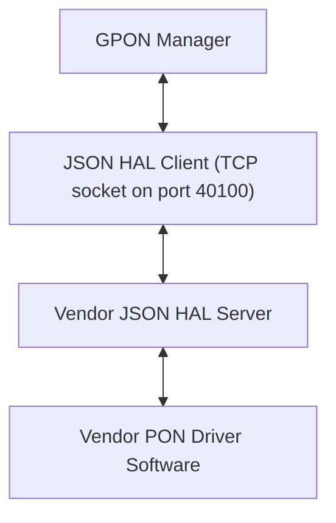
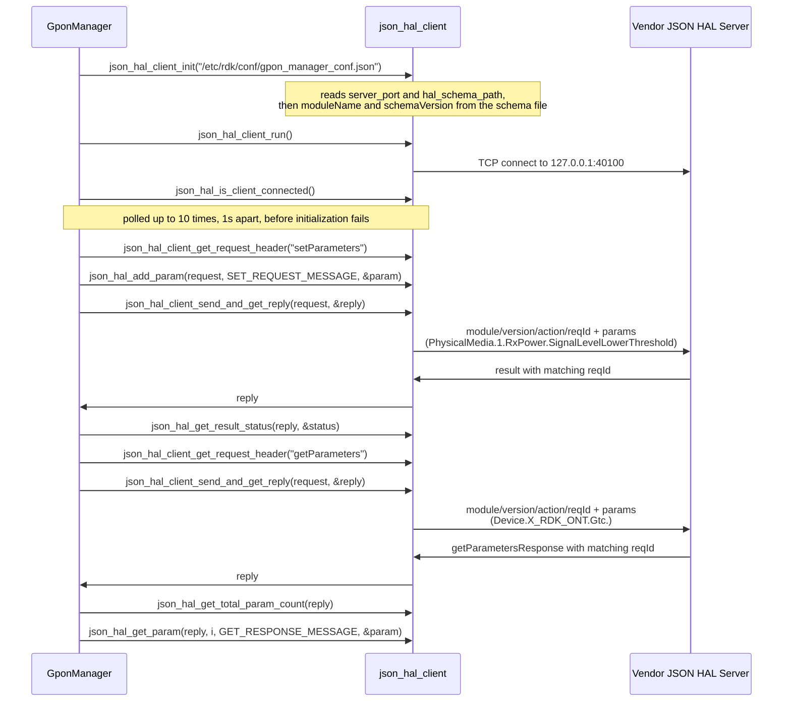

# GPON HAL Documentation

## Version History

| Date | Comment | Version |
| --- | --- | --- |
| 2026-08-24 | Initial release. Specifies the GPON `JSON` HAL contract carried by `hal_schema/gpon_hal_schema.json`. | 1.0.0 |

## Repositories

GPON Manager - https://github.com/rdkcentral/gpon-manager

JSON HAL Library - https://github.com/rdkcentral/json-hal-library

## Acronyms

- `ACS` \- Auto Configuration Server, the remote management server a `TR-069` agent contacts
- `DML` \- Data Model Layer, the `TR-181` parameter surface the manager exposes to the rest of `RDK-B`
- `FEC` \- Forward Error Correction
- `GEM` \- `GPON` Encapsulation Method, the frame format carrying user traffic over the `PON`
- `GPON` \- Gigabit-capable Passive Optical Network
- `GTC` \- `GPON` Transmission Convergence, the framing sub-layer between the `PON` and `GEM`
- `HAL` \- Hardware Abstraction Layer
- `IPC` \- Inter-Process Communication
- `JSON` \- JavaScript Object Notation
- `JSON-RPC` \- The remote procedure call convention carried over `JSON`, used by this HAL's transport
- `MIC` \- Message Integrity Check, the integrity field on an `OMCI` message
- `OMCI` \- `ONT` Management and Control Interface
- `ONT` \- Optical Network Termination, the subscriber-side endpoint this interface models
- `ONU` \- Optical Network Unit, the term the `ITU-T` recommendations use for the same endpoint
- `PLOAM` \- Physical Layer Operations, Administration and Maintenance
- `PON` \- Passive Optical Network
- `RDK-B` \- Reference Design Kit for Broadband Devices
- `TCP` \- Transmission Control Protocol
- `TR-069` \- Broadband Forum Technical Report 069, the CPE WAN management protocol
- `TR-181` \- Broadband Forum Technical Report 181, which defines the `Device:2` root data model
- `VEIP` \- Virtual Ethernet Interface Point, the `OMCI` managed entity bridging `PON` to Ethernet
- `VLAN` \- Virtual Local Area Network
- `ITU-T` \- International Telecommunication Union Telecommunication Standardization Sector

## Description

The GPON HAL is the interface between `RDK-B` middleware and a vendor's `GPON` implementation. It
differs from most HALs in `RDK-B` in one structural respect that governs everything else in this
document: **it is not a C header, and no library is linked across the HAL boundary.** The contract
is a `JSON` Schema, the two participants are separate processes, and they exchange messages over a
`TCP` socket. There is consequently no header from which to generate an inline API reference, and
the per-parameter detail that inline documentation would carry for a C HAL is carried instead by
[halSpecDetailed.md](halSpecDetailed.md) in this folder.

The diagram below describes a high-level software architecture of the GPON HAL module stack.

GponManager is the `RDK-B` middleware that owns `GPON` state, and it is the **client** of this
interface; the vendor supplies the **server**. The manager presents `ONT` configuration and status
to the rest of `RDK-B` as a `TR-181` `DML` surface under `Device.X_RDK_ONT`, and translates reads
and writes on that surface into `JSON` HAL requests
[`gponmgr_dml_hal.c`](https://github.com/rdkcentral/gpon-manager/blob/main/source/TR-181/middle_layer_src/gponmgr_dml_hal.c). No separate middleware service sits between
the `RDK-B` stack and this interface,

**The object tree is a custom extension, not a Broadband Forum model, and that decides where its
semantics come from.** Every parameter lives under `Device.X_RDK_ONT`, and the `X_` prefix marks an
extension to the `TR-181` `Device:2` root data model rather than a branch the Broadband Forum
defines. 

What the interface covers, in the terms the segments use: the optical transceiver and its alarms
(`PhysicalMedia`), `GEM` port and Ethernet flow mapping including `VLAN` tag handling (`Gem`), the
`VEIP` interface and its Ethernet flows (`Veip`), the `PLOAM` registration state and its timers
(`Ploam`), `GTC` framing and `FEC` counters (`Gtc`), `OMCI` message and `MIC` error counts (`Omci`),
and the `ACS` address and associated tag handed from the `OMCI` domain to the `TR-069` domain
(`TR69`). `API Surface` names all seven segments with their parameter counts.

**How to read the rest of this document.** It is arranged in two tiers. The overview tier is this
topic plus `Component Runtime Execution Requirements`, which together answer what this interface is
and how to call it — initialization order, threading, memory, timeouts and error handling. The
protocol tier is `Non functional requirements` and `Interface API Documentation`, which answer what
the wire actually looks like, what varies by build, and what happens when a call fails. Within that
second tier `API Surface` is the index: it names every action and every object segment, and marks
the point past which the detail continues into [halSpecDetailed.md](halSpecDetailed.md).

## Component Runtime Execution Requirements

The client side of this interface is a library linked into the calling process; the server side is a
separate process. What follows applies to a caller running the client, which for this repository is
GponManager and for a test harness is whatever process links the same client library.

### Initialization and Startup

**Three steps, in this order, and the third is not optional.** The manager's own bring-up is the
reference sequence [`gponmgr_dml_hal.c`](https://github.com/rdkcentral/gpon-manager/blob/main/source/TR-181/middle_layer_src/gponmgr_dml_hal.c):

1. `json_hal_client_init()` with the path of the client configuration file
   [`gponmgr_dml_hal.c`]. This is where the deployment contract is read.
2. `json_hal_client_run()`, which starts the client socket thread [`gponmgr_dml_hal.c`].
3. Poll `json_hal_is_client_connected()` until it reports a connection, sleeping one second between
   attempts and giving up after ten [`gponmgr_dml_hal.c`, with
   `HAL_CONNECTION_RETRY_MAX_COUNT`]. Initialization fails if the connection is not
   established inside that window, and the manager returns failure rather than proceeding
   [`gponmgr_dml_hal.c`].

Step 3 exists because step 2 succeeding does not mean a connection exists. `json_hal_client_run()`
starts a thread; the socket connects asynchronously on that thread. A caller that issues a request
immediately after step 2 may be issuing it into an unconnected client.

**What step 1 actually reads, which matters more than it looks.** The configuration file supplies
the server port and the schema path. The client library then opens the **schema file itself** and
takes the module name and the schema version out of it — `definitions.moduleName.const` and
`definitions.schemaVersion.const` — storing both for later use. Every request header the client
subsequently builds carries those two values as its `module` and `version` fields. Three
consequences follow for anyone deploying or testing this HAL:

- The schema file must exist and be readable at the path the configuration names, or initialization
  fails. It is a runtime dependency of the client, not merely a design-time artefact.
- The `module` and `version` a caller sends are **not** hard-coded in the caller. They come from the
  deployed schema file, so deploying the wrong file silently changes the identity of every message.
- Because both GPON schemas declare the same `moduleName` `gponhal` and the same `schemaVersion`
  `0.0.1`, a variant mismatch between manager and vendor is **not** detectable from the envelope. It
  shows up later, as an unrecognised parameter name.

**No initialization message is sent over the wire.** Some `JSON` HALs in `RDK-B` write an
initialization flag as their first request; this contract defines no such parameter, and the manager
sends nothing at bring-up. The first message a vendor server sees is an ordinary request.

**The client entry points this interface is used through**, all declared by the pinned transport
library cited in `Build Requirements`:

- `json_hal_client_init()` — read the configuration and the schema, and prepare the client
- `json_hal_client_run()` — start the client socket thread
- `json_hal_is_client_connected()` — test whether the socket is connected
- `json_hal_client_get_request_header()` — build an envelope for a named action
- `json_hal_add_param()` — append a parameter entry to a request's `params` array
- `json_hal_client_send_and_get_reply()` — send and wait for the correlated reply
- `json_hal_client_send_and_get_reply_with_timeout()` — the same, with a caller-supplied wait
- `json_hal_client_subscribe_event()` — register a callback and subscribe one event
- `json_hal_get_result_status()` — read `Result.Status` out of a reply
- `json_hal_get_total_param_count()` and `json_hal_get_param()` — walk a reply's `params` array
- `json_hal_client_terminate()` — tear the client down

GponManager uses `json_hal_client_get_request_header()`, `json_hal_add_param()`,
`json_hal_client_send_and_get_reply()`, `json_hal_get_result_status()`, `json_hal_get_param()` and
`json_hal_client_subscribe_event()` [`gponmgr_dml_hal.c].

**Vendor obligation.** The server must be listening before, or shortly after, the client starts, and
must accept a reconnection without operator intervention: the client's ten-second window is the
whole budget a cold start gets, and a server that is not accepting connections inside it causes
manager initialization to fail outright rather than to degrade.

### Threading Model

**Transport threading belongs to the client library, not to this interface.**
`json_hal_client_run()` starts the client socket thread, so after initialization a dedicated thread
owns the socket and performs the receive loop. A caller's own thread never touches the socket.

**Asynchronous event callbacks arrive on that library-owned thread**, not on the thread that
registered them. GponManager registers its callback through `json_hal_client_subscribe_event()`
[`source/TR-181/middle_layer_src/gponmgr_dml_hal.c`], and the callback signature receives
the raw event message and its length rather than a parsed object, so parsing happens on the
library's thread inside the callee. Any state a callback touches must therefore be synchronised by
the caller; the manager's callback parses the message and hands the result to the surrounding
component rather than mutating shared state in place.

Neither schema states a concurrency limit, and the transport neither serialises submissions nor
documents concurrent submission as supported, so this document states the position rather than
inventing a guarantee either way. What a caller should do is consequently conservative:

- **Issue HAL requests from one thread, or serialise them behind a lock the caller owns.** It is the
  only arrangement this interface's evidence supports, and it is not what the reference caller does
  for free: GponManager reaches the HAL both from its link state machine's own thread
  [`source/GponManager/gponmgr_link_state_machine.c`] and from its
  `TR-181` handler path [`source/TR-181/middle_layer_src/gponmgr_dml_func.c`], and
  nothing in this contract establishes that those two never overlap. A caller building on this
  interface should not treat that arrangement as a worked example of safe concurrency.
- **Reduce round trips by batching, not by parallelising.** Several parameters in one `params` array
  cost one exchange; the same parameters from several threads cost several, with no stated behaviour
  for the overlap. Size the batch against the request bound in `Memory Model`.
- **Expect the wait to be per caller.** A slow or unresponsive server costs the calling thread the
  full wait described in `Blocking calls`; where a caller has serialised its own requests, each
  waiting thread then pays its own wait in turn.
- **Do not treat request-identifier uniqueness as concurrency support.** Correlation by `reqId` is
  what lets a reply find its request, and it works whatever the caller's threading; it says nothing
  about whether the client's pending-list bookkeeping is safe against simultaneous submission.

**Vendor obligation.** A server must tolerate a single long-lived client connection carrying
sequential requests, and it must stamp every reply with the `reqId` of the request it answers —
that identifier is the only field a client can correlate on, and the client library cross-checks it
before handing a reply back. A server may not require a caller to hold more than one request open at
a time, since this interface does not establish that a caller can.

### Process Model

**The manager and the vendor implementation are two processes communicating over a TCP socket.** This
is the single most consequential difference between this HAL and the C HALs in the RDK-B corpus, and
most of the rest of this document follows from it. There is no vendor `.so` in the manager's address
space, no shared memory and no direct function call: a vendor's allocations and pointers cannot
reach the manager's heap, and equally the manager cannot recover a crashed vendor server by any means
other than reconnecting. That is isolation of memory, not isolation from the peer. The peer's data
crosses the boundary and is copied into fixed manager buffers, in places without a bound;
`Contract Defects` in [halSpecDetailed.md](halSpecDetailed.md) records those copies with their locators, so a malformed or
hostile message can corrupt manager memory through the parsing path.

**Roles are fixed and asymmetric.** A single client instance per manager process is expected.  GponManager is always the **client** and the vendor software
always supplies the **server**. Both sides are given the port by the same configuration file, so
they agree on it without a discovery step. The server's listen backlog is 32 connections, which is
ample for the single client this interface expects and is stated here only so that a vendor
implementing the server side knows it is not one.

**The exchange is `JSON-RPC` style over a `TCP` socket**, as the transport library's own description
of both participants states [`json-hal-library`]: a request names an
action, and the reply that answers it is matched to the request by identifier rather than by
position on the connection.

**Direction of travel per action.** The client originates `getSchema`, `getParameters`,
`setParameters`, `subscribeEvent`, `getActiveSubscriptions` and — were it usable — `deleteObject`.

The server originates `getSchemaResponse`, `getParametersResponse`,
`getActiveSubscriptionsResponse`, `result` and `publishEvent`. Only `publishEvent` is unsolicited.
`API Surface` gives the complete mapping with the payload each action must carry.

Because the two sides are separate processes, they are also separately restartable, and the interface
says nothing about what a vendor server does with subscriptions across its own restart. A caller that
has restarted, or that suspects the server has, should re-establish its subscriptions rather than
assume they survived.

### Memory Model

Because the vendor implementation is a separate process, no memory is shared across the HAL boundary
and no buffer lifetime spans it. What crosses the boundary is a serialized `JSON` document. The
memory model that matters to a caller is therefore entirely local: it concerns the `json_object`
handles the client library hands out and takes back, and those are reference-counted rather than
owned outright.

Two handles exist per exchange. The **request** object is created by the caller, conventionally from
`json_hal_client_get_request_header()`, which returns a `json_object` already carrying the `module`,
`version`, `action` and `reqId` fields, and — for every action except `getSchema` — an empty `params`
array ready for the caller to append to. The **reply** object is produced by the library and returned
through an out-parameter. Both are released with `json_object_put()`, which decrements the reference
count rather than freeing unconditionally.

#### Caller Responsibilities

- **Always release the request, on every path.** The caller creates the request handle and the client
  library never takes ownership of it: the send path reads the request and returns without releasing
  it, on both the success and the failure branch. So the request is the
  caller's to release whatever the outcome. The manager's pattern is a guarded release macro applied at each exit, used at every failure branch around a send.

- **Release the reply only when the out-parameter was populated, which is why it must be initialised
  to null and tested before release.** The caller owns that reference.

- **Do not retain a value extracted from a reply beyond the reply's lifetime.** Values read out of a
  reply with `json_hal_get_param()` must be copied into caller-owned storage before the reply handle
  is released. A pointer into a released `JSON` document is not valid afterwards.
- **Bound what a request carries. The 16384-byte figure applies to a request and not to a reply, and
  the asymmetry belongs to the transport rather than to the protocol.** `MAX_BUFFER_SIZE` is 16384
  bytes at the pinned transport revision.
- **Do not reuse a request handle for a second send.** Correlation depends on each exchange carrying
  its own `reqId`, and the header helper allocates one per call.
- **Zero-terminate every string placed in a request.** The parameter entry the manager fills is a
  fixed-size character structure copied with a bounded copy [`gponmgr_dml_hal.c:218-231`], and the
  transport serializes it as a C string.

#### Module Responsibilities

- The client library owns the receive buffer on the **reply** path and the assembly of a reply that
  spans several reads. That assembly is occupancy-driven rather than framed:
  a caller can see a partial reply, because a short read ends the assembly whether or not the
  document is complete. The server side of the transport provides no assembly at all, which is why
  the size bound above applies to the request direction only.

- The library assigns the reply handle only after an exchange that returned a non-negative code, and
  only from parsing the received buffer; it transfers that handle to the
  caller, who becomes responsible for releasing it. It never releases, and never takes ownership of,
  the caller's request handle.

- The library owns the request-identifier counter and the per-request tracking record, and frees that
  record when the exchange completes or expires.

- The vendor server owns everything on its side of the socket. It must not assume that a client
  which disconnected has released anything on its behalf, and it must be able to serve a fresh
  connection from a restarted manager.

- Neither side may assume the other's allocation lifetimes. This is the practical benefit of the
two-process model: a vendor's allocation policy cannot reach the manager's heap, because the
  two share no address space and no allocator. That is a statement about pointers and
  allocations, and it must not be read as isolation from a hostile peer: the peer's DATA does
  cross the boundary, and this manager copies received JSON names and values into fixed buffers
  without always bounding them.

### Power Management Requirements

**No power-management behaviour is specified by this interface.** Neither shipped schema defines a
power state, a low-power mode, a sleep or wake action, or a parameter reporting participation in
power management; no action in the vocabulary requests a power transition; and neither the client
configuration nor the manager source establishes any power-management role for this HAL. A caller
must not expect a `GPON` HAL request to affect device power state, and a vendor is not obliged by
this contract to implement one.

**One nearby group of parameters is easy to mistake for power management and is not.** The
`PhysicalMedia` segment carries optical diagnostics — received and transmitted signal levels with
their lower and upper thresholds, supply voltage, laser bias current and transceiver temperature.
These are optical link measurements, and the four writable threshold parameters set alarm thresholds
rather than transmit power. Reading or writing them does not change device power consumption, and
this contract states nothing about the effect of writing them beyond the alarm behaviour the
`ITU-T G.988` clauses cited in their descriptions define.

### Asynchronous Notification Model

**One subscription mechanism, two message flows.** A caller subscribes with `subscribeEvent`, which
the server acknowledges with a `result`; thereafter the server sends `publishEvent` messages
unsolicited whenever the subscribed parameter meets the notification condition. There is no
unsubscribe action.

**Required fields differ between `subscribeEvent` and `publishEvent`, which is the most common
mistake in implementing them.**
A `subscribeEvent` parameter entry requires `name` and `notificationType` and carries no value. A
`publishEvent` parameter entry requires `name`, `type` and `value` — the datatype travels with the
event, so a receiver does not have to look the parameter up to interpret its value.

`notificationType` admits exactly two values: `interval` and `onChange`, with `onChange` as the
default. GponManager subscribes with `onChange`.

**Eighteen parameters can be delivered as events, identical in both schema variants, and only two of
them can be subscribed to.** The two halves of that sentence come from two different constraints and
both matter. The outer bound is that `subscribeEvent` and `publishEvent` bind their `params` items to
`subscribeEventSupportedList` and to nothing else, so no parameter outside those eighteen enters the
event mechanism in either direction. The inner bound is that a `subscribeEvent` entry **requires**
`notificationType`, every parameter definition declares `additionalProperties: false`, and only
`ontPhysicalMediaStatus` and `ontVeipAdministrativeState` declare a `notificationType` property at
all — so a `subscribeEvent` naming any of the other sixteen is an invalid message that a validating
server rejects, while a `publishEvent` naming any of the eighteen is valid.

| Group | Parameters | Valid in `subscribeEvent` |
| --- | --- | --- |
| Optical status | `Device.X_RDK_ONT.PhysicalMedia.{i}.Status` | **Yes** |
| Optical alarms (14) | `Device.X_RDK_ONT.PhysicalMedia.{i}.Alarm.` `RDI`, `PEE`, `LOS`, `LOF`, `DACT`, `DIS`, `MIS`, `MEM`, `SUF`, `SD`, `SF`, `LCDG`, `TF`, `ROGUE` | No — the definitions declare no `notificationType` property |
| Registration | `Device.X_RDK_ONT.Ploam.RegistrationState` | No — same reason |
| `VEIP` administrative state | `Device.X_RDK_ONT.Veip.{i}.AdministrativeState` | **Yes** |
| `VEIP` operational state | `Device.X_RDK_ONT.Veip.{i}.OperationalState` | No — same reason |

Each alarm carries `alarmEnumList`, so an event value is `Active` or `Inactive`; the optical status
carries `statusEnumList`; the registration state carries its own nine-value enumeration. `Ploam`
is a singleton so its path has no instance number, while `PhysicalMedia` and `Veip` are indexed, and
the alarm leaf names are upper case exactly as written above. `State Diagram` enumerates every value
each of these can take.

**What an event handler may and may not do, restated here because this is where a caller meets it.**
An event is delivered by calling the registered callback on the client's receive thread while the
transport holds its subscription lock [`json_hal_client.c`], so the callback must copy
anything it needs after it returns — the buffer it is given points into the event's own `JSON` object
and is released as soon as dispatch finishes — must return promptly, and must not issue
a synchronous HAL request, subscribe, re-subscribe or terminate the client from inside itself, each of
which deadlocks rather than merely delaying. `Threading Model` sets out the mechanism and the evidence
for each of those rules; a handler that parses the message, copies what it needs and hands it to a
caller-owned thread satisfies all of them, and is what the manager's own handler does.

**Vendor obligation.** A server must acknowledge every `subscribeEvent` with a `result` — silence
costs the caller its full timeout — must publish only parameters that appear in the table above, and
must send `publishEvent` with all three required fields populated, since a receiver has no other way
to type the value. A server must not require a `getActiveSubscriptions` exchange in order to
establish or maintain a subscription, since the content of its response is undefined.

### Blocking calls

**The request path is synchronous and it blocks.** The C HALs in `RDK-B` require that none of their
calls block; this interface is the opposite, and a caller coming from a C HAL must adjust for it. A
send-and-reply call blocks the calling thread until the server answers or the wait expires, so HAL
requests must not be issued from a thread with latency obligations of its own.

**Connection establishment blocks for its own bounded window**, up to ten one-second attempts, as
`Initialization and Startup` sets out. The worst case for a cold start is that window followed by
the first request's wait.

**Synchronous and Responsive:** every parameter read and write is a round trip to another process.
A caller must treat each one as potentially slow and must not issue one from a context that cannot
tolerate waiting — in particular not from an event callback, which runs on the transport's own
receive thread.

**Timeout Handling: both variants are bounded, and they are bounded by the same mechanism.**
`json_hal_client_send_and_get_reply()` is not an unbounded wait. It passes
`SEND_MSG_TICKER_TIMEOUT`, which is `40` (`json_hal_client.c`), to the internal send-and-wait
routine, and the definition's own comment records the intent as
`Ticker timeout for aprox. 10s (40 x 250ms)`. A caller that supplies no deadline therefore
gets one of approximately ten seconds rather than none.

`json_hal_client_send_and_get_reply_with_timeout()` (`json_hal_client.h`) takes a deadline in
seconds, converts it to ticks as `(timeout * 1000000) / LOOP_TIMEOUT` with `LOOP_TIMEOUT` at
`250000` microseconds (`tcp_client.h`) — four ticks per second — and then **clamps the result at
both ends**, down to `40 (10s)` (`json_hal_client.c`) and up to `480 (120s)`, the upper bound. The deadline is approximate, and it is an upper bound rather than a guaranteed minimum wait.

**Nothing on this interface is asynchronous except event delivery.** There is no request handle to
poll, no completion callback for a request, and no way to cancel one in flight. A caller needing
concurrency gets it by not calling from a latency-sensitive thread, not by a non-blocking form of
these calls — and, as `Threading Model` records, whether two requests may be in flight at once is not
established by this interface, so extra threads are not a supported way to overlap them.

**Vendor obligation.** A server must answer every request it receives, including one it cannot
satisfy. An unanswered request costs the caller its full wait and yields no information, whereas a
prompt `result` carrying `Failed`, `Invalid Argument` or `Not Supported` costs a round trip and tells
the caller what happened.

### Internal Error Handling

**Errors arrive in the reply, not out of band.** There is no error callback and no error event. A
failure is either a **transport failure**, visible as a failed send-and-reply call, or an
**application failure**, carried in the reply's `Result.Status`. A caller must distinguish the two:
the first means the request may never have been processed, the second means it was processed and
refused.

`Result.Status` takes one of four values, from `definitions.resultStatusEnumList`, with `Success` as
the schema's default. The value is read with `json_hal_get_result_status()` rather than by reaching
into the document. What a caller should do differs per value:

| Status | Meaning | What the caller should do |
| --- | --- | --- |
| `Success` | The request was accepted and applied. | Proceed. For a write, success means the vendor accepted the value, not that any dependent optical or registration state has finished converging — re-read the affected parameter if the settled value matters. |
| `Failed` | The request was understood but could not be applied. | Do not retry blindly; the same request will usually fail again. Log the parameter and the status, and surface the failure upward. |
| `Invalid Argument` | A parameter name, type or value was not acceptable. | Treat as a defect in the request rather than a transient condition. Check the name against the schema's `name` constraint, the `type` against the parameter's declared datatype, and the value against its constraint. |
| `Not Supported` | The vendor does not implement this parameter or action. | Treat as a normal outcome for a path reachable only through `getParameterOptionalList`, and stop requesting it. See `Optional Components`. |

`Invalid Argument` and `Not Supported` are the two most often mishandled</b>, because both are
permanent for a given request and neither should be retried. Retrying either produces load without
progress.

**The schema states what a well-formed message looks like; the pinned transport does not check
inbound messages against it.** This is the single most consequential difference between the contract
and its carrier, because a caller — or a test — that expects malformed input to come back as a clean
rejection is expecting something no code here performs. The server's internal request dispatcher
(`json_hal_server.c`) behaves as follows on a request:

| Inbound request | What the pinned server does | What the caller sees |
| --- | --- | --- |
| Not parseable as JSON | Logs the parse offset and returns from the dispatcher | **No reply at all** — the caller waits out the ticker deadline |
| Valid JSON with no `reqId` | Logs and discards the object  | **No reply at all** |
| Valid JSON with no `action` | Logs and discards the object  | **No reply at all** |
| Wrong `module` or wrong `version` | Neither field is ever read; the message is dispatched on its `action` alone | The handler's own answer, as though the envelope were correct |
| An `action` with no registered handler | Builds a generic `result`  | `Not Supported` |
| A handler that returns non-`RETURN_OK` | Builds a generic `result` | `Failed` |
| A parameter value outside its schema constraint, or a `params` entry missing a required property | Nothing inspects either; `params` is only counted, and the count is taken as an array length without checking that `params` is an array  | Whatever the vendor's handler decides |

**Internal Error Reporting:** a vendor server should report its own internal failures through
`Result.Status` rather than by closing the connection or omitting a reply, and should answer a
malformed or out-of-range request with a status rather than silently dropping it. Both are
obligations on the implementation, not services the transport provides: as the table above shows, the
dropped-input paths are exactly what the pinned dispatcher does by default. A missing reply is
indistinguishable to the caller from a hung server, and costs the caller the full blocking wait.

**Validation is the sender's job on both sides.** Because nothing validates a message on the way in,
a caller that wants a malformed request caught at all must validate its own outbound messages against
[`hal_schema/gpon_hal_schema.json`](../../hal_schema/gpon_hal_schema.json ) before sending them, and a
vendor server must apply the parameter constraints in [halSpecDetailed.md](halSpecDetailed.md) in its handler. Neither
side is protected by the other.

**Focus on Logging for Errors:** for failures that cannot be expressed in a status value — a
malformed message, a connection lost mid-exchange — both sides should log with enough context to
identify the exchange, which in practice means the `reqId`.

### Persistence Model

**This contract asks the HAL server to persist nothing.** No action in the schema commits or reloads
configuration, and there is no parameter through which a caller could request that a value survive a
restart. A `setParameters` exchange states the intended value of a TR-181 parameter and is answered
with a status; what the vendor does to make that value durable, if anything, is outside this
interface.

Persistence of the TR-181 data model is the manager's responsibility and that of the CCSP framework
around it, not the HAL's. The parameter definitions this repository backs are declared in
[`config/RdkGponManager.xml`](https://github.com/rdkcentral/gpon-manager/blob/main/config/RdkGponManager.xml), and it is that layer which decides
what is restored at startup.

## Non functional requirements

The following non-functional requirements apply to a vendor implementation of the GPON `JSON` HAL
server and, where stated, to the client side of the interface.

### Logging and debugging requirements

Vendor software is required to record all errors and critical informative messages, so that the
functional flow across the socket can be identified and debugged. Logging should use the `syslog`
mechanism, which is suited to system-level software; the use of `printf` is discouraged unless
`syslog` is unavailable.

Logs should be categorized by the following levels, as defined by the Linux standard logging system
and listed here in descending order of severity:

- **FATAL:** Critical conditions, typically indicating a crash or a failure that requires immediate
  attention.
- **ERROR:** Non-fatal error conditions that nonetheless significantly impede normal operation.
- **WARNING:** Potentially harmful situations that do not yet represent errors.
- **NOTICE:** Important but not error-level events.
- **INFO:** General informational messages that highlight system operation.
- **DEBUG:** Detailed information useful when diagnosing a problem.
- **TRACE:** Very fine-grained logging that traces internal flow.

Each entry should carry a timestamp, the level and a message describing the event, so that logs from
different vendors and components can be parsed and correlated uniformly. For this interface
specifically, an entry describing a message exchange should include the `reqId`, since that is the
only field that ties a reply back to its request.

### Memory and performance requirements

**Client module responsibility.** The caller allocates and releases the `json_object` handles
described in `Memory Model`, and copies any value it needs out of a reply before releasing it.

**Vendor implementation responsibility.** A vendor server allocates whatever it needs internally and
is solely responsible for releasing it. No allocation and no pointer crosses the process boundary,
so a vendor's allocation policy cannot affect the caller's heap. Received data does cross it, and
`Contract Defects` in [halSpecDetailed.md](halSpecDetailed.md) records where this manager copies peer-supplied names and
values into fixed buffers without bounding them; the process boundary does not protect the manager
from its own handling of what it receives.

**The quantitative limits this interface actually imposes**, each with the artefact that sets it:

| Limit | Value | Where it comes from |
| --- | --- | --- |
| Request size | 16384 bytes, the server's single fixed receive buffer | `MAX_BUFFER_SIZE` [`json_rpc_common.h`], read at `tcp_server.c`; a larger request is not assembled and is discarded unanswered |
| Reply size | no stated ceiling; assembled on the heap from 16384-byte reads | `tcp_client.c`; see `Memory Model` |
| Synchronous reply window | 40-tick floor, 480-tick ceiling — nominally about 10 and 120 seconds | Tick clamp, transport library; the elapsed time is approximate, see `Blocking calls` |
| Connection establishment window | 10 attempts, 1 second apart | `HAL_CONNECTION_RETRY_MAX_COUNT`, manager |
| Server listen backlog | 32 | Transport library server |
| Manager-side re-read suppression | 10 seconds per cached object | `DML_GTC_FETCH_INTERVAL`, manager |
| Outstanding requests per client | not specified; the client takes a mutex per request, not per exchange | `json_hal_client.c`; see `Threading Model` |

**No memory footprint limit and no CPU budget are specified for this interface.** Neither schema, the
client configuration nor the manager source states a resident-memory ceiling, a per-request CPU
budget or a throughput target for a vendor server, and this document does not invent one. A vendor
should size its implementation against the product specification for the platform it ships on. What
*is* specified, and is the practical performance contract, is the reply window above: a server that
cannot answer within the 40-tick floor — nominally about 10 seconds, and less than that on a busy
connection — will have its caller time out on the untimed form that GponManager uses everywhere.

**One performance consequence of the model worth planning for.** Because each request carries a full
round trip and a caller is advised to issue them one at a time for the reason `Threading Model` gives,
the cost of reading the `ONT` is dominated by the number of requests rather than by their size. The manager reads by object prefix — seven requests for the whole tree
rather than one per parameter [`source/TR-181/middle_layer_src/gponmgr_dml_hal.c`] —
and a caller should follow the same pattern, keeping each request inside the 16384-byte request bound
above rather than inside any assumed reply bound, since only the request direction has one.

### Quality Control

To ensure quality and reliability, third-party analysis tools such as `Coverity`, `Black Duck` and
`Valgrind` should be used to analyse a vendor implementation, so that memory leaks, memory
corruption and other defects are found before deployment. Both the vendor server and any client
linking the transport library must practise disciplined allocation, release and error handling, for
the reasons `Memory Model` sets out.

**One check is specific to a schema-defined interface and is the most valuable one available here:
validate every message against the shipped schema.** Because the contract is a machine-readable
`draft-07` schema, conformance is testable directly rather than by inspection — a request or reply
can be validated against `hal_schema/gpon_hal_schema.json`, before it is trusted. 

### Licensing

The GPON HAL contract and this repository are licensed under the **Apache License, Version 2.0**. A
vendor implementation of the HAL server is expected to be released under the same licence.

The licence text and the attribution notice ship with the repository as `LICENSE`, `COPYING` and
`NOTICE` at its root.

### Build Requirements

**No HAL library is built from this repository, and none is linked across the HAL boundary.** This
follows from the contract being a schema rather than a header, and it is the first thing an
integrator coming from a C HAL needs to know. There is no `libhal_*` artefact to produce for the HAL
itself, no header to install for the contract, and no symbol a vendor must export. What a vendor
delivers is a **process** that speaks the protocol and validates against the shipped schema; what
this repository delivers on the HAL boundary is the schema file.

GPON manager links JSON HAL client library [`json_hal_client`] and uses the JSON HAL contract.

### Variability Management

Each interface is versioned using [Semantic Versioning 2.0.0](https://semver.org/spec/v2.0.0.html), and a vendor
implementation complies with a specific version of it. Adjusting the interface is an architecture
decision; vendors align their implementation with a designated version and move to a newer one as
demand requires.

**The version that governs a message on the wire is the HAL schema version, `1.0.0`**, carried by the
`schemaVersion` definition and required in the `version` field of every message. The schema states
its own rule for it:

> DO NOT modify the value of the version string. HAL operation cannot be performed without correct
> supported version.

A client and a vendor server that disagree on this value cannot interoperate, because `version` is
one of the four required envelope fields and is a `const` in the schema — a mismatch makes the
message invalid rather than merely unrecognised. This is the identity a caller negotiates against,
and it advances independently of the repository's release tag.
This HAL contract has no compile-time variability flag.

### Platform or Product Customization

The vendor supplies the JSON HAL **server**, and the contract it must satisfy is the schema. So
customization for this HAL is not a matter of compile-time flags but of **which parameters and
objects a platform actually implements** — and the schema expresses that directly through its own
optional/mandatory split.

| Effect | Default build |
| ---| --- |
| Configuration file read | `/etc/rdk/conf/gpon_manager_conf.json` |
| Schema the configuration names | `gpon_hal_schema.json` |
| Parameter definitions | 90|
| Writable parameters | 8 |
| Datatypes in use | `string`, `int`, `unsignedInt`, `unsignedLong`|
| Vendor server process | started by the platform |

**The five parameters the variant adds**, all on the indexed optical interface
`Device.X_RDK_ONT.PhysicalMedia.{i}.`:

| Parameter | Datatype | Access | What it is |
| --- | --- | --- | --- |
| `Enable` | `boolean` | Read-Write | Whether the interface is enabled |
| `Alias` | `string`, up to 64 characters | Read-Write | Non-volatile unique key for referencing this instance |
| `LowerLayers` | `string`, up to 1024 characters | Read-Write | Comma-separated list of lower-layer interface paths |
| `LastChange` | `unsignedInt` | Read-Only | Seconds accumulated in the current operational state |
| `Upstream` | `boolean` | Read-Only | Whether the interface points towards the network rather than towards end devices |

Three of the five — `Enable`, `Alias` and `LowerLayers` — are writable, and they are what takes the
writable surface from 8 to 11: in the default build the only writable parameters are the four optical
signal-level thresholds and the four `VEIP` Ethernet-flow tag and `VLAN` identifier parameters.
`Enable` and `Upstream` are the interface's only `boolean` parameters, so a client built for the
default schema will never encounter that datatype and a vendor server serving the variant must handle
it.

## Interface API Documentation

The interface is defined by the `JSON` Schema files under `hal_schema/`, which are the authority for
every field, action, path and constraint named below. This block is the protocol tier of the
document: it describes how the interface is used, what shapes a caller must build and read, what the
complete callable surface is, and what the interface does and does not say about state.

### Theory of operation and key concepts

A caller does not call functions on this HAL; it exchanges messages with a peer process. Four
concepts carry that difference, and everything else in this block follows from them.

**The envelope is the call.** Every message, in either direction, carries the same four required
fields — `module`, `version`, `action` and `reqId` — and the `action` value decides what else the
message must carry. There is no method name, no argument list and no return value in the C sense;
there is an action and a payload whose shape the schema binds to that action.

**The data model is the parameter surface.** What a C HAL expresses as distinct getter and setter
functions, this interface expresses as one `getParameters` action and one `setParameters` action
applied to `TR-181` paths under `Device.X_RDK_ONT`. Adding a capability to this HAL means adding a
parameter definition to the schema, not adding an action.

**Correlation replaces the call stack.** A reply is matched to its request by `reqId`, not by
ordering on the connection, and the client library performs that match before returning a reply to
the caller. This is what lets an unsolicited `publishEvent` share the connection with request and
reply traffic.

**The schema is enforceable, and both sides should enforce it.** Because the contract is
machine-readable, a message can be checked mechanically rather than by convention. `Quality Control`
recommends doing exactly that, and the two constraints most worth checking are the `name` patterns —
which decide whether a path is addressable at all — and the datatype `const` on each parameter.

#### Object Lifecycles

**The client has a lifecycle; the interface has no session.** The client library is initialized,
started, observed to be connected, used, and optionally terminated — the sequence in
`Initialization and Startup`. Across the socket, however, there is no session to open or close: no
action begins or ends a conversation, no state is established by a first message, and a server must
treat each request as complete in itself.

**Object instances belong to the vendor, and this interface exposes them without creating them.**
Three of the seven segments are instanced — `PhysicalMedia`, `Gem` and `Veip`, addressed as
`Device.X_RDK_ONT.PhysicalMedia.{i}.` and so on — and four are singletons: `Gtc`, `Ploam`, `Omci`
and `TR69`. Nothing in the action vocabulary creates an instance: there is no `addObject`, and
`deleteObject` exists in the enumeration but is unusable, as `API Surface` records. So the instance
set is whatever the vendor's hardware presents, and a caller discovers it by reading rather than by
enumerating a table: a read of a singleton object's path returns its parameters, while an instanced
object's parameters are addressed per instance number.

**Subscriptions are the only client-created state on the server side**, established by
`subscribeEvent`. Their lifecycle is barely specified: there is no unsubscribe action in the
vocabulary, neither schema states whether a subscription outlives a reconnection, and the one action
that appears to read the state back — `getActiveSubscriptions` — has a response whose content this
contract does not define, so it cannot be used to confirm what the server holds. A caller therefore
keeps its own record of what it subscribed to, and re-subscribes after a reconnection subject to the
duplicate-delivery caveat `Asynchronous Notification Model` sets out.

#### Method Sequencing

**Before any request:** initialize, run, and confirm connectivity. A request issued before
`json_hal_is_client_connected()` reports success is issued into an unconnected client.

**`getSchema` before relying on a schema path.** A caller that needs to know which schema file the
server is using asks with `getSchema` and reads `SchemaInfo.FilePath` from the
`getSchemaResponse`. It is not a prerequisite for anything else — the client already has its own
schema path from its configuration — and what it returns is the server's view, which is the only way
to detect a mismatch between the two sides. A caller must not assume the returned path matches its
own: one of the shipped example responses returns a path belonging to a different HAL entirely, which
is exactly the mismatch this action exists to reveal.

**`subscribeEvent` before any `publishEvent` can arrive.** An event is not sent for a parameter that
was never subscribed, and only a parameter in the eighteen-entry table in
`Asynchronous Notification Model` enters the event mechanism at all. Of those eighteen, only the
optical status and the `VEIP` administrative state can be named in a `subscribeEvent` a validating
server accepts, so for the remaining sixteen there is no sequence that reliably produces an event and
a caller polls instead.

**Reads and writes are otherwise unordered**, with two qualifications. A write is not read-back: the
`result` acknowledging a `setParameters` reports acceptance, not the settled value, so a caller that
needs the settled value reads it afterwards. And ordering between requests issued from different
threads is not established by this interface, so a caller that needs one request to precede another
issues them from one thread rather than relying on the client to sequence them, as
`Threading Model` describes.

#### State-Dependent Behavior

**Before the client is connected**, `json_hal_client_init()` and `json_hal_client_run()` are the only
calls that are meaningful; `json_hal_is_client_connected()` is the test, and it exists precisely
because a started client is not necessarily a connected one. Sending a request in this state fails as
a transport failure rather than returning an application status.

**After the connection is lost**, the same test is what distinguishes a transport problem from a
vendor refusal. Neither schema nor the transport states whether the client re-establishes a dropped
connection automatically, so a caller must not assume recovery; it should test connectivity before
concluding that a run of failures is the server's fault.

**Parameter values are state-dependent in the ordinary sense.** Optical counters, alarm flags,
registration state and `VEIP` administrative and operational states all reflect the `ONT`'s current
condition, and a read returns what is true at the moment the vendor answers. What this interface does
**not** define is which value may follow which: no successor set, no transition table and no ordering
constraint appears anywhere in either schema. `State Diagram` says exactly what is and is not
established, and why no diagram is drawn from it.

### Data Structures and Defines

For a C HAL this topic lists the enumerations, structures and macros a caller must construct or
interpret. **There is no C header here and therefore no C type**; the equivalents are schema
definitions, and they fall into four groups. The complete per-definition inventory is in
[halSpecDetailed.md](halSpecDetailed.md); what follows are the shapes a caller must be able to
build and read.

**The envelope.** Four required fields, three of them bound to a definition rather than declared
inline:

| Field | Bound to | Form |
| --- | --- | --- |
| `module` | `moduleName` | `string`, `const` `gponhal` |
| `version` | `schemaVersion` | `string`, `const` `1.0.0` |
| `action` | `action` | `string`, one of the eleven members listed in `API Surface` |
| `reqId` | declared inline | `string` matching `^[0-9]+$`; the client emits a zero-padded eight-digit decimal |

**The payload objects.** Three payload shapes exist, selected by the action:

| Payload | Carried by | Shape |
| --- | --- | --- |
| `params` | `getParameters`, `setParameters`, `getParametersResponse`, `subscribeEvent`, `publishEvent`, `deleteObject` | An array, at least one item, items unique. Each item is a parameter entry whose required fields vary by action. |
| `Result` | `result` | An object with a single `Status` field, `additionalProperties: false`, `Status` required. |
| `SchemaInfo` | `getSchemaResponse` | An object with a single `FilePath` field, `additionalProperties: false`, `FilePath` required, matching `^(.+)/([^/]+)$`. |

**Required fields per `params` entry, which differ by action and are easy to get wrong:**

| Action | Required in each `params` entry |
| --- | --- |
| `getParameters` | `name` only |
| `setParameters`, `getParametersResponse`, `publishEvent` | `name`, `type` and `value` |
| `subscribeEvent` | `name` and `notificationType` |
| `deleteObject` | `name` — but the action is unusable; see `API Surface` |

**A leaf parameter definition**, which is this interface's analogue of a documented function
parameter, carries a `description` and three properties, and most forbid others through
`additionalProperties: false`: `name` — a `const` exact path for a parameter on a singleton object,
or a regular expression for one on an instanced object; `type` — a `const` giving the `TR-181`
datatype; and `value` — the constraint the value must satisfy. Subscribable parameters carry a fourth
property, `notificationType`. An **object definition** is the same shape reduced to `name` alone;
there are 26 of them, and they are what a prefix-scoped read addresses. Every one of the 90
parameters in the default schema carries a `description`, and every description ends with an
`(Access = Read-Only)` or `(Access = Read-Write)` marker.

**Access is derivable two ways, and for this interface they agree exactly.** The prose marker in each
description and membership of `setParameterSupportedList` — which is what a server enforces — both
identify the same 8 writable parameters in the default schema and the same 11 in the variant, with no
disagreement in either file. That is worth stating because it is not true of every `JSON` HAL in
`RDK-B`, and it means a caller can trust the marker here.

**The nine enumerations.** These are the closest thing this interface has to a C HAL's `enum`
declarations, and a caller must treat each as closed:

| Enumeration | Members | Default |
| --- | --- | --- |
| `action` | The eleven members in `API Surface` | none |
| `resultStatusEnumList` | `Success`, `Failed`, `Invalid Argument`, `Not Supported` | `Success` |
| `notificationType` | `interval`, `onChange` | `onChange` |
| `statusEnumList` | `Up`, `Down`, `Unknown`, `Dormant`, `NotPresent`, `LowerLayerDown`, `Error` | none |
| `alarmEnumList` | `Active`, `Inactive` | none |
| `lockEnumList` | `Lock`, `Unlock` | none |
| `redundancyStateEnumList` | `Active`, `Standby` | none |
| `ponModeEnumList` | `GPON`, `XG-PON`, `NG-PON2`, `XGS-PON` | none |
| `physicalConnectorEnumList` | `LC`, `ST`, `FC`, `SC`, `MT-RJ` | none |

`Device.X_RDK_ONT.Ploam.RegistrationState` constrains its value to a nine-member set declared inline
on the parameter rather than as a named enumeration; `State Diagram` lists it with the rest.

**The datatype vocabulary.** Parameter `type` values in use are `string`, `int`, `unsignedInt` and
`unsignedLong`, plus `boolean` in the variant schema only. The transport library recognises a wider
set, including `long`, `hexBinary` and `base64`, but no GPON parameter declares one, so a message
using them would name a datatype this contract does not.

### API Surface

This topic is the boundary between the overview above and the protocol depth below. A reader who came
for an orientation can stop here; a reader with a protocol question starts here and continues into
[halSpecDetailed.md](halSpecDetailed.md), which carries every parameter definition, every object
path, the enumeration appendix, worked message exchanges and the record of contract defects.

**Where a C HAL has functions, this interface has eleven action values.** They are the complete
callable surface, declared by `definitions.action` in both schemas in the same order:

| Action | Originated by | Payload it must carry |
| --- | --- | --- |
| `getSchema` | Client | none — bare envelope |
| `getParameters` | Client | `params` |
| `getParametersResponse` | Server | `params` |
| `setParameters` | Client | `params` |
| `subscribeEvent` | Client | `params` |
| `getActiveSubscriptions` | Client | none — bare envelope |
| `getActiveSubscriptionsResponse` | Server | none — bare envelope |
| `getSchemaResponse` | Server | `SchemaInfo` |
| `publishEvent` | Server | `params` |
| `deleteObject` | Client | `params` — **but see below; not usable** |
| `result` | Server | `Result` |

**Eight actions bind a payload; three travel as the bare envelope.** The schema attaches a
conditional payload requirement, through its eight `allOf` branches, to `setParameters`,
`getParameters`, `deleteObject`, `subscribeEvent`, `publishEvent`, `result`, `getSchemaResponse` and
`getParametersResponse`. The three with no binding are `getSchema`, `getActiveSubscriptions` and
`getActiveSubscriptionsResponse`: for these the four envelope fields are the entire message.

**There is no `setParametersResponse`.** This is the single most commonly mis-stated fact about this
protocol, so it is stated plainly: a write is acknowledged by the generic **`result`** action carrying
`Result.Status`. A caller waiting for an action name symmetrical with `setParameters` waits for a
message the contract does not define. Two of the eleven actions are answered by `result` rather than
by a dedicated response — `setParameters` and `subscribeEvent` — while `getParameters`, `getSchema`
and `getActiveSubscriptions` each have a matching named response.

**`deleteObject` is not usable under either shipped schema.** Its payload definition carries an empty
`anyOf`, a construct no instance can satisfy, so no schema-valid delete message exists to send. It is
listed above for completeness, because it is a member of the enumeration a server must be able to
parse, but it must be treated as **unsupported**: a caller should not attempt object deletion through
this interface, and a vendor need not implement it. This is a defect in the shipped contract rather
than a design decision, and it is recorded rather than worked around — the schemas are the contract,
and editing them is outside the scope of this documentation.
[halSpecDetailed.md](halSpecDetailed.md) records it, together with the identical defect on
`setParameterOptionalList`.

**The object tree.** Every parameter lives under **`Device.X_RDK_ONT`**, across seven named segments:

| Segment | Path | Parameters | What it covers |
| --- | --- | --- | --- |
| `PhysicalMedia` | `Device.X_RDK_ONT.PhysicalMedia.{i}.` | 41 | Transceiver identity and status, optical signal levels and thresholds, voltage, bias, temperature, and the 14 alarms |
| `Gem` | `Device.X_RDK_ONT.Gem.{i}.` | 18 | `GEM` port state and its Ethernet flow, including `C-VLAN` and `S-VLAN` tag handling |
| `Veip` | `Device.X_RDK_ONT.Veip.{i}.` | 13 | `VEIP` administrative and operational state and its `Q-VLAN` Ethernet flows |
| `Ploam` | `Device.X_RDK_ONT.Ploam.` | 10 | Registration state, registration timers and `PLOAM` counters |
| `Gtc` | `Device.X_RDK_ONT.Gtc.` | 8 | `GTC` framing counters and `FEC` corrected and uncorrected counts |
| `Omci` | `Device.X_RDK_ONT.Omci.` | 3 | `OMCI` message counts and `MIC` error count |
| `TR69` | `Device.X_RDK_ONT.TR69.` | 2 | The `ACS` address and the associated tag passed from the `OMCI` domain to the `TR-069` domain |
| **Total** | | **95** | |

The three instanced segments use a regular expression for `name` that requires an instance number;
the four singletons use an exact `const`. The manager corroborates the same seven-way split with one
query prefix per segment [`source/TR-181/middle_layer_src/gponmgr_dml_hal.c`], and the `DML`
description declares the same objects [`config/RdkGponManager.xml`].

**Bulk reads by object prefix, and the one trap in them.** A `getParameters` request can name an
object path rather than a leaf, and the manager reads the whole tree that way — seven requests, one
per segment [`gponmgr_dml_hal.c`]. But a prefix is only addressable if
it matches an object definition's `name` constraint, and that splits the seven:

- `Device.X_RDK_ONT.Gtc.`, `Device.X_RDK_ONT.Ploam.`, `Device.X_RDK_ONT.Omci.` and
  `Device.X_RDK_ONT.TR69.` are declared as exact `const` values, so a request naming one of them
  satisfies the schema.
- `Device.X_RDK_ONT.PhysicalMedia.`, `Device.X_RDK_ONT.Gem.` and `Device.X_RDK_ONT.Veip.` are
  declared as instance-indexed patterns requiring `.{i}.`, so a request naming the bare prefix does
  **not** satisfy the schema; only `Device.X_RDK_ONT.PhysicalMedia.1.` and its siblings do.

The consequence is concrete and a caller should know it before writing a test: a vendor server that
validates incoming requests strictly against the shipped schema will reject the bare
`PhysicalMedia`, `Gem` and `Veip` prefix reads, while accepting the other four. The shipped
`hal_schema/example_getParameters_msg.json` is an instance of exactly that case — it names
`Device.X_RDK_ONT.PhysicalMedia.` and does not validate — and
[halSpecDetailed.md](halSpecDetailed.md) publishes a corrected form. A caller wanting a bulk read of
an instanced segment should address it per instance, and a vendor supporting prefix reads for those
segments should document that it accepts an extension to the shipped contract.

### Sequence Diagram

The exchange below shows a cold start, one write and one read, using the actual client entry points
and the actual action names. Every function named in it is declared by `json_hal_client.h` or
`json_hal_common.h` at the pinned transport revision cited in `Build Requirements`; every action name
is a member of `definitions.action` in the shipped schemas; every parameter path exists in those
schemas; and the ordering follows
`source/TR-181/middle_layer_src/gponmgr_dml_hal.c`. Nothing in it is illustrative.

Four details in that exchange are worth drawing out, because each is a place implementations diverge.
The write is answered by **`result`**, not by a response action named after the request. The read is
answered by `getParametersResponse`, which is one of the actions that *does* have a dedicated name —
the asymmetry is in the contract, not in the diagram. The read is scoped to a singleton object prefix,
`Device.X_RDK_ONT.Gtc.`, which is addressable for the reason `API Surface` gives. And every reply is
matched to its request by `reqId` rather than by arrival order, which is what allows an unsolicited
`publishEvent` to arrive between any two of these steps.

Event delivery runs on its own path rather than as part of this exchange: the client calls
`json_hal_client_subscribe_event()` once, and the server thereafter sends `publishEvent` messages
unsolicited, delivered on the library's socket thread. See `Asynchronous Notification Model`.

### State Diagram

**No state diagram is drawn for this interface, and the reason is the point of this topic.** The
schemas constrain the **set of values** several parameters may hold, and they constrain nothing about
the **order** those values occur in. There is no successor set, no transition table, no ordering
constraint and no legality rule anywhere in either file. A diagram drawn from a value set alone would
invent its own edges, and a reader — or a test author writing assertions from this document — would
have no way to tell an invented edge from a specified one. So the values are enumerated instead, and
the absence of a transition model is stated rather than papered over.

**The status-bearing enumerations this interface exposes**, with the parameters that use them:

| Values | Where | Meaning |
| --- | --- | --- |
| `Up`, `Down`, `Unknown`, `Dormant`, `NotPresent`, `LowerLayerDown`, `Error` | `statusEnumList`, used by `Device.X_RDK_ONT.PhysicalMedia.{i}.Status` | Operational status of the optical interface at physical level |
| `O1`, `O2`, `O3`, `O4`, `O5`, `O6`, `O7`, `O8`, `O9` | declared inline on `Device.X_RDK_ONT.Ploam.RegistrationState` | The registration state of the `ONT` |
| `Active`, `Inactive` | `alarmEnumList`, used by the 14 `Device.X_RDK_ONT.PhysicalMedia.{i}.Alarm.` parameters | Whether an optical alarm is currently raised |
| `Lock`, `Unlock` | `lockEnumList`, used by the `VEIP` administrative state | Whether the `VEIP` interface is administratively locked |
| `Active`, `Standby` | `redundancyStateEnumList`, used by `Device.X_RDK_ONT.PhysicalMedia.{i}.RedundancyState` | Which of a redundant pair of optical interfaces is in service |

`Device.X_RDK_ONT.Veip.{i}.OperationalState` is likewise enumerated, and every value above is
readable with `getParameters`. Their availability as *events* is narrower and is not uniform across
the table: the optical status, the registration state, the fourteen alarms and both `VEIP` states can
be delivered by `publishEvent`, `RedundancyState` cannot be delivered at all because it is not in
`subscribeEventSupportedList`, and only the optical status and the `VEIP` administrative state can be
named in a `subscribeEvent` — the distinction `Asynchronous Notification Model` sets out per
parameter.

**Transitions between the values above are not specified by this interface.** A caller must not
infer an ordering, a precedence or a legal successor from the value sets: the schemas say which
values a parameter may hold and nothing at all about the sequence in which it holds them.

**The `O`-series names are the trap, so they are addressed directly.** `O1` through `O9` are the
`ONU` activation state names of `ITU-T G.984.3`, and a reader who knows that recommendation knows the
activation sequence it describes. **This interface does not specify that sequence.** The schema
declares the nine values a caller may read and says nothing about which may follow which, so
reproducing the standard's state machine here would mean importing transitions from an external
document and presenting them as this contract's. The recommendation is named as a factual pointer for
a reader who needs the underlying semantics — and a vendor implementation will follow it — but a
caller must not treat an ordering as guaranteed by this HAL, and a test must not assert one against
it.

