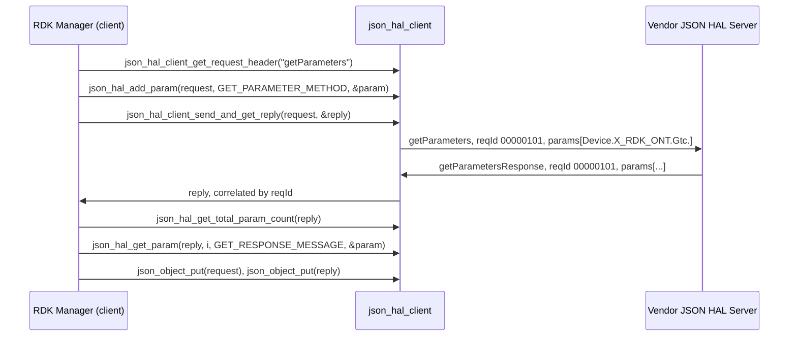
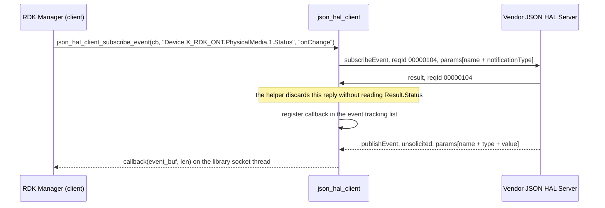

# GPON HAL Detailed Parameter Reference

This document is the per-parameter reference for the `GPON` `JSON` HAL. It stands to the two shipped
schema files as inline `Doxygen` documentation stands to a C header: for every parameter the contract
declares, it gives the `TR-181` path, the wire datatype, the value constraint, the access the server
enforces and the meaning the schema states. The interface overview — architecture, initialization,
threading, memory, blocking behaviour and the non-functional requirements — is in
[halSpec.md](halSpec.md) and is not repeated here.

## Purpose and how to read it

**Two contracts ship, and this document covers both.** `hal_schema/gpon_hal_schema.json` declares 90
parameter definitions and `hal_schema/gpon_wan_unify_hal_schema.json` declares 95. The second is a
strict superset: it removes nothing, changes nothing, and adds five `PhysicalMedia` definitions. A
build loads exactly one of the two, chosen at compile time, so the tables below present the union and
mark each variant-only definition rather than duplicating 90 rows. Where a definition exists in both,
its `name`, `type`, `value` constraint and `description` are byte-identical between the two files —
verified by a definition-level comparison — so there is no per-variant divergence to carry for any
shared key, and any row not marked `wan_unify` only applies unchanged to both.

**Where every fact in this document comes from.** The schema files are the authority for the
parameter surface and are read-only here: a defect in one is recorded in `Contract Defects` and not
repaired, because the schemas are the contract and downstream consumers may already depend on them.
The client configuration files under `config/` are the authority for the deployment contract. The
manager source under `source/TR-181/` is the authority for how one specific caller uses the
interface. The transport is
[`json-hal-library` at commit `86a0a300b976f8e3295064af8fb3fd1c793c9e64`](https://github.com/rdkcentral/json-hal-library/tree/86a0a300b976f8e3295064af8fb3fd1c793c9e64),
cited by pinned revision throughout because the manager repositories are independent checkouts in
which a relative path would not resolve. Where none of those establishes a behaviour, this document
says so in as many words rather than filling the gap: a downstream test author writes assertions
against what this document claims, so a stated gap is more useful than a confident guess.

**How the rest of the document is arranged.** `Transport and Protocol` and `Deployment contract`
answer what a message must look like and where it goes. `Object Index` and `Parameter Reference` are
the reference proper. `Enumeration Appendix` collects the closed value sets. `Worked Message
Examples` gives one complete exchange per protocol workflow, each validated against the schema it
claims. `Contract Defects` records what is wrong with the shipped contract, `Error Handling` what a
caller does about a refusal, and `Event Model` how the asynchronous path works and where the pinned
transport diverges from the schema on it.

**One verification limit applies throughout.** `GPON` is not available on the `HUB6` or `XER10`
reference platforms [the superproject README, lines 102-103], so nothing here has been confirmed by
running the HAL. Every statement is derived from a shipped artefact, and each carries the locator
that establishes it.

*Derived from `hal_schema/gpon_hal_schema.json`, `hal_schema/gpon_wan_unify_hal_schema.json`,
`config/gpon_manager_conf.json`, `source/TR-181/middle_layer_src/gponmgr_dml_hal.c` and the pinned
transport revision cited above.*

## Transport and Protocol

### The envelope

Every message in either direction carries the same four **required** fields. Three of them are bound
to a definition; `reqId` is declared inline on the schema root.

| Field | Bound to | Form | Set by |
| --- | --- | --- | --- |
| `module` | `moduleName` | `string`, `const` `gponhal` | Read by the client out of the deployed schema file |
| `version` | `schemaVersion` | `string`, `const` `0.0.1` | Read by the client out of the deployed schema file |
| `action` | `action` | `string`, one of the eleven members below | The caller, per request |
| `reqId` | declared inline | `string` matching `^[0-9]+$` | The client library, one per request header |

**Those four are the required set, not the whole message.** Neither schema root declares
`additionalProperties: false`, so a message carrying members beyond the four required fields and the
payload its action binds still validates. That is a property of the contract rather than an
invitation: a caller should send only what an action binds, and a server must not depend on an
unknown member being rejected for it. Verified by instance validation — a `result` message carrying
an additional top-level member validates against both schemas.

<b>`reqId` is a client-side counter zero-padded to *at least* eight digits, and its two
representations differ.</b> The client formats it with `sprintf(id, "%8.8d", req_id)` into a
seventeen-byte buffer
[[`json_hal_client.c:849,852`](https://github.com/rdkcentral/json-hal-library/blob/86a0a300b976f8e3295064af8fb3fd1c793c9e64/json_hal_client.c)].
`%8.8d` is a minimum field width of eight with a precision of eight, so it pads a shorter value to
eight characters but does **not** truncate a longer one: while the counter — which starts at `100`
[`json_rpc_common.h:89`] and increments once per request header [`json_hal_client.c:959-966`] — is
below `100000000` the identifier is eight characters, and above it the identifier is nine and then
ten. The first request of a fresh process carries `"00000101"`. **Eight is therefore the padded
minimum, not a fixed width**, and every emitted form satisfies the envelope's `^[0-9]+$` constraint,
which imposes no length bound of its own. The counter's growth is defined only while its value remains
representable in the `static int` behind it: the reset guard at
[`json_hal_client.c:962-963`](https://github.com/rdkcentral/json-hal-library/blob/86a0a300b976f8e3295064af8fb3fd1c793c9e64/json_hal_client.c#L962-L963)
is unreachable in defined arithmetic and the increment past `INT_MAX` is signed overflow, so no
identifier may be asserted beyond that boundary — [halSpec.md](halSpec.md)'s `Persistence Model` states the three
cases. The receive path, however, parses the value
with `strtol(..., 16)` — base **16** — on both the send and the match side
[same file, `:646` and `:485`]. For the decimal digits `0`-`9` the two agree on every value the
counter emits, so correlation works; a server that answered with a `reqId` containing a hexadecimal
letter would be parsed differently from how it was written. A server must echo the identifier it was
sent, unchanged, and must not renumber it.

<b>`reqId` is unbounded in the schema and bounded at 63 usable bytes in the pinned server.</b> Neither
file places a `maxLength` on it — the whole constraint is `{"type": "string", "pattern": "^[0-9]+$"}`
— so an identifier of any length validates. The server stores it in fixed 64-byte arrays: a local
`char req_id[BUF_64]` in the request handler
[[`json_hal_server.c:328`](https://github.com/rdkcentral/json-hal-library/blob/86a0a300b976f8e3295064af8fb3fd1c793c9e64/json_hal_server.c)]
and the first member of the per-subscription `event_subscription_msg_status_t` [same file, `:70`],
`BUF_64` being `64` [`json_rpc_common.h:84`]. All three fills use the **non-terminating**
`strncpy(dst, json_object_get_string(returnObj), sizeof(dst))` shape — unconditionally at
`json_hal_server.c:383` in the request handler, and under `JSON_BLOCKING_SUBSCRIBE_EVENT` at `:777`
and `:1007` into the stored `last_msg.req_id` — so a source of 64 bytes or more is copied without a
`NUL`, and the subscription match at `:427` (`strlen` on that array, same build) and the unguarded
record copy at `:609` (bare `strcpy` between two of them) then read past its end. **63 bytes is
therefore the longest `reqId` that survives the server intact.** A server must validate presence,
pattern and a length of at most 63 bytes before dispatching on the value — presence included, because
under `JSON_BLOCKING_SUBSCRIBE_EVENT` the absent-`reqId` path only logs and still passes the null
object to `json_object_get_string()` [same file, `:772-777`]. Every `reqId` in the examples below is
well inside the bound, and the shipped client cannot exceed it; a caller building its own envelope
can, and must not.

*Derived from `properties` and `definitions.moduleName`, `definitions.schemaVersion` in both files
under `hal_schema/`, `json_hal_client.c:485,646,848-858,959-966` and
`json_hal_server.c:70,328,383,427,609,772-777,1007` with `json_rpc_common.h:84,89` at
pinned `json-hal-library` commit `86a0a300`.*

### Message boundaries

**Nothing frames a message on this transport, so every example in this document must fit in one
read.** There is no length prefix and no delimiter in either direction: each side depends on a single
`recv()` returning one complete `JSON` document into a 16384-byte buffer
[[`json_rpc_common.h:87`](https://github.com/rdkcentral/json-hal-library/blob/86a0a300b976f8e3295064af8fb3fd1c793c9e64/json-rpc-common/json_rpc_common.h)].
The server reads once per readable descriptor and does not accumulate
[[`tcp_server.c:217-263`](https://github.com/rdkcentral/json-hal-library/blob/86a0a300b976f8e3295064af8fb3fd1c793c9e64/tcp_server.c)];
the client accumulates only while a read fills the buffer, and it decides that from **buffer
occupancy** — whether *this* read came back full — rather than from `JSON` completeness
[[`tcp_client.c:188-234`](https://github.com/rdkcentral/json-hal-library/blob/86a0a300b976f8e3295064af8fb3fd1c793c9e64/tcp_client.c)].
The `recv()` at `:188` is issued with `MAX_BUFFER_SIZE` as its length, so the `rc >= MAX_BUFFER_SIZE`
test at `:191` can be satisfied only by a full buffer.

Four consequences bear directly on how a message in this document should be sized, and
[halSpec.md](halSpec.md) states them in full under `Memory Model`. The first two are the two
directions of the same occupancy condition and neither is safe to quote without the other:

- **Any read that leaves room in the buffer is parsed on the spot**, as though the document were
  complete. So a message below 16384 bytes is **not** guaranteed to arrive whole — 500 bytes and
  16383 bytes are treated identically — and a split delivery hands truncated `JSON` to the parser at
  any size.
- **A reply is never parsed at all only where every read in its sequence came back full.** That is a
  property of how `TCP` delivered the bytes, not one derivable from the serialized length: an exact
  multiple of 16384 bytes is the length at which such a sequence can run to the end of a message, but
  a single short read anywhere in it sends the accumulator to the parser instead. It is a hazard to
  design against, not an outcome to predict from a size.
- **While that state persists the client's idle callback is suppressed** [`tcp_client.c:251`], and
  that callback is what ages pending requests, so the synchronous wait in `Error Handling` runs with
  no timer beneath it. [halSpec.md](halSpec.md) gives the chain.
- **The accumulator is `NUL`-delimited rather than length-delimited**, because each append copies a
  fixed `MAX_BUFFER_SIZE` bytes at an offset computed with `strlen()`.

**A bulk read should therefore be scoped so the `getParametersResponse` it provokes stays comfortably
inside the buffer** — the practical constraint on the object-prefix reads `Object Index` describes —
which reduces the number of reads the reply needs and so the number of chances to split, without
making whole delivery a guarantee at any size. A failed exchange must be treated as possibly a
truncation rather than as a refusal.

*Derived from `json_rpc_common.h:87`, `tcp_client.c:167-251` and `tcp_server.c:217-263` at pinned `json-hal-library`
commit `86a0a300`.*

### The action vocabulary

`definitions.action` declares exactly eleven members, identical in both files and in this order:
`getSchema`, `getParameters`, `getParametersResponse`, `setParameters`, `subscribeEvent`,
`getActiveSubscriptions`, `getActiveSubscriptionsResponse`, `getSchemaResponse`, `publishEvent`,
`deleteObject`, `result`.

**There is no `setParametersResponse`.** This is the single most commonly mis-stated fact about this
protocol, so it is stated plainly rather than left to be inferred from a table: a write is
acknowledged by the generic <b>`result`</b> action carrying `Result.Status`. A caller waiting for an
action named symmetrically with `setParameters` waits for a message this contract does not define.
`result` is consequently the reply in more than one workflow — it answers `setParameters` and
`subscribeEvent`. It is **not** stated to be the reply to `deleteObject`: that action cannot be
instantiated under either shipped schema, and nothing in the schemas or the transport specifies what
a server should answer to a message that cannot exist, so this document does not assert a mapping
for it.

**The transport names only seven of the eleven actions as macros**, which matters to an implementer
reaching for a constant. `json_rpc_common.h` defines `JSON_RPC_ACTION_GET_PARAM`,
`JSON_RPC_ACTION_GET_PARAM_RESPONSE`, `JSON_RPC_ACTION_RESULT`, `JSON_RPC_ACTION_GET_SCHEMA` and
`JSON_RPC_ACTION_GET_SCHEMA_RESPONSE`
[[`json_rpc_common.h:77-81`](https://github.com/rdkcentral/json-hal-library/blob/86a0a300b976f8e3295064af8fb3fd1c793c9e64/json-rpc-common/json_rpc_common.h)],
plus `JSON_RPC_SUBSCRIBE_EVENT_ACTION_NAME` and `JSON_RPC_PUBLISH_EVENT_ACTION_NAME` [same file,
`:58-59`]. There is **no** macro for `setParameters`, `getActiveSubscriptions`,
`getActiveSubscriptionsResponse` or `deleteObject`, so a caller passes those four as literal strings —
GponManager does exactly that, defining its own `SET_PARAMETER_METHOD`
[`source/TR-181/middle_layer_src/gponmgr_dml_hal.h:37`]. The status macros are likewise partial:
`JSON_RPC_STATUS_SUCCESS`, `JSON_RPC_STATUS_FAILED` and `JSON_RPC_STATUS_NOT_SUPPORTED` exist [same
file, `:72-75`] and `Invalid Argument` has none — its string is absent from the pinned library
altogether, so no transport code path can emit it and any occurrence on the wire comes from the vendor.

*Derived from `definitions.action` in both files under `hal_schema/`;
`json_rpc_common.h:58-59,72-75,77-81` at pinned `json-hal-library` commit `86a0a300`; and
`source/TR-181/middle_layer_src/gponmgr_dml_hal.h:37`.*

### Payload binding per action

Eight of the eleven actions bind a payload through one of the schema root's eight `allOf` branches.
Three bind nothing.

| Action | Originated by | Payload the schema requires | Required members of each `params` entry |
| --- | --- | --- | --- |
| `getSchema` | Client | none — no payload binding | not applicable |
| `getParameters` | Client | `params`, array, minimum 1 item, items unique | `name` |
| `getParametersResponse` | Server | `params`, array, minimum 1 item, items unique | `name`, `type`, `value` |
| `setParameters` | Client | `params`, array, minimum 1 item, items unique | `name`, `type`, `value` |
| `subscribeEvent` | Client | `params`, array, minimum 1 item, items unique | `name`, `notificationType` |
| `getActiveSubscriptions` | Client | none — no payload binding | not applicable |
| `getActiveSubscriptionsResponse` | Server | none — no payload binding | not applicable |
| `getSchemaResponse` | Server | `SchemaInfo`, object, `FilePath` required | not applicable |
| `publishEvent` | Server | `params`, array, minimum 1 item, items unique | `name`, `type`, `value` |
| `deleteObject` | Client | `params` — **uninstantiable**; see `Contract Defects` | `name`, but no value satisfies it |
| `result` | Server | `Result`, object, `Status` required | not applicable |

<b>"No payload binding" is not the same as "sent as a bare envelope."</b> The schema binds no payload to
`getSchema`, `getActiveSubscriptions` or `getActiveSubscriptionsResponse`, so a bare four-field
envelope validates for all three. But the transport's own header helper,
`json_hal_client_get_request_header()`, attaches an **empty `params` array** whenever
`strncmp(action_name, "getSchema", strlen("getSchema")) != 0`
[[`json_hal_client.c:865-870`](https://github.com/rdkcentral/json-hal-library/blob/86a0a300b976f8e3295064af8fb3fd1c793c9e64/json_hal_client.c),
with the action name at `json_rpc_common.h:80`]. **That is a prefix test, not an exact match**, so the
array is withheld from every action name beginning with those nine characters — here both `getSchema`
and `getSchemaResponse` — and attached to the other nine, `getActiveSubscriptions` and
`getActiveSubscriptionsResponse` included. So a `getActiveSubscriptions` built with that helper and
sent without appending to the array travels as the four fields **plus** `"params": []`. Both forms
validate, because the root permits the extra member and no `allOf` branch constrains `params` for that
action. Three consequences a caller must plan for: the array the helper creates has to be appended to
before sending any action that *does* bind a payload, since `minItems` is 1 and an empty array fails
validation; a server must accept an empty `params` array on the three unbound actions, because the
standard client produces one for two of the three; and on a `getSchema` or `getSchemaResponse` message
`json_hal_add_param()` returns `RETURN_ERR`, because it looks the array up and fails when it is absent
[`json_hal_common.c:161,213-215`], so a payload for either must be attached with plain `json-c` calls
— which is what the schema wants regardless, `getSchemaResponse` binding `SchemaInfo` and not `params`.

**The two payload objects, and what forbids extension in them.** `Result` carries a single `Status`
property with `additionalProperties: false`, and `SchemaInfo` a single `FilePath` property with
`additionalProperties: false` and the pattern `^(.+)/([^/]+)$`, which requires an absolute or at
least directory-qualified path — a bare filename does not validate.

*Derived from the eight `allOf` branches and `definitions.result`, `definitions.getSchemaResponse`,
`definitions.getParameters`, `definitions.setParameters`, `definitions.getParametersResponse`,
`definitions.subscribeEvent`, `definitions.publishEvent` in both files under `hal_schema/`, and
`json_hal_client.c:859-869` at pinned `json-hal-library` commit `86a0a300`.*

### Parameter entry shapes

A `params` entry names a `TR-181` path in `name` and, depending on the action, carries `type`,
`value` and `notificationType`. Which entries are legal for a given action is decided by an `anyOf`
over a named list rather than by a free-form shape, and that is what makes the surface closed:

| Action | Entry must satisfy | Which means |
| --- | --- | --- |
| `getParameters`, `getParametersResponse` | `getParameterSupportedList` or `getParameterOptionalList` | Any of the 90 parameters or any of the 26 objects — 95 parameters in the variant. `getParametersResponse` additionally requires `type` and `value`, which excludes `ontPhysicalMediaAlarmObj`; see `The validation boundary` |
| `setParameters` | `setParameterSupportedList` or `setParameterOptionalList` | The 8 writable parameters, or 11 in the variant. The optional list is empty; see `Contract Defects` |
| `subscribeEvent`, `publishEvent` | `subscribeEventSupportedList` | Exactly the 18 subscribable parameters, identical in both variants |
| `deleteObject` | an empty `anyOf` | Nothing. The action is uninstantiable |

A leaf parameter definition declares `name`, `type` and `value`, and 89 of the 90 forbid any other
member with `additionalProperties: false`. A subscribable parameter declares a fourth property,
`notificationType`. An object definition declares `name` alone. The one parameter and the 25 objects
that omit `additionalProperties: false` are recorded in `Contract Defects`, and they are the reason a
boundary verdict on this interface is **not** uniform: whether an unknown member, a `null` value or a
wrong `type` label is rejected depends on which of four definition kinds the entry's `name` resolves
to. `The validation boundary` gives those four kinds and the verdict for each.

*Derived from `definitions.getParameterSupportedList`, `definitions.getParameterOptionalList`,
`definitions.setParameterSupportedList`, `definitions.setParameterOptionalList`,
`definitions.subscribeEventSupportedList` and every parameter and object definition in both files
under `hal_schema/`.*

### The validation boundary

**Nobody on this interface validates an inbound message against the deployed schema.** That is the
single most important fact in this section, and it is not what a reader of a schema-defined contract
expects, so it is given with its evidence before the per-action detail:

- **The client validates nothing at all.** `json_hal_client_init()` calls `json_hal_load_config()`
  and wires the socket callbacks; it initialises no validator
  [[`json_hal_client.c:190-214`](https://github.com/rdkcentral/json-hal-library/blob/86a0a300b976f8e3295064af8fb3fd1c793c9e64/json_hal_client.c)].
  Neither a reply nor an inbound `publishEvent` is checked against the schema before the value is
  handed to the caller.
- **The server validates one thing, conditionally.** `json_hal_server_init()` calls into the
  schema-validator wrapper's `json_validator_init`
  [`json-schema-validator-wrapper/json_schema_validator_wrapper.h:42`] only under the
  `JSON_SCHEMA_VALIDATION_ENABLED` compile guard
  [[`json_hal_server.c:281-283`](https://github.com/rdkcentral/json-hal-library/blob/86a0a300b976f8e3295064af8fb3fd1c793c9e64/json_hal_server.c)],
  and the one call to the validator checks the **reply the server itself just generated**, replacing
  it with a `Not Supported` result if it fails [same file, `:496-512`]. An inbound **request** is
  never validated against the schema on either side.
- **The schema root accepts unknown members.** Neither file declares `additionalProperties: false`
  at the root, so even a validator would not reject an unexpected top-level member.

The practical consequence is that schema conformance on this interface is a **testing and
implementation obligation**, not a runtime guarantee. A caller that needs a malformed reply or a
malformed event to be rejected must validate it itself, against the schema file its configuration
names; `Event Model` states where that obligation is sharpest.

**A `params` entry's verdict depends on which definition its `name` resolves to, so the strictness of
this contract is not uniform.** Every action binds `params` through an `anyOf` over one or two named
lists, and the definitions reachable from those lists fall into four kinds. The kinds are given first,
because a verdict quoted without its definition kind is wrong about half the surface:

| Definition kind | How many | What the definition declares | What it therefore rejects |
| --- | --- | --- | --- |
| Closed leaf | 89 of 90 parameters; 94 of 95 in the variant | `name`, `type` and `value`, with `additionalProperties: false` | An unknown member; a `null` `value`; a `type` label other than its `const`; a value outside its constraint |
| Open leaf | `ontTR69url` alone, in both files | the same three, **without** `additionalProperties: false` | A `null` `value` and a wrong `type` label — but **not** an unknown member |
| Open object | 25 of the 26 object definitions | `name` alone, no `additionalProperties: false` | Nothing beyond its `name` pattern. `type`, `value` and any further member are unconstrained, so a `null` value and a nonsense `type` label both validate |
| Closed object | `ontPhysicalMediaAlarmObj` alone | `name` alone **with** `additionalProperties: false` | Every member except `name` — so this prefix cannot appear in any action whose entry requires `type` and `value` |

The action-level `required` list applies on top of all four, because it is set by the action rather
than by the definition. An entry in a `getParametersResponse`, `setParameters` or `publishEvent`
message must therefore carry `name`, `type` and `value` even where the definition it resolves to
constrains none of them — and that combination is what makes `ontPhysicalMediaAlarmObj` unusable in a
response, since the action requires two members the definition forbids.

**What the schema does and does not decide, per boundary condition.** Each row states the schema
verdict per referenced definition kind — established by validating instances against
`hal_schema/gpon_hal_schema.json` — and then what actually happens at runtime, which is a different
question because nothing validates.

| Condition | Schema verdict, by referenced definition | Runtime behaviour |
| --- | --- | --- |
| `value` present but `null` | **Invalid** against either leaf kind: every leaf constrains `value` by type. **Valid** against an open object, where `value` is an unconstrained extra member | Not specified by this interface. Nothing rejects it, and a caller reading it with `json_hal_get_param()` receives whatever that helper makes of a null node |
| A required member of a `params` entry missing | **Invalid for all four kinds.** `required` is set by the action: `name` for `getParameters` and `deleteObject`, `name`/`type`/`value` for `setParameters`, `getParametersResponse` and `publishEvent`, `name`/`notificationType` for `subscribeEvent` | Nothing rejects it. For a missing `value` the extraction helper's outcome is **asymmetric by datatype** and is specified exactly — see `Missing value: five datatypes fail silently` below |
| `params` present but an empty array | Invalid for every action that binds `params`, because each branch sets `minItems: 1`. Valid for the three actions with no binding, which is what the client's header helper produces for two of them | Not specified. The empty array reaches the peer |
| Two `params` entries naming the **same parameter** with different content | **Valid.** `uniqueItems` compares whole entry objects, not the `name` member, so it rejects only a byte-identical repeat. A two-entry `setParameters` on `Device.X_RDK_ONT.PhysicalMedia.1.RxPower.SignalLevelLowerThreshold` carrying `-30` and `-25` validates, as does the equivalent `getParametersResponse` pair, and a `subscribeEvent` naming `Device.X_RDK_ONT.PhysicalMedia.1.Status` twice with `interval` and `onChange`. Only `getParameters` and `deleteObject` are protected, and only incidentally: their entry is `name` alone, so two entries naming one parameter are necessarily identical | **Not specified, and not reported.** `result` carries one `Status` for the whole message rather than one per entry, so a caller cannot learn which value was applied — see the note below the per-action table |
| An unknown member alongside the four required envelope fields | Valid. The root declares no `additionalProperties: false` | Not specified by this interface. Nothing rejects the member, and no code path in the pinned transport reads a member it does not expect |
| An unknown member inside a `params` entry | **Invalid** against a closed leaf and against `ontPhysicalMediaAlarmObj`. **Valid** against `ontTR69url` and against all 25 open object definitions, which omit `additionalProperties: false` — see `Contract Defects` | Not specified |
| A `type` label that disagrees with the parameter's declared datatype | **Invalid** against either leaf kind, which binds `type` to a `const`. **Valid** against any object definition, which declares no `type` at all | Not specified. The label is informational on the wire; nothing cross-checks it against the value |
| A value outside the parameter's constraint | **Invalid** against a leaf, **except** for `PonMode` and `Connector`, whose enumeration reference is inert. **Unconstrained** against an open object, which declares no `value` at all — see `Contract Defects` | Not specified |
| `reqId` sent as a `JSON` number rather than a string | Invalid. The envelope requires `string` | Correlation still works on the client, which stringifies before parsing, but the message does not conform. The pinned server's publish helper does exactly this; see `Event Model` |

**Per-action summary, naming the definition kinds each action can reach**, so an implementer can read
one row rather than reason from the general rules. The two read actions are the only ones that reach
anything other than a closed leaf, which is why they are the only ones whose verdicts are conditional:

| Action | Definition kinds its `anyOf` can reach | Empty `params` array | Unknown member, `null` value or wrong `type` in an entry |
| --- | --- | --- | --- |
| `getSchema` | none — binds no `params` | Valid; the helper sends no array for this action | not applicable |
| `getParameters` | all four — 89 closed leaves (94 in the variant), `ontTR69url`, 25 open objects, `ontPhysicalMediaAlarmObj` | **Invalid** — `minItems: 1` | Only `name` is required here, so the question is the unknown member alone: **rejected** against a closed leaf or `ontPhysicalMediaAlarmObj`, **accepted** against `ontTR69url` or any of the 25 open objects |
| `getParametersResponse` | the same four | **Invalid** — `minItems: 1` | **Rejected** against a closed leaf; an unknown member is **accepted** against `ontTR69url`, and an unknown member, a `null` value and a wrong `type` label are all **accepted** against an open object. `ontPhysicalMediaAlarmObj` cannot appear at all, because the action requires `type` and `value` and the definition forbids both |
| `setParameters` | closed leaves only — 8, or 11 in the variant | **Invalid** — `minItems: 1` | Rejected in every case |
| `subscribeEvent` | closed leaves only — the 18 members of `subscribeEventSupportedList`, but only **2 of the 18 can form a valid message at all**; see `Event Model` | **Invalid** — `minItems: 1` | Rejected in every case |
| `publishEvent` | closed leaves only — the same 18, every one of which can form a valid message | **Invalid** — `minItems: 1` | Rejected in every case |
| `deleteObject` | none — its `anyOf` is empty, so no entry can validate | Invalid, as is every other form of this action | Invalid, as is every other form |
| `getActiveSubscriptions` | none — binds no `params` | Valid; the helper sends `"params": []` | not applicable |
| `getActiveSubscriptionsResponse` | none — binds no `params` | Valid | not applicable |
| `getSchemaResponse` | not applicable — carries `SchemaInfo` | not applicable, and the client helper sends no array for this name either: its exclusion is a prefix test on `getSchema` | `SchemaInfo` sets `additionalProperties: false`, so rejected |
| `result` | not applicable — carries `Result` | not applicable | `Result` sets `additionalProperties: false`, so rejected |

**One parameter may be named more than once in a single message, and nothing in this contract decides
what that means.** The boundary table above records the verdict; what it costs a caller is worth stating
separately, because `uniqueItems` reads at a glance like a guarantee that it is not. The schema does not
order `params`, states nowhere that a later entry supersedes an earlier one, and acknowledges a write
with a single `Result.Status` for the whole message rather than one status per entry. So where two
entries name one parameter with different values, a caller cannot establish from the contract or from
the reply which value was applied, whether both were applied in sequence, or whether the server took
the message as a whole and rejected it. Three obligations follow. A **caller** de-duplicates `params` by
`name` before dispatch and does not use entry order to express intent. A **vendor** settles the
behaviour deliberately and records it outside this contract, rather than assuming a validating message
carries at most one value per parameter. And a **test author** does not read schema validity as
semantic well-formedness on this surface: a positive case generated by mutating one entry of a
multi-entry array can validate while asserting nothing about what the server did.

### Missing value: five datatypes fail silently

**When a `params` entry omits `value`, `json_hal_get_param()` reports failure for three datatypes and
success for five, and the success cases are indistinguishable from a genuine zero.** This is the one
place on this interface where "what actually happens" is fully determined, and it is the opposite of
safe. The helper zeroes the caller's `hal_param_t` on entry
[[`json_hal_common.c:38`](https://github.com/rdkcentral/json-hal-library/blob/86a0a300b976f8e3295064af8fb3fd1c793c9e64/json_hal_common.c)]
and then dispatches on the entry's `type` label:

| Entry's `type` label | Result when `value` is absent |
| --- | --- |
| `string`, `hexBinary`, `base64` | `RETURN_ERR` — each arm has an `else` that returns [same file, `:72-74,81-83,90-92`] |
| `boolean`, `int`, `unsignedInt`, `long`, `unsignedLong` | <b>`RETURN_OK`.</b> Those five arms have no `else` [`:95-129`], so `param->value` keeps the empty string from the `memset` while `param->type` is set as though a value had been read |
| any label matching none of the eight | <b>`RETURN_OK`</b> with the struct still fully zeroed: the `if`/`else if` chain ends and control falls to the `break` [`:129-134`] and then to `return RETURN_OK` [`:141`] |
| any label, under the publish action | <b>`RETURN_OK`</b> with the struct fully zeroed — `PUBLISHEVENT_RESPONSE_MESSAGE` shares the `default` arm, which logs and breaks without reading anything [`:135-138`] |

**So the return code is not a sufficient check, and three direct checks are required instead.** First,
before extracting, confirm with `json_object_object_get_ex()` that the entry actually carries `name`,
`type` and `value` — the action's `required` list says it must, and nothing enforces that at runtime.
Second, after extracting, test `param->type` for membership of `eParamType`: a value of `0` is
outside the enumeration, whose first member is `PARAM_BOOLEAN = 1`
[[`json_hal_common.h:57-67`](https://github.com/rdkcentral/json-hal-library/blob/86a0a300b976f8e3295064af8fb3fd1c793c9e64/json_hal_common.h)],
and it is the **only** signal the helper gives for the unknown-label and publish cases. Third, test
`param->value` for emptiness where a value was required, because an empty numeric string later
converted with `atoi()`, `atol()` or `atoll()` yields `0` — so a missing counter reads as a counter
of zero and no layer reports the difference.

This is also why `GPON`'s own event path does not use this helper: GponManager parses the `publishEvent`
message in its own internal splitter, `get_event_param`
[`source/TR-181/middle_layer_src/gponmgr_dml_hal.c:302-363`], which returns failure when `name` or
`value` is absent [same file, `:338-343,350-355`] — the check the helper's publish arm does not make.

**Two worked cases, so the difference is not left as an inference.** Under `getParametersResponse`,
the entry `{"name": "Device.X_RDK_ONT.PhysicalMedia.1.", "type": "unsignedLong", "value": null,
"extra": 1}` **validates**: the name resolves to an open object definition, which constrains only the
name, while the action's own `required` list is satisfied by the presence of `type` and `value`
whatever they contain. Substituting the closed leaf `Device.X_RDK_ONT.Gtc.CorrectedFecBytes` for that
prefix makes the same entry **fail** on the unknown member and on the `null` value together. And
`{"name": "Device.X_RDK_ONT.PhysicalMedia.1.Alarm.", "type": "unsignedLong", "value": 1}` **fails**
under `getParametersResponse` while `{"name": "Device.X_RDK_ONT.PhysicalMedia.1.Alarm."}` **validates**
under `getParameters` — the closed object is readable by prefix and unrepresentable in a response.

**Date, time and encoding.** No parameter in either schema declares a date, a time, a timestamp or a
duration datatype: the five datatypes in use are `string`, `int`, `unsignedInt`, `unsignedLong` and,
in the variant only, `boolean`. `LastChange` in the variant is an elapsed-seconds counter typed
`unsignedInt`, not a timestamp. There is consequently no date or time format to specify and none is
invented here. Two encoding facts do apply: `Device.X_RDK_ONT.Ploam.SerialNumber` constrains its
value to the pattern `^([a-fA-F0-9]{2})+$` with a maximum length of 128, so it is transported as an
even-length hexadecimal string rather than as raw bytes; and the transport recognises the wider
datatype vocabulary `long`, `hexBinary` and `base64`
[[`json_rpc_common.h:61-68`](https://github.com/rdkcentral/json-hal-library/blob/86a0a300b976f8e3295064af8fb3fd1c793c9e64/json-rpc-common/json_rpc_common.h)]
which no `GPON` parameter declares, so a message using one of those labels names a datatype this
contract does not.

**Numeric fidelity: both unsigned datatypes cross the transport through signed accessors, and nothing
range-checks them.** 46 of the 90 base parameters and 47 of the 95 variant parameters are `unsignedInt`
or `unsignedLong`, so this applies to the largest datatype group in the contract. What the transport
does is fixed at the pin; what a **non-representable** value becomes is a property of the `json-c`
build rather than of this contract, and the two are separated below because a test written against the
second is not portable.

**Fixed at the pin.** `json_hal_get_param()` selects an arm by prefix-comparing the entry's `type`
label, so the arm follows the label rather than the JSON value's own type. The `unsignedInt` arm
applies `json_object_get_int()`
[[`json_hal_common.c:111`](https://github.com/rdkcentral/json-hal-library/blob/86a0a300b976f8e3295064af8fb3fd1c793c9e64/json_hal_common.c#L111)],
formats with `"%d"`
[[`:112`](https://github.com/rdkcentral/json-hal-library/blob/86a0a300b976f8e3295064af8fb3fd1c793c9e64/json_hal_common.c#L112)]
and labels the struct `PARAM_UNSIGNED_INTEGER`
[[`:114`](https://github.com/rdkcentral/json-hal-library/blob/86a0a300b976f8e3295064af8fb3fd1c793c9e64/json_hal_common.c#L114)];
the `unsignedLong` arm uses `json_object_get_int64()` with `"%ld"`
[[`:123-128`](https://github.com/rdkcentral/json-hal-library/blob/86a0a300b976f8e3295064af8fb3fd1c793c9e64/json_hal_common.c#L123-L128)].
On construction, `json_hal_add_param()` uses `atoi()` for `int`, `atol()` for `long` and <b>`atoll()`
for both unsigned datatypes</b>, wrapping the result with `json_object_new_int()` for `unsignedInt` — a
32-bit signed container — or `json_object_new_int64()` for `unsignedLong`
[[`json_hal_common.c:190-209`](https://github.com/rdkcentral/json-hal-library/blob/86a0a300b976f8e3295064af8fb3fd1c793c9e64/json_hal_common.c#L190-L209)].
Both numeric extraction arms write through `snprintf()` bounded by `sizeof(param->value)`, so a numeric
value is bounded and `NUL`-terminated. The non-terminating `strncpy(dest, src, sizeof(dest))` at
[`json_hal_common.c:51,61,70,79,88`](https://github.com/rdkcentral/json-hal-library/blob/86a0a300b976f8e3295064af8fb3fd1c793c9e64/json_hal_common.c#L51-L88),
and with it the 255-byte `name` and 2047-byte `value` usable limits that `Read parameters` sets out
against `hal_param_t`
[[`json_hal_common.h:84-89`](https://github.com/rdkcentral/json-hal-library/blob/86a0a300b976f8e3295064af8fb3fd1c793c9e64/json_hal_common.h#L84-L89)],
belong to the `string`, `hexBinary` and `base64` arms and not to these two.

**The label mismatch, which holds on every build and needs no version qualification.** `"%d"` takes an
`int` while the argument is an `unsigned int`, and `"%ld"` takes a `long` while the argument is an
`unsigned long`. So `hal_param_t.value` is filled by a **signed** conversion while `param->type`
announces `PARAM_UNSIGNED_INTEGER` or `PARAM_UNSIGNED_LONG`: the label and the formatting that produced
the digits disagree, and a caller must treat the string as a decimal to re-validate rather than as a
rendered unsigned value.

**Version-qualified, because the contract pins no `json-c`.** Both accessors return signed types,
`int32_t` and `int64_t`, so a JSON number outside that range has to be converted and the conversion
belongs to the linked `json-c`. [halSpec.md](halSpec.md)'s `Build Requirements` records the two revisions this
interface names: <b>`json-c (0.11)` as the declared minimum</b> [`json-hal-library/README.md:56,140`] and
<b>`json-c-0.15-20200726` as the revision the upstream native build exercises</b>
[`json-hal-library/cov_docker_script/component_config.json:11`]. In both of those the accessor
**clamps** an out-of-range number to the nearest representable bound rather than wrapping it, so the
negative decimal string a wrap would produce does not arise there; another `json-c` may differ.
**No row in this document, and no generated test, may assert a particular converted value for an
out-of-range number.** The portable statement is only that the value which arrives may differ from the
value that was sent, and that detecting it is the caller's job.

**And two C-level facts stated as what they are rather than as outcomes.** Converting an out-of-range
value to a **signed** type is *implementation-defined* — which is what `json_object_new_int()` does
with an `unsigned int` above `INT32_MAX` — while converting to an **unsigned** type is a well-defined
modular reduction, which is what assigning an `atoll()` result into `unsigned int` does. `atoi()`,
`atol()` and `atoll()` signal no error at all: each returns `0` for a non-numeric string, stops
silently at the first non-numeric character, and is **undefined** when the value is not representable
in its return type. An overflowing input string therefore has no defined result to record, and none is
recorded here.

**So five checks belong to the caller, on every numeric entry, in both directions.** Confirm the string
is **wholly** consumed as a number rather than merely starting with digits; confirm the **sign** is
non-negative where the declared datatype is unsigned; confirm the value lies inside the **range** the
`Parameter Reference` row states for that path; confirm **enumeration membership** where the row names
an enumeration; and confirm the value fits the **width** of the declared datatype, because the schema
does not. That last check is the one a reader is most likely to think redundant: 44 of the 46
`unsignedInt` and `unsignedLong` definitions in the default schema and 45 of the 47 in the variant
declare a `minimum` with **no `maximum`**, and `PhysicalMedia.{i}.Bias.CurrentBias` declares neither
bound, so 45 of the 46 and 46 of the 47 carry no upper bound at all — `Device.X_RDK_ONT.Ploam.OnuId`,
bounded at 1022, is the only definition in either file that declares a `maximum`. A negative number
therefore validates against a parameter typed `unsignedInt`. Neither the schema nor the transport performs any of
the five at the point of extraction or construction, for the reason `The validation boundary` gives.

**Unsupported actions.** `deleteObject` is a member of the enumeration and cannot be instantiated,
so a caller must not send it and a vendor need not implement it beyond parsing the enumeration
member. There is no `addObject` and no unsubscribe action in the vocabulary at all: object instances
are created and destroyed by the vendor, and a subscription cannot be withdrawn through this
interface. Neither schema states what a server should answer to an action it does not implement;
`Not Supported` in a `result` is the value the enumeration provides for that purpose, and
`Error Handling` describes it.

*Derived from `json_hal_client.c:190-214`, `json_hal_server.c:281-283,496-512`,
`json_hal_common.c:26-141,95-220`, `json_hal_common.h:57-67`,
`source/TR-181/middle_layer_src/gponmgr_dml_hal.c:302-363`, `json_rpc_common.h:61-68`,
the `json-hal-library` README at lines 56 and 140, and
`json-hal-library/cov_docker_script/component_config.json:11` at pinned `json-hal-library` commit
`86a0a300`; the eight `allOf` branches, every parameter and object definition, a census of the `value`
constraint on every `unsignedInt` and `unsignedLong` definition, and `definitions.ontPloamSerialNumber`
in both files under `hal_schema/`; and instance validation of each condition above against
`hal_schema/gpon_hal_schema.json`. `json-c` accessor behaviour is attributed to the declared minimum
and the exercised revision, not to this contract, which pins neither.*

## Deployment contract

**Which contract a deployment speaks is decided in two steps, and the flag alone does not decide
it.** A reader told only about the compile flag cannot tell which schema their build loads, because
the flag selects a *configuration file* and the configuration file selects the schema.

| Step | Default build | `WAN_MANAGER_UNIFICATION_ENABLED` defined |
| --- | --- | --- |
| 1 — flag selects the configuration file | `/etc/rdk/conf/gpon_manager_conf.json` | `/etc/rdk/conf/gpon_manager_wan_unify_conf.json` |
| 2 — configuration names the schema | `/etc/rdk/schemas/gpon_hal_schema.json` | `/etc/rdk/schemas/gpon_wan_unify_hal_schema.json` |
| 2 — configuration names the port | `40100` | `40100` |
| Parameter definitions in that schema | 90 | 95 |
| Writable parameters | 8 | 11 |

Step 1 is `#if defined(WAN_MANAGER_UNIFICATION_ENABLED)` setting `GPON_MANAGER_CONF_FILE`
[`source/TR-181/middle_layer_src/gponmgr_dml_hal.c:57-61`], and that path is what the manager passes
to `json_hal_client_init()` [same file, `:111`]. Step 2 is the two configuration files themselves
[`config/gpon_manager_conf.json`, `config/gpon_manager_wan_unify_conf.json`], each of which carries
exactly two keys, `hal_schema_path` and `server_port`.

**Three consequences an integrator needs.** The port is `40100` in both builds, so a vendor server
cannot infer which variant it is serving from the port it was given. The schema file is a **runtime**
dependency of the client, not merely a design-time artefact: the client opens it and takes
`moduleName` and `schemaVersion` out of it, so it must exist and be readable at the configured path.
And because both variants declare the same `moduleName` `gponhal` and the same `schemaVersion`
`0.0.1`, a variant mismatch between the two sides is **not** detectable from the envelope — it
surfaces later as an unrecognised parameter name.

**The socket is loopback-only.** The client sets its host to `127.0.0.1` and takes only the port from
the configuration, so the server address is not configurable and both processes run on the same
device. A vendor server listens on `127.0.0.1:40100`; the listen backlog is 32.

*Derived from `source/TR-181/middle_layer_src/gponmgr_dml_hal.c:57-61,111`,
`config/gpon_manager_conf.json`, `config/gpon_manager_wan_unify_conf.json`, and `tcp_client.c`,
`tcp_server.c` at pinned `json-hal-library` commit `86a0a300`.*

## Object Index

**An object definition is a `name` and nothing else**, and its purpose is to make a *prefix* readable:
a `getParameters` entry naming an object path asks for that object's parameters in one round trip
rather than one request per leaf. There are 26 of them, identical in both shipped files.

**The one trap, and it decides whether a bulk read works.** A prefix is addressable only if it
satisfies an object definition's `name` constraint, and the 26 split 5 to 21 on how they express it.
Five definitions — the four singleton segments `Gtc.`, `Omci.`, `Ploam.` and `TR69.`, plus
`Ploam.RegistrationTimers.` beneath one of them — declare an exact `const`, so a request naming
`Device.X_RDK_ONT.Gtc.` validates as it stands. The other 21, covering the three instanced segments
`PhysicalMedia`, `Gem` and `Veip` and their sub-objects, declare an instance-indexed `pattern`
requiring `.{i}.`, so a request naming the bare `Device.X_RDK_ONT.PhysicalMedia.` does **not**
validate — only `Device.X_RDK_ONT.PhysicalMedia.1.` and its siblings do. GponManager nonetheless issues the bare
form for all seven segments [`source/TR-181/middle_layer_src/gponmgr_dml_hal.c:64-70,737-1165`], so
three of its seven bulk reads do not conform to the shipped schema; a vendor server that validates
inbound requests strictly would reject them. The shipped
`hal_schema/example_getParameters_msg.json` is an instance of the same case, and
`Worked Message Examples` publishes the conforming form.

In the `{i}` column below, `{i}` stands for the `\d+` the pattern requires, not for a literal
placeholder a caller may send.

| Object path | Definition key | `name` form | Addressable as a read prefix |
| --- | --- | --- | --- |
| `Device.X_RDK_ONT.Gem.{i}.` | `ontGemObj` | `pattern` `^Device\.X_RDK_ONT\.Gem\.\d+\.$` | per instance only |
| `Device.X_RDK_ONT.Gem.{i}.EthernetFlow.` | `ontGemEthernetFlowObj` | `pattern` `^Device\.X_RDK_ONT\.Gem\.\d+\.EthernetFlow\.$` | per instance only |
| `Device.X_RDK_ONT.Gem.{i}.EthernetFlow.Egress.` | `ontGemEthernetFlowEgressObj` | `pattern` `^Device\.X_RDK_ONT\.Gem\.\d+\.EthernetFlow\.Egress\.$` | per instance only |
| `Device.X_RDK_ONT.Gem.{i}.EthernetFlow.Egress.C-VLAN.` | `ontGemEthernetFlowEgressCVlanObj` | `pattern` `^Device\.X_RDK_ONT\.Gem\.\d+\.EthernetFlow\.Egress\.C-VLAN\.$` | per instance only |
| `Device.X_RDK_ONT.Gem.{i}.EthernetFlow.Egress.S-VLAN.` | `ontGemEthernetFlowEgressSVlanObj` | `pattern` `^Device\.X_RDK_ONT\.Gem\.\d+\.EthernetFlow\.Egress\.S-VLAN\.$` | per instance only |
| `Device.X_RDK_ONT.Gem.{i}.EthernetFlow.Ingress.` | `ontGemEthernetFlowIngressObj` | `pattern` `^Device\.X_RDK_ONT\.Gem\.\d+\.EthernetFlow\.Ingress\.$` | per instance only |
| `Device.X_RDK_ONT.Gem.{i}.EthernetFlow.Ingress.C-VLAN.` | `ontGemEthernetFlowIngressCVlanObj` | `pattern` `^Device\.X_RDK_ONT\.Gem\.\d+\.EthernetFlow\.Ingress\.C-VLAN\.$` | per instance only |
| `Device.X_RDK_ONT.Gem.{i}.EthernetFlow.Ingress.S-VLAN.` | `ontGemEthernetFlowIngressSVlanObj` | `pattern` `^Device\.X_RDK_ONT\.Gem\.\d+\.EthernetFlow\.Ingress\.S-VLAN\.$` | per instance only |
| `Device.X_RDK_ONT.Gtc.` | `ontGtcObj` | `const` | yes |
| `Device.X_RDK_ONT.Omci.` | `ontOmciObj` | `const` | yes |
| `Device.X_RDK_ONT.PhysicalMedia.{i}.` | `ontPhysicalMediaObjName` | `pattern` `^Device\.X_RDK_ONT\.PhysicalMedia\.\d+\.$` | per instance only |
| `Device.X_RDK_ONT.PhysicalMedia.{i}.Alarm.` | `ontPhysicalMediaAlarmObj` | `pattern` `^Device\.X_RDK_ONT\.PhysicalMedia\.\d+\.Alarm\.$` | per instance only |
| `Device.X_RDK_ONT.PhysicalMedia.{i}.Bias.` | `ontPhysicalMediaBiasObj` | `pattern` `^Device\.X_RDK_ONT\.PhysicalMedia\.\d+\.Bias\.$` | per instance only |
| `Device.X_RDK_ONT.PhysicalMedia.{i}.PerformanceThreshold.` | `ontPhysicalMediaPerformanceThresholdObj` | `pattern` `^Device\.X_RDK_ONT\.PhysicalMedia\.\d+\.PerformanceThreshold\.$` | per instance only |
| `Device.X_RDK_ONT.PhysicalMedia.{i}.RxPower.` | `ontPhysicalMediaRxPowerObj` | `pattern` `^Device\.X_RDK_ONT\.PhysicalMedia\.\d+\.RxPower\.$` | per instance only |
| `Device.X_RDK_ONT.PhysicalMedia.{i}.Temperature.` | `ontPhysicalMediaTemperatureObj` | `pattern` `^Device\.X_RDK_ONT\.PhysicalMedia\.\d+\.Temperature\.$` | per instance only |
| `Device.X_RDK_ONT.PhysicalMedia.{i}.TxPower.` | `ontPhysicalMediaTxPowerObj` | `pattern` `^Device\.X_RDK_ONT\.PhysicalMedia\.\d+\.TxPower\.$` | per instance only |
| `Device.X_RDK_ONT.PhysicalMedia.{i}.Voltage.` | `ontPhysicalMediaVoltageObj` | `pattern` `^Device\.X_RDK_ONT\.PhysicalMedia\.\d+\.Voltage\.$` | per instance only |
| `Device.X_RDK_ONT.Ploam.` | `ontPloamObj` | `const` | yes |
| `Device.X_RDK_ONT.Ploam.RegistrationTimers.` | `ontPloamRegistrationTimersObj` | `const` | yes |
| `Device.X_RDK_ONT.TR69.` | `ontTR69Obj` | `const` | yes |
| `Device.X_RDK_ONT.Veip.{i}.` | `ontVeipObj` | `pattern` `^Device\.X_RDK_ONT\.Veip\.\d+\.$` | per instance only |
| `Device.X_RDK_ONT.Veip.{i}.EthernetFlow.Egress.` | `ontVeipEthernetFlowEgressObj` | `pattern` `^Device\.X_RDK_ONT\.Veip\.\d+\.EthernetFlow\.Egress.$` | per instance only [D2] |
| `Device.X_RDK_ONT.Veip.{i}.EthernetFlow.Egress.Q-VLAN.` | `ontVeipEthernetFlowEgressQVlanObj` | `pattern` `^Device\.X_RDK_ONT\.Veip\.\d+\.EthernetFlow\.Egress\.Q-VLAN\.$` | per instance only |
| `Device.X_RDK_ONT.Veip.{i}.EthernetFlow.Ingress.` | `ontVeipEthernetFlowIngressObj` | `pattern` `^Device\.X_RDK_ONT\.Veip\.\d+\.EthernetFlow\.Ingress.$` | per instance only [D2] |
| `Device.X_RDK_ONT.Veip.{i}.EthernetFlow.Ingress.Q-VLAN.` | `ontVeipEthernetFlowIngressQVlanObj` | `pattern` `^Device\.X_RDK_ONT\.Veip\.\d+\.EthernetFlow\.Ingress\.Q-VLAN\.$` | per instance only |

*Derived from every object definition in `hal_schema/gpon_hal_schema.json` and
`hal_schema/gpon_wan_unify_hal_schema.json`, and
`source/TR-181/middle_layer_src/gponmgr_dml_hal.c:64-70,737-1165`.*

## Parameter Reference

This is the per-parameter contract: 90 definitions in `hal_schema/gpon_hal_schema.json` plus the 5
the `wan_unify` variant adds, for 95 rows in total, sectioned by `TR-181` segment under
`Device.X_RDK_ONT`. Every row is derived from the schema definition itself rather than transcribed,
so the table cannot drift from the contract.

### How to read a row

| Column | What it carries |
| --- | --- |
| `TR-181` Parameter | The path from the definition's `name`, with the **schema definition key** on the line beneath it so every row is traceable to its source object, and nothing else. A pattern-matched path shows `{i}` where the definition requires `\d+` |
| Type and Constraint | The definition's `type` `const` — the datatype label that must travel in the entry's `type` member — followed by the `value` constraint, either inline or as the named enumeration it references |
| Access | `Read-Write` where the definition is a member of `setParameterSupportedList`, `Read-Only` otherwise, plus `subscribable` where it is a member of `subscribeEventSupportedList` and `optional read` where it is reachable only through `getParameterOptionalList` |
| Description | The definition's own `description`, with its trailing `(Access = …)` marker removed because the Access column carries that fact, and with the variant and defect annotations described below |

**Access is taken from the set lists, not from the prose marker, because the set lists are what the
server enforces.** A `setParameters` entry must satisfy `setParameterSupportedList` or
`setParameterOptionalList`; membership of the first is therefore the operative definition of
writable. Every one of the 90 base definitions and all 95 variant definitions also carries an
`(Access = Read-Only)` or `(Access = Read-Write)` marker in its `description`, and the two agree in
**every single case** — there is no disagreement anywhere in either file. That is worth stating
rather than leaving implicit, because it is not true of every `JSON` HAL in `RDK-B`, and it means a
reader of these schemas can trust the marker.

**Three annotations appear in the tables below, and none of them sits in the first column** — that
cell carries the path and the definition key and nothing more, so a reader or a tool may take it as
exactly what the schema declares:

- A definition that exists only in the `wan_unify` variant is flagged <b>`wan_unify` only</b> at the head
  of its `Description` cell. Five definitions carry that flag, all in `PhysicalMedia`.
- `[D1]` marks a parameter whose declared enumeration is not enforced, and sits in the
  `Type and Constraint` cell beside the constraint it qualifies.
- `[D2]` marks a definition whose `name` pattern contains an unescaped `.` and therefore matches more
  paths than intended. It sits in the last column of the row — `Addressable as a read prefix` in
  `Object Index`, `Description` in a parameter table — so that neither the path cell nor the pattern
  cell carries anything but what the schema declares.

Both markers point into `Contract Defects`.

**Eight parameters are writable in the default schema and eleven in the variant**; every other row is
read-only. `subscribeEvent` reaches exactly 18 definitions. Reads reach all 90, or all 95, with 16
parameters and 8 objects reachable only through the optional list.

### PhysicalMedia

`Device.X_RDK_ONT.PhysicalMedia.{i}.` — 41 parameter definitions, of which **5 exist only in the
`wan_unify` variant**. The optical transceiver and its alarms. This is the largest segment and the
only one the `wan_unify` variant extends. The 14 `Alarm.` parameters use uppercase acronym suffixes
— `RDI`, `PEE`, `LOS`, `LOF`, `DACT`, `DIS`, `MIS`, `MEM`, `SUF`, `SD`, `SF`, `LCDG`, `TF` and
`ROGUE` — matched exactly by their `name` patterns, so a title-cased spelling does not validate. Six
sub-objects group the optical measurements: `RxPower.`, `TxPower.`, `Voltage.`, `Bias.`,
`Temperature.` and `PerformanceThreshold.`, each listed in `Object Index`.

| `TR-181` Parameter | Type and Constraint | Access | Description |
| --- | --- | --- | --- |
| `Device.X_RDK_ONT.PhysicalMedia.{i}.Alarm.DACT`<br>`ontPhysicalMediaAlarmDact` | `string`; `alarmEnumList` | Read-Only, subscribable | Deactivate ONU-ID |
| `Device.X_RDK_ONT.PhysicalMedia.{i}.Alarm.DIS`<br>`ontPhysicalMediaAlarmDis` | `string`; `alarmEnumList` | Read-Only, subscribable | Disabled ONU |
| `Device.X_RDK_ONT.PhysicalMedia.{i}.Alarm.LCDG`<br>`ontPhysicalMediaAlarmLcdg` | `string`; `alarmEnumList` | Read-Only, subscribable | Loss of GEM channel delineation, When GEM fragment delineation is lost according to clause 8.3.2 state machine |
| `Device.X_RDK_ONT.PhysicalMedia.{i}.Alarm.LOF`<br>`ontPhysicalMediaAlarmLof` | `string`; `alarmEnumList` | Read-Only, subscribable | Loss of frame |
| `Device.X_RDK_ONT.PhysicalMedia.{i}.Alarm.LOS`<br>`ontPhysicalMediaAlarmLos` | `string`; `alarmEnumList` | Read-Only, subscribable | Loss of signal |
| `Device.X_RDK_ONT.PhysicalMedia.{i}.Alarm.MEM`<br>`ontPhysicalMediaAlarmMem` | `string`; `alarmEnumList` | Read-Only, subscribable | Message error message, when ONU receives an unknown message |
| `Device.X_RDK_ONT.PhysicalMedia.{i}.Alarm.MIS`<br>`ontPhysicalMediaAlarmMis` | `string`; `alarmEnumList` | Read-Only, subscribable | Link mismatching |
| `Device.X_RDK_ONT.PhysicalMedia.{i}.Alarm.PEE`<br>`ontPhysicalMediaAlarmPee` | `string`; `alarmEnumList` | Read-Only, subscribable | Physical Equipment error |
| `Device.X_RDK_ONT.PhysicalMedia.{i}.Alarm.RDI`<br>`ontPhysicalMediaAlarmRdi` | `string`; `alarmEnumList` | Read-Only, subscribable | Remote defect indication |
| `Device.X_RDK_ONT.PhysicalMedia.{i}.Alarm.ROGUE`<br>`ontPhysicalMediaAlarmRogue` | `string`; `alarmEnumList` | Read-Only, subscribable | ROGUE ONU, The ONU transmitter is declared as ROGUE ONU |
| `Device.X_RDK_ONT.PhysicalMedia.{i}.Alarm.SD`<br>`ontPhysicalMediaAlarmSd` | `string`; `alarmEnumList` | Read-Only, subscribable | Signal failed, when BER value is beyond to the one configured at the ONU |
| `Device.X_RDK_ONT.PhysicalMedia.{i}.Alarm.SF`<br>`ontPhysicalMediaAlarmSf` | `string`; `alarmEnumList` | Read-Only, subscribable | Signal failed, when BER value is beyond to the one configured at the ONU |
| `Device.X_RDK_ONT.PhysicalMedia.{i}.Alarm.SUF`<br>`ontPhysicalMediaAlarmSuf` | `string`; `alarmEnumList` | Read-Only, subscribable | Start up failure, when the ranging of the ONU has failed |
| `Device.X_RDK_ONT.PhysicalMedia.{i}.Alarm.TF`<br>`ontPhysicalMediaAlarmTf` | `string`; `alarmEnumList` | Read-Only, subscribable | Transmitter failure, The ONU transmitter is declared in failure when there is no nominal backfacet photocurrent or when the drive currents go beyond the maximum specification |
| `Device.X_RDK_ONT.PhysicalMedia.{i}.Alias`<br>`ontPhysicalMediaAlias` | `string`; string, max length 64 | Read-Write | <b>`wan_unify` only.</b> The alias, it shows a non-volatile unique key used to reference this instance. Alias provides a mechanism for a Controller to label this instance for future reference. |
| `Device.X_RDK_ONT.PhysicalMedia.{i}.Bias.CurrentBias`<br>`ontPhysicalMediaCurrentBias` | `unsignedInt`; integer, otherwise unconstrained | Read-Only | The bias current measured at the optical module |
| `Device.X_RDK_ONT.PhysicalMedia.{i}.Cage`<br>`ontPhysicalMediaCage` | `string`; string, one of `BoB`, `SFP` | Read-Only | Specifies the hardware layout for the optical device, bosa on board or external SFP |
| `Device.X_RDK_ONT.PhysicalMedia.{i}.Connector`<br>`ontPhysicalMediaConnector` | `string`; string, no value constraint in effect [D1] | Read-Only | The kind of optical connector used in the optical module |
| `Device.X_RDK_ONT.PhysicalMedia.{i}.Enable`<br>`ontPhysicalMediaEnable` | `boolean`; boolean, otherwise unconstrained | Read-Write | <b>`wan_unify` only.</b> The Enable, indicates whether the interface is enabled or disbled. |
| `Device.X_RDK_ONT.PhysicalMedia.{i}.LastChange`<br>`ontPhysicalMediaLastChange` | `unsignedInt`; integer, minimum 0 | Read-Only | <b>`wan_unify` only.</b> The last change, it shows the accumulated time in seconds since the DSL line entered its current operational state. |
| `Device.X_RDK_ONT.PhysicalMedia.{i}.LowerLayers`<br>`ontPhysicalMediaLowerLayers` | `string`; string, max length 1024 | Read-Write | <b>`wan_unify` only.</b> The lower layers, it shows comma-separated list (maximum list length 1024) of strings. |
| `Device.X_RDK_ONT.PhysicalMedia.{i}.ModuleFirmwareVersion`<br>`ontPhysicalMediaModuleFirmwareVersion` | `string`; string, max length 256 | Read-Only | Informs about the firmware version of the optical module |
| `Device.X_RDK_ONT.PhysicalMedia.{i}.ModuleName`<br>`ontPhysicalMediaModuleName` | `string`; string, max length 256 | Read-Only | Informs about the module name of the optical module |
| `Device.X_RDK_ONT.PhysicalMedia.{i}.ModuleVendor`<br>`ontPhysicalMediaModuleVendor` | `string`; string, max length 256 | Read-Only | Informs about the vendor of the optical media |
| `Device.X_RDK_ONT.PhysicalMedia.{i}.ModuleVersion`<br>`ontPhysicalMediaModuleVersion` | `string`; string, max length 256 | Read-Only | Informs about the hardware version of the optical module |
| `Device.X_RDK_ONT.PhysicalMedia.{i}.NominalBitRateDownstream`<br>`ontPhysicalMediaNominalBitRateDownstream` | `unsignedInt`; integer, minimum 0 | Read-Only | The nominal bit rate for PonMode configured Downstream |
| `Device.X_RDK_ONT.PhysicalMedia.{i}.NominalBitRateUpstream`<br>`ontPhysicalMediaNominalBitRateUpstream` | `unsignedInt`; integer, minimum 0 | Read-Only | The nominal bit rate for PonMode configured upstream |
| `Device.X_RDK_ONT.PhysicalMedia.{i}.PerformanceThreshold.SignalDegrade`<br>`ontPhysicalMediaPerformanceThresholdSignalDegrade` | `unsignedInt`; integer, minimum 0 | Read-Only | This attribute specifies the downstream bit error rate (BER) threshold to detect the SD alarm, The SD threshold must be lower than the SF threshold |
| `Device.X_RDK_ONT.PhysicalMedia.{i}.PerformanceThreshold.SignalFail`<br>`ontPhysicalMediaPerformanceThresholdSignalFail` | `unsignedInt`; integer, minimum 0 | Read-Only | This attribute specifies the downstream bit error rate (BER) threshold to detect the SF alarm |
| `Device.X_RDK_ONT.PhysicalMedia.{i}.PonMode`<br>`ontPhysicalMediaPonMode` | `string`; string, no value constraint in effect [D1] | Read-Only | The passive optical network mode supported by the optical module and ONT |
| `Device.X_RDK_ONT.PhysicalMedia.{i}.RedundancyState`<br>`ontPhysicalMediaRedundancyState` | `string`; `redundancyStateEnumList` | Read-Only | The redundancy state, it shows the current redundancy state of the optical interface at physical level |
| `Device.X_RDK_ONT.PhysicalMedia.{i}.RxPower.SignalLevel`<br>`ontPhysicalMediaRxPowerSignalLevel` | `int`; integer, otherwise unconstrained | Read-Only | The optical level received at the optical module |
| `Device.X_RDK_ONT.PhysicalMedia.{i}.RxPower.SignalLevelLowerThreshold`<br>`ontPhysicalMediaRxPowerSignalLevelLowerThreshold` | `int`; integer, otherwise unconstrained | Read-Write | The optical level threshold configured to generate a Low signal level alarm |
| `Device.X_RDK_ONT.PhysicalMedia.{i}.RxPower.SignalLevelUpperThreshold`<br>`ontPhysicalMediaRxPowerSignalLevelUpperThreshold` | `int`; integer, otherwise unconstrained | Read-Write | The optical level threshold configured to generate an signal overload alarm |
| `Device.X_RDK_ONT.PhysicalMedia.{i}.Status`<br>`ontPhysicalMediaStatus` | `string`; `statusEnumList` | Read-Only, subscribable | It shows the current operational status of the optical interface at physical level |
| `Device.X_RDK_ONT.PhysicalMedia.{i}.Temperature.CurrentTemp`<br>`ontPhysicalMediaTemperatureCurrentTemp` | `int`; integer, otherwise unconstrained | Read-Only | The current temperature measured at the optical module |
| `Device.X_RDK_ONT.PhysicalMedia.{i}.TxPower.SignalLevel`<br>`ontPhysicalMediaTxPowerSignalLevel` | `int`; integer, otherwise unconstrained | Read-Only | The optical level received at the optical module |
| `Device.X_RDK_ONT.PhysicalMedia.{i}.TxPower.SignalLevelLowerThreshold`<br>`ontPhysicalMediaTxPowerSignalLevelLowerThreshold` | `int`; integer, otherwise unconstrained | Read-Write | The optical level threshold configured to generate a Low signal level alarm |
| `Device.X_RDK_ONT.PhysicalMedia.{i}.TxPower.SignalLevelUpperThreshold`<br>`ontPhysicalMediaTxPowerSignalLevelUpperThreshold` | `int`; integer, otherwise unconstrained | Read-Write | The optical level threshold configured to generate an signal overload alarm |
| `Device.X_RDK_ONT.PhysicalMedia.{i}.Upstream`<br>`ontPhysicalMediaUpstream` | `boolean`; boolean, otherwise unconstrained | Read-Only | <b>`wan_unify` only.</b> The Upstream, indicates whether the interface points towards the Internet (true) or towards End Devices (false). |
| `Device.X_RDK_ONT.PhysicalMedia.{i}.Voltage.VoltageLevel`<br>`ontPhysicalMediaVoltageLevel` | `int`; integer, otherwise unconstrained | Read-Only | The voltage measured the optical module |

### Gem

`Device.X_RDK_ONT.Gem.{i}.` — 18 parameter definitions. `GEM` port state and its Ethernet flow,
including `C-VLAN` and `S-VLAN` tag handling. Fourteen of the eighteen are reachable only through
`getParameterOptionalList`, so a vendor may answer `Not Supported` for any of them without violating
the contract; the four reachable through `getParameterSupportedList` are `PortId`, `ReceivedFrames`,
`TransmittedFrames` and `TrafficType`. Nothing in this segment is writable or subscribable.

| `TR-181` Parameter | Type and Constraint | Access | Description |
| --- | --- | --- | --- |
| `Device.X_RDK_ONT.Gem.{i}.EthernetFlow.Egress.C-VLAN.Dei`<br>`ontGemEthernetFlowEgressCVlanDei` | `unsignedInt`; integer, minimum 0 | Read-Only, optional read | Drop Eligible Indicator |
| `Device.X_RDK_ONT.Gem.{i}.EthernetFlow.Egress.C-VLAN.Pcp`<br>`ontGemEthernetFlowEgressCVlanPcp` | `unsignedInt`; integer, minimum 0 | Read-Only, optional read | Priority Code Point |
| `Device.X_RDK_ONT.Gem.{i}.EthernetFlow.Egress.C-VLAN.Vid`<br>`ontGemEthernetFlowEgressCVlanVid` | `unsignedInt`; integer, minimum 0 | Read-Only, optional read | VLAN ID |
| `Device.X_RDK_ONT.Gem.{i}.EthernetFlow.Egress.S-VLAN.Dei`<br>`ontGemEthernetFlowEgressSVlanDei` | `unsignedInt`; integer, minimum 0 | Read-Only, optional read | Drop Eligible Indicator |
| `Device.X_RDK_ONT.Gem.{i}.EthernetFlow.Egress.S-VLAN.Pcp`<br>`ontGemEthernetFlowEgressSVlanPcp` | `unsignedInt`; integer, minimum 0 | Read-Only, optional read | Priority Code Point |
| `Device.X_RDK_ONT.Gem.{i}.EthernetFlow.Egress.S-VLAN.Vid`<br>`ontGemEthernetFlowEgressSVlanVid` | `unsignedInt`; integer, minimum 0 | Read-Only, optional read | VLAN ID |
| `Device.X_RDK_ONT.Gem.{i}.EthernetFlow.Egress.Tagged`<br>`ontGemEthernetFlowEgressTagged` | `string`; string, one of `Single`, `Double` | Read-Only, optional read | Informs the network traffic configuration |
| `Device.X_RDK_ONT.Gem.{i}.EthernetFlow.Ingress.C-VLAN.Dei`<br>`ontGemEthernetFlowIngressCVlanDei` | `unsignedInt`; integer, minimum 0 | Read-Only, optional read | Drop Eligible Indicator |
| `Device.X_RDK_ONT.Gem.{i}.EthernetFlow.Ingress.C-VLAN.Pcp`<br>`ontGemEthernetFlowIngressCVlanPcp` | `unsignedInt`; integer, minimum 0 | Read-Only, optional read | Priority Code Point |
| `Device.X_RDK_ONT.Gem.{i}.EthernetFlow.Ingress.C-VLAN.Vid`<br>`ontGemEthernetFlowIngressCVlanVid` | `unsignedInt`; integer, minimum 0 | Read-Only, optional read | VLAN ID |
| `Device.X_RDK_ONT.Gem.{i}.EthernetFlow.Ingress.S-VLAN.Dei`<br>`ontGemEthernetFlowIngressSVlanDei` | `unsignedInt`; integer, minimum 0 | Read-Only, optional read | Drop Eligible Indicator |
| `Device.X_RDK_ONT.Gem.{i}.EthernetFlow.Ingress.S-VLAN.Pcp`<br>`ontGemEthernetFlowIngressSVlanPcp` | `unsignedInt`; integer, minimum 0 | Read-Only, optional read | Priority Code Point |
| `Device.X_RDK_ONT.Gem.{i}.EthernetFlow.Ingress.S-VLAN.Vid`<br>`ontGemEthernetFlowIngressSVlanVid` | `unsignedInt`; integer, minimum 0 | Read-Only, optional read | VLAN ID |
| `Device.X_RDK_ONT.Gem.{i}.EthernetFlow.Ingress.Tagged`<br>`ontGemEthernetFlowIngressTagged` | `string`; string, one of `Single`, `Double` | Read-Only, optional read | Informs the network traffic configuration |
| `Device.X_RDK_ONT.Gem.{i}.PortId`<br>`ontGemPortId` | `unsignedInt`; integer, minimum 0 | Read-Only | The identification of the Gem port |
| `Device.X_RDK_ONT.Gem.{i}.ReceivedFrames`<br>`ontGemReceivedFrames` | `unsignedLong`; integer, minimum 0 | Read-Only | Number of frames received by this port |
| `Device.X_RDK_ONT.Gem.{i}.TrafficType`<br>`ontGemTrafficType` | `string`; string, one of `Unidirectional`, `Bidirectional` | Read-Only | The kind of traffic associated to this port based on what kind of GEM port |
| `Device.X_RDK_ONT.Gem.{i}.TransmittedFrames`<br>`ontGemTransmittedFrames` | `unsignedLong`; integer, minimum 0 | Read-Only | Number of frames transmitted by this port |

### Veip

`Device.X_RDK_ONT.Veip.{i}.` — 13 parameter definitions. The Virtual Ethernet Interface Point and
its `Q-VLAN` Ethernet flows. Four of the eight writable parameters in the default schema live here.
Four definitions in this segment carry a malformed `name` pattern; see `Contract Defects`.

| `TR-181` Parameter | Type and Constraint | Access | Description |
| --- | --- | --- | --- |
| `Device.X_RDK_ONT.Veip.{i}.AdministrativeState`<br>`ontVeipAdministrativeState` | `string`; `lockEnumList` | Read-Only, subscribable | Informs the current administrative state of Veip interface from OMCI domain |
| `Device.X_RDK_ONT.Veip.{i}.EthernetFlow.Egress.Q-VLAN.Dei`<br>`ontVeipEthernetFlowEgressQVlanDei` | `unsignedInt`; integer, minimum 0 | Read-Only | Drop Eligible Indicator |
| `Device.X_RDK_ONT.Veip.{i}.EthernetFlow.Egress.Q-VLAN.Pcp`<br>`ontVeipEthernetFlowEgressQVlanPcp` | `unsignedInt`; integer, minimum 0 | Read-Only | Priority Code Poin |
| `Device.X_RDK_ONT.Veip.{i}.EthernetFlow.Egress.Q-VLAN.Vid`<br>`ontVeipEthernetFlowEgressQVlanVid` | `unsignedInt`; integer, minimum 0 | Read-Write | VLAN ID |
| `Device.X_RDK_ONT.Veip.{i}.EthernetFlow.Egress.Tagged`<br>`ontVeipEthernetFlowEgressTagged` | `string`; string, one of `Untagged`, `Single`, `Double` | Read-Write | Informs the network traffic configuration [D2] |
| `Device.X_RDK_ONT.Veip.{i}.EthernetFlow.Ingress.Q-VLAN.Dei`<br>`ontVeipEthernetFlowIngressQVlanDei` | `unsignedInt`; integer, minimum 0 | Read-Only | Drop Eligible Indicator |
| `Device.X_RDK_ONT.Veip.{i}.EthernetFlow.Ingress.Q-VLAN.Pcp`<br>`ontVeipEthernetFlowIngressQVlanPcp` | `unsignedInt`; integer, minimum 0 | Read-Only | Priority Code Point |
| `Device.X_RDK_ONT.Veip.{i}.EthernetFlow.Ingress.Q-VLAN.Vid`<br>`ontVeipEthernetFlowIngressQVlanVid` | `unsignedInt`; integer, minimum 0 | Read-Write | VLAN ID |
| `Device.X_RDK_ONT.Veip.{i}.EthernetFlow.Ingress.Tagged`<br>`ontVeipEthernetFlowIngressTagged` | `string`; string, one of `Untagged`, `Single`, `Double` | Read-Write | Informs the network traffic configuration [D2] |
| `Device.X_RDK_ONT.Veip.{i}.InterDomainName`<br>`ontVeipInterDomainName` | `string`; string, max length 25 | Read-Only | This attribute is a character string that provides an optional way to identify the VEIP to a non-OMCI management domain, and expose the default provider brigde configuration. |
| `Device.X_RDK_ONT.Veip.{i}.InterfaceName`<br>`ontVeipInterfaceName` | `string`; string, max length 256 | Read-Only | Informs about interface name used on top of the Veip to terminate vlan traffic |
| `Device.X_RDK_ONT.Veip.{i}.MeId`<br>`ontVeipMeId` | `unsignedInt`; integer, minimum 0 | Read-Only | Identifier of the VEIP ME |
| `Device.X_RDK_ONT.Veip.{i}.OperationalState`<br>`ontVeipOperationalState` | `string`; string, one of `Up`, `Down`, `Unknown`, `Dormant`, `NotPresent`, `LowerLayerDown`, `Error` | Read-Only, subscribable | Informs the current operational state of Veip interface from OMCI domain |

### Ploam

`Device.X_RDK_ONT.Ploam.` — 10 parameter definitions. `PLOAM` registration state, the two
registration timers and the `PLOAM` message counters. `Ploam` is a singleton, so every path here is
an exact `const` with no instance number, and the whole segment is addressable as a read prefix.

| `TR-181` Parameter | Type and Constraint | Access | Description |
| --- | --- | --- | --- |
| `Device.X_RDK_ONT.Ploam.ActivationCounter`<br>`ontPloamActivationCounter` | `unsignedInt`; integer, minimum 0 | Read-Only | The number of times the ONU pass through O5 between reboots |
| `Device.X_RDK_ONT.Ploam.MicErrors`<br>`ontPloamMicErrors` | `unsignedInt`; integer, minimum 0 | Read-Only | The number of packets with MIC errors |
| `Device.X_RDK_ONT.Ploam.OnuId`<br>`ontPloamOnuId` | `unsignedInt`; integer, 0 to 1022 | Read-Only | The vendor id of the ONU the same as the 4 most significant bytes of the ONU serial number |
| `Device.X_RDK_ONT.Ploam.RegistrationState`<br>`ontPloamRegistrationState` | `string`; string, one of `O1`, `O2`, `O3`, `O4`, `O5`, `O6`, `O7`, `O8`, `O9` | Read-Only, subscribable | The registration state of ONT |
| `Device.X_RDK_ONT.Ploam.RegistrationTimers.TO1`<br>`ontPloamRegistrationTimersTO1` | `unsignedInt`; integer, minimum 0 | Read-Only | Ranging timer |
| `Device.X_RDK_ONT.Ploam.RegistrationTimers.TO2`<br>`ontPloamRegistrationTimersTO2` | `unsignedInt`; integer, minimum 0 | Read-Only | Loss of downstream synchronization |
| `Device.X_RDK_ONT.Ploam.RxMessageCount`<br>`ontPloamRxMessageCount` | `unsignedInt`; integer, minimum 0 | Read-Only | The number of PLOAM messages received |
| `Device.X_RDK_ONT.Ploam.SerialNumber`<br>`ontPloamSerialNumber` | `string`; string, pattern `^([a-fA-F0-9]{2})+$`, max length 128 | Read-Only | ONU serial number as defined in the TC layer |
| `Device.X_RDK_ONT.Ploam.TxMessageCount`<br>`ontPloamTxMessageCount` | `unsignedInt`; integer, minimum 0 | Read-Only | The number of PLOAM messages transmitted |
| `Device.X_RDK_ONT.Ploam.VendorId`<br>`ontPloamVendorId` | `string`; string, otherwise unconstrained | Read-Only | The vendor id of the ONU the same as the 4 most significant bytes |

### Gtc

`Device.X_RDK_ONT.Gtc.` — 8 parameter definitions. `GTC` framing counters and the `FEC` corrected
and uncorrected counts. A singleton, addressable as a read prefix. Nothing in this segment is
writable or subscribable.

| `TR-181` Parameter | Type and Constraint | Access | Description |
| --- | --- | --- | --- |
| `Device.X_RDK_ONT.Gtc.CorrectedFecBytes`<br>`ontGtcCorrectedFecBytes` | `unsignedLong`; integer, minimum 0 | Read-Only | Count of FEC codewords that contained errors but were corrected by the FEC function. Reference: ITU-T G.988, Clause 9.2.9 and 9.2.22 |
| `Device.X_RDK_ONT.Gtc.CorrectedFecCodeWords`<br>`ontGtcCorrectedFecCodeWords` | `unsignedLong`; integer, minimum 0 | Read-Only | Count of FEC codewords that contained errors but were corrected by the FEC function. Reference: ITU-T G.988, Clause 9.2.9 and 9.2.2 |
| `Device.X_RDK_ONT.Gtc.FrameHecErrors`<br>`ontGtcFrameHecErrors` | `unsignedLong`; integer, minimum 0 | Read-Only | The number of instances of an XGEM frame HEC error. (Reference: 'Count of XGEM frame header HEC errors' in Table C.14.1 of ITU-T G.9807,ITU-T G.988, Clause 9.2.15 and 9.2.23) |
| `Device.X_RDK_ONT.Gtc.FramesLost`<br>`ontGtcFramesLost` | `unsignedLong`; integer, minimum 0 | Read-Only | The number of 4 byte words lost because of an XGEM frame HEC error. Reference: ITU-T G.988, Clause 9.2.15 and 9.2.23 |
| `Device.X_RDK_ONT.Gtc.HecErrorCount`<br>`ontGtcHecErrorCount` | `unsignedLong`; integer, minimum 0 | Read-Only | The number of FEC words included into a physical burst payload. (Reference: 'FS HEC error count' defined in Table C.14.1 of ITU-T G.9807) |
| `Device.X_RDK_ONT.Gtc.PSBdHecErrors`<br>`ontGtcPSBdHecErrors` | `unsignedLong`; integer, minimum 0 | Read-Only | This attribute counts HEC errors in any of the fields of the downstream physical sync block (Reference: 'PSBd HEC error count' defined in Table C.14.1 of ITU-T G.9807,ITU-T G.988, Clause 9.2.15 and 9.2.23) |
| `Device.X_RDK_ONT.Gtc.TotalFecCodeWords`<br>`ontGtcGtcTotalFecCodeWords` | `unsignedLong`; integer, minimum 0 | Read-Only | Count of total received code words. Reference: ITU-T G.988, Clause 9.2.9 and 9.2.22 |
| `Device.X_RDK_ONT.Gtc.UnCorrectedFecCodeWords`<br>`ontGtcUnCorrectedFecCodeWords` | `unsignedLong`; integer, minimum 0 | Read-Only | Count of FEC codewords that contained errors and could not be corrected by the FEC function. Reference: ITU-T G.988, Clause 9.2.9 and 9.2.22 |

### Omci

`Device.X_RDK_ONT.Omci.` — 3 parameter definitions. `OMCI` message counts and the `MIC` error count.
A singleton, addressable as a read prefix. Nothing in this segment is writable or subscribable.

| `TR-181` Parameter | Type and Constraint | Access | Description |
| --- | --- | --- | --- |
| `Device.X_RDK_ONT.Omci.MicErrors`<br>`ontOmciMicErrors` | `unsignedInt`; integer, minimum 0 | Read-Only | Count of MIC errors |
| `Device.X_RDK_ONT.Omci.RxBaseLineMessageCountValid`<br>`ontOmciRxBaseLineMessageCountValid` | `unsignedInt`; integer, minimum 0 | Read-Only | Count of OMCI messages |
| `Device.X_RDK_ONT.Omci.RxExtendedMessageCountValid`<br>`ontOmciRxExtendedMessageCountValid` | `unsignedInt`; integer, minimum 0 | Read-Only | Count of OMCI messages |

### TR69

`Device.X_RDK_ONT.TR69.` — 2 parameter definitions. The `ACS` address and the tag carried from the
`OMCI` domain into the `TR-069` domain. A singleton, addressable as a read prefix, and reachable
only through `getParameterOptionalList`. `url` is the one parameter definition in either file that
omits `additionalProperties: false`; see `Contract Defects`.

| `TR-181` Parameter | Type and Constraint | Access | Description |
| --- | --- | --- | --- |
| `Device.X_RDK_ONT.TR69.AssociatedTag`<br>`ontTR69AssociatedTag` | `unsignedInt`; integer, minimum 0 | Read-Only, optional read | Tag to transfer information from OMCI domain to TR69 domain |
| `Device.X_RDK_ONT.TR69.url`<br>`ontTR69url` | `string`; string, otherwise unconstrained | Read-Only, optional read | ACS URI to be used by DNS client to resolve to an IP address |

*Derived from every parameter definition, `definitions.setParameterSupportedList`,
`definitions.getParameterOptionalList` and `definitions.subscribeEventSupportedList` in
`hal_schema/gpon_hal_schema.json` and `hal_schema/gpon_wan_unify_hal_schema.json`.*

## Enumeration Appendix

Nine named enumerations are declared, identically in both files. These are this interface's analogue
of a C HAL's `enum` declarations, and a caller must treat each as closed: a value outside the list
does not validate, except where a defect prevents the list from being applied at all.

Each row gives the members, the schema default where one is declared, and where the enumeration is
used. **A `Members` cell carries nothing but the members, and a `Where it is used` cell carries the
commentary**, so a member list may be read from this table directly. Two of the nine are declared and
never enforced, and that is recorded here as well as in `Contract Defects`, because a test author
reading only this appendix would otherwise assert a constraint the contract does not apply.

| Enumeration | Members | Default | Where it is used |
| --- | --- | --- | --- |
| `action` | `getSchema`, `getParameters`, `getParametersResponse`, `setParameters`, `subscribeEvent`, `getActiveSubscriptions`, `getActiveSubscriptionsResponse`, `getSchemaResponse`, `publishEvent`, `deleteObject`, `result` | none | The callable surface. Every member is listed in `Payload binding per action` |
| `resultStatusEnumList` | `Success`, `Failed`, `Invalid Argument`, `Not Supported` | `Success` | The four values `Result.Status` may take, and the whole of what the contract fixes about a result. `Error Handling` gives the emissions the transport itself makes, states that vendor meaning and transience are unspecified, and shows why the transport's helper cannot express the distinction |
| `notificationType` | `interval`, `onChange` | `onChange` | The two notification types a `subscribeEvent` entry may request. The transport admits two more; see the note below |
| `statusEnumList` | `Up`, `Down`, `Unknown`, `Dormant`, `NotPresent`, `LowerLayerDown`, `Error` | none | Referenced once, by `PhysicalMedia.{i}.Status`. `Veip.{i}.OperationalState` declares the same seven members inline instead of referencing this list |
| `alarmEnumList` | `Active`, `Inactive` | none | Referenced by all 14 `PhysicalMedia.{i}.Alarm.` parameters — the most-used enumeration in the contract |
| `lockEnumList` | `Lock`, `Unlock` | none | Referenced once, by `Veip.{i}.AdministrativeState` |
| `redundancyStateEnumList` | `Active`, `Standby` | none | Referenced once, by `PhysicalMedia.{i}.RedundancyState` |
| `ponModeEnumList` | `GPON`, `XG-PON`, `NG-PON2`, `XGS-PON` | none | **Declared but never enforced.** Its single reference is nested under a non-keyword `value` key; see `Contract Defects` |
| `physicalConnectorEnumList` | `LC`, `ST`, `FC`, `SC`, `MT-RJ` | none | **Declared but never enforced.** Its single reference is nested under a non-keyword `value` key; see `Contract Defects` |

**The transport admits two notification types that this contract does not, and they are transport
symbols rather than schema members.** `json-hal-library` defines
`JSON_RPC_FIELD_PARAM_NOTIFICATION_TYPE_ON_CHANGE_SYNC` as `onChangeSync` and
`…_ON_CHANGE_SYNC_TIMEOUT` as `onChangeSyncTimeout`, both inside a `JSON_BLOCKING_SUBSCRIBE_EVENT`
compile guard
[[`json_rpc_common.h:53-56`](https://github.com/rdkcentral/json-hal-library/blob/86a0a300b976f8e3295064af8fb3fd1c793c9e64/json-rpc-common/json_rpc_common.h)],
with the server-side handling under the same guard
[[`json_hal_server.c:400-438,670-740`](https://github.com/rdkcentral/json-hal-library/blob/86a0a300b976f8e3295064af8fb3fd1c793c9e64/json_hal_server.c)].
Neither string appears in either GPON schema, so a `subscribeEvent` entry requesting one does not
validate against this contract and must not be sent to a GPON server.

**Eight further value sets are closed by an inline `enum` rather than by a named definition**, so
they do not appear in the table above and are easy to miss. They are the same eight in both files,
carried by six rows below because two pairs of parameters share a value set:

| Parameter | Members | Note |
| --- | --- | --- |
| `Ploam.RegistrationState` | `O1`, `O2`, `O3`, `O4`, `O5`, `O6`, `O7`, `O8`, `O9` | Subscribable; the `PLOAM` state machine states |
| `PhysicalMedia.{i}.Cage` | `BoB`, `SFP` | Bosa-on-board or external `SFP` |
| `Gem.{i}.TrafficType` | `Unidirectional`, `Bidirectional` | — |
| `Gem.{i}.EthernetFlow.Ingress.Tagged`, `Gem.{i}.EthernetFlow.Egress.Tagged` | `Single`, `Double` | Two parameters, one value set. Note that the `Gem` pair omits `Untagged`, which the `Veip` pair admits |
| `Veip.{i}.EthernetFlow.Ingress.Tagged`, `Veip.{i}.EthernetFlow.Egress.Tagged` | `Untagged`, `Single`, `Double` | Two parameters, one value set |
| `Veip.{i}.OperationalState` | `Up`, `Down`, `Unknown`, `Dormant`, `NotPresent`, `LowerLayerDown`, `Error` | Subscribable. The same seven members `statusEnumList` declares, restated inline rather than referenced |

Each is also carried in the parameter's own `Parameter Reference` row. Counting these, **25 of the 90
parameters are constrained to a closed value set**: the 17 whose `value` references a named
enumeration effectively — 14 alarms plus `PhysicalMedia.{i}.Status`,
`PhysicalMedia.{i}.RedundancyState` and `Veip.{i}.AdministrativeState` — and these 8. The two whose
reference is inert, `PhysicalMedia.{i}.PonMode` and `PhysicalMedia.{i}.Connector`, are **not** among
the 25; see `Contract Defects`.

*Derived from `definitions.action`, `definitions.resultStatusEnumList`,
`definitions.notificationType`, `definitions.statusEnumList`, `definitions.alarmEnumList`,
`definitions.lockEnumList`, `definitions.redundancyStateEnumList`, `definitions.ponModeEnumList` and
`definitions.physicalConnectorEnumList` in both files under `hal_schema/`, and the inline `enum`
constraints on the eight parameters named above.*

## Worked Message Examples

**Five workflows cover ten of the eleven actions.** The eleventh, `deleteObject`, is uninstantiable
under both shipped schemas, so no delete message is published here — a message that cannot validate
is not a worked example. Every fenced `JSON` block below has been validated against the schema the
surrounding text names, and each is annotated with which of the two files it satisfies.

The `reqId` values below are illustrative of the form the client emits — a decimal counter starting
at `00000101` and zero-padded to at least eight digits, `Transport and Protocol` above — and a real
exchange carries whatever the counter is at, at whatever length that value needs.

**Both diagrams in this reference are authored as fenced `mermaid` blocks.** Such blocks render as
diagrams on GitHub, which is the primary surface for a developer reading this repository. The
documentation generator used here does **not** render them; it displays their source text instead.
That limitation is stated rather than worked around, because the only available workaround would fix
the generated site at the cost of the surface most readers actually use. [halSpec.md](halSpec.md) records the
same limitation for the diagrams it carries.



### Read parameters

`getParameters` names one or more paths and the server answers `getParametersResponse` with the same
paths, each carrying its datatype label and its value. The request below scopes the read to the
`Gtc` singleton prefix, which is addressable because `ontGtcObj` declares an exact `const`.

**Request** — manager to vendor server, valid against both `hal_schema/gpon_hal_schema.json`
and `hal_schema/gpon_wan_unify_hal_schema.json`:

```json
{
  "module": "gponhal",
  "version": "0.0.1",
  "action": "getParameters",
  "reqId": "00000101",
  "params": [
    { "name": "Device.X_RDK_ONT.Gtc." }
  ]
}
```

The response repeats each leaf under that prefix with its `type` and `value`. Two of the eight `Gtc`
parameters are shown; a real reply carries every parameter the vendor implements under the prefix.

**Response** — vendor server to manager:

```json
{
  "module": "gponhal",
  "version": "0.0.1",
  "action": "getParametersResponse",
  "reqId": "00000101",
  "params": [
    { "name": "Device.X_RDK_ONT.Gtc.CorrectedFecBytes", "type": "unsignedLong", "value": 41233 },
    { "name": "Device.X_RDK_ONT.Gtc.FramesLost", "type": "unsignedLong", "value": 0 }
  ]
}
```

**Reading the entries out of that reply, and the two bounds it imposes.** A caller walks the array
with `json_hal_get_total_param_count()` and `json_hal_get_param()`. The second **copies** each entry
into a caller-supplied `hal_param_t` — `char name[256]; char value[2048]; eParamType type;`
[[`json_hal_common.h:84-89`](https://github.com/rdkcentral/json-hal-library/blob/86a0a300b976f8e3295064af8fb3fd1c793c9e64/json_hal_common.h)]
— with `strncpy()` for string members and `snprintf()` for numeric and boolean ones
[[`json_hal_common.c:51,61,70,79,88,98,105,112,119,126`](https://github.com/rdkcentral/json-hal-library/blob/86a0a300b976f8e3295064af8fb3fd1c793c9e64/json_hal_common.c)],
so the extracted value is caller-owned storage that outlives `json_object_put()`. It does not alias
the reply; only a pointer taken directly with `json_object_get_string()` has the reply's lifetime.
Because `strncpy(dest, src, sizeof(dest))` does not `NUL`-terminate a source as long as the
destination, the usable payloads are **255 bytes for a `name` and 2047 for a `value`**, and a longer
inbound string leaves the member unterminated (`CWE-170`).

**Neither schema bounds a name, so the 255 bytes are the caller's obligation and not a limit the
contract keeps for it.** Every indexed definition writes its instance number as an unbounded digit
run — `\d+`, in 88 definitions in the base schema and 93 in the `wan_unify` variant — so a
schema-valid name has no length ceiling, and a conforming server may send one of any length.
Measuring the shipped definitions yields a *sample* rather than a bound: with single-digit instance
numbers the longest path expands to 67 bytes and the longest exact `const` path is 49 bytes, and the
largest declared `value` maximum is 1024, on the `wan_unify` variant's `LowerLayers`. Those figures
describe what a well-behaved server is likely to send and must not be used to size a buffer; on top
of them, `PhysicalMedia.{i}.PonMode`, `PhysicalMedia.{i}.Connector`, `Ploam.VendorId` and `TR69.url`
constrain value length not at all. A caller must therefore measure the inbound `name` and `value` and
reject an over-long one **before** the copy — and the same obligation applies on the event path, where
the client copies a published name into `char event_name[512]` with the same non-terminating
`strncpy(..., sizeof(...))` shape [`json_hal_client.c:423-424,739`] and GponManager's own internal
`get_event_param` [`gponmgr_dml_hal.c:302`] then copies name and value with a **bare `strcpy`**
[`gponmgr_dml_hal.c:335,347`] into `char[256]` callback buffers [same file, `:507-508`], where an
over-long conforming name overruns the stack rather than truncating (`CWE-121`). `Event Model` states
the callback-side obligation.

The helper's datatype dispatch is likewise a prefix comparison —
`strncmp(param_type, "string", strlen("string"))` and its siblings [same file,
`:68,77,86,95,102,109,116,123`] — so a label beginning with a known datatype name is accepted as that
datatype, and a caller needing the label checked exactly compares it against the parameter's declared
`type` `const` from `Parameter Reference`.

**The corrected form of the shipped `getParameters` fixture.** `hal_schema/example_getParameters_msg.json`
names the bare prefix `Device.X_RDK_ONT.PhysicalMedia.`, which does not validate against either
schema because `ontPhysicalMediaObjName` requires an instance number. The conforming form addresses
the instance.

**Request** — manager to vendor server, the corrected form of the shipped fixture:

```json
{
  "module": "gponhal",
  "version": "0.0.1",
  "action": "getParameters",
  "reqId": "00000101",
  "params": [
    { "name": "Device.X_RDK_ONT.PhysicalMedia.1." }
  ]
}
```

### Write parameters

A write carries `name`, `type` and `value`, and the entry must satisfy `setParameterSupportedList`.
It is acknowledged by `result`, **not** by a response action named after the request. The example
writes an optical alarm threshold, one of the eight writable parameters in the default schema.

**Request** — manager to vendor server, valid against both files:

```json
{
  "module": "gponhal",
  "version": "0.0.1",
  "action": "setParameters",
  "reqId": "00000102",
  "params": [
    {
      "name": "Device.X_RDK_ONT.PhysicalMedia.1.RxPower.SignalLevelLowerThreshold",
      "type": "int",
      "value": -2700
    }
  ]
}
```

The acknowledgement is the canonical `result` message, which is also the reply to `subscribeEvent`
and is referenced from that workflow rather than repeated.

**Acknowledgement** — vendor server to manager:

```json
{
  "module": "gponhal",
  "version": "0.0.1",
  "action": "result",
  "reqId": "00000102",
  "Result": {
    "Status": "Success"
  }
}
```

**A `wan_unify`-only write, published as the shipped bytes.**
`hal_schema/example_setParameters_msg.json` writes `Device.X_RDK_ONT.PhysicalMedia.1.Enable` with
`type` `boolean`. That parameter exists only in `hal_schema/gpon_wan_unify_hal_schema.json`, so the
fixture is **invalid against the default schema and valid, unchanged, against the variant**. It is a
correct `wan_unify` example rather than a broken one — correcting it would damage it — so it is
published below with its variant named and its formatting left as it ships. A build that has not
defined `WAN_MANAGER_UNIFICATION_ENABLED` must not send this message.

**What a reader can check about that block.** It carries the file's bytes as shipped, including the
two trailing spaces after `"version": "0.0.1",`, the space before the colon in `"reqId" : "100001"`,
and the line break between `"params":` and its opening bracket. The file itself ends at its closing
brace with **no final newline**; the newline that closes the fenced block stands in for it, and that
is the only respect in which the block differs from the file. The fixture is not edited by this
documentation, only quoted — and the whitespace inside the block is therefore deliberate, so
reformatting or tidying it would falsify this paragraph.

**Request** — manager to vendor server, `wan_unify` variant only, the shipped bytes:

```json
{
  "module": "gponhal",
  "version": "0.0.1",  
  "action": "setParameters",
  "reqId" : "100001",
  "params":
  [
     {"name":"Device.X_RDK_ONT.PhysicalMedia.1.Enable", "type":"boolean", "value": true}
  ]
}
```

### Retrieve the server's schema location

`getSchema` is one of the two actions the client's header helper sends without a `params` array — the
helper's exclusion is a prefix test on `getSchema`, so it covers `getSchemaResponse` as well
(`Transport and Protocol` above) — and the server answers `getSchemaResponse` carrying
`SchemaInfo.FilePath`. It is not a prerequisite for
anything else — the client already has its own schema path from its configuration — and its value is
that it reveals a mismatch between the two sides.

**Request** — manager to vendor server, valid against both files:

```json
{
  "module": "gponhal",
  "version": "0.0.1",
  "action": "getSchema",
  "reqId": "00000103"
}
```

The response below is the **corrected** form of the shipped
`hal_schema/example_getSchemaResponse_msg.json`. That fixture is schema-valid and semantically wrong:
it returns `/etc/rdk/hal_schemas/xtm_hal_schema.json` — the `xTM` schema, in the `GPON` repository,
under a directory no `GPON` configuration names. The path a default-build server should return is the
one `config/gpon_manager_conf.json` names; a `wan_unify` server returns
`/etc/rdk/schemas/gpon_wan_unify_hal_schema.json` instead. `FilePath` must be directory-qualified,
because its pattern is `^(.+)/([^/]+)$`.

**Response** — vendor server to manager, the corrected form of the shipped fixture:

```json
{
  "module": "gponhal",
  "version": "0.0.1",
  "action": "getSchemaResponse",
  "reqId": "00000103",
  "SchemaInfo": {
    "FilePath": "/etc/rdk/schemas/gpon_hal_schema.json"
  }
}
```

### Subscribe, then receive

A subscription entry carries `name` and `notificationType` and no value, and the entry must satisfy
`subscribeEventSupportedList` — exactly the 18 parameters `Event Model` lists. The server
acknowledges with `result`, in the form shown under `Write parameters`, and thereafter sends
`publishEvent` unsolicited.



**Request** — manager to vendor server, valid against both files:

```json
{
  "module": "gponhal",
  "version": "0.0.1",
  "action": "subscribeEvent",
  "reqId": "00000104",
  "params": [
    {
      "name": "Device.X_RDK_ONT.PhysicalMedia.1.Status",
      "notificationType": "onChange"
    }
  ]
}
```

The event the vendor then publishes must carry all three of `name`, `type` and `value` — the datatype
travels with the event so a receiver does not have to look the parameter up.

**Unsolicited event** — vendor server to manager:

```json
{
  "module": "gponhal",
  "version": "0.0.1",
  "action": "publishEvent",
  "reqId": "00000105",
  "params": [
    {
      "name": "Device.X_RDK_ONT.PhysicalMedia.1.Status",
      "type": "string",
      "value": "Up"
    }
  ]
}
```

**The pinned transport's publish helper does not produce that message.** `Event Model` sets out the
incompatibility in full; the short form is that a vendor implementing this contract must construct
the event itself rather than rely on `json_hal_server_publish_event()`
[[`json_hal_server.h:110`](https://github.com/rdkcentral/json-hal-library/blob/86a0a300b976f8e3295064af8fb3fd1c793c9e64/json_hal_server.h)
at pinned `json-hal-library` commit `86a0a300`].

### Enumerate subscriptions

`getActiveSubscriptions` and `getActiveSubscriptionsResponse` are two of the three actions with no
payload binding. Both validate as the four-field envelope, and both also validate with the empty
`params` array the client's header helper attaches — neither name begins with `getSchema`, so the
helper's prefix exclusion does not reach them.

**Request** — manager to vendor server:

```json
{
  "module": "gponhal",
  "version": "0.0.1",
  "action": "getActiveSubscriptions",
  "reqId": "00000106"
}
```

**Response** — vendor server to manager:

```json
{
  "module": "gponhal",
  "version": "0.0.1",
  "action": "getActiveSubscriptionsResponse",
  "reqId": "00000106"
}
```

**The representation of the returned subscription set is not specified by this interface.** Neither
schema binds a payload to `getActiveSubscriptionsResponse`, so there is no `params` shape, no
`Result` object and no field of any kind defined to carry the set of active subscriptions; and the
transport provides no client helper for either action, so no implementation in the pinned source
establishes a convention either. The action and its direction are part of the contract — client
asks, server answers — and the content of the answer is not. A caller must not assume a shape, and a
vendor and a caller that need this action to convey anything must agree on a representation outside
this contract. The response above is therefore complete as far as the schema goes, and empty as far
as information goes.

### Object deletion is not available

`deleteObject` is a member of the `action` enumeration and **no valid `deleteObject` message
exists**, in either shipped schema. Its payload definition is `{"anyOf": [], "required": ["name"]}`,
and an empty `anyOf` can never be satisfied, so every possible `params` entry fails. No example is
published because none could be. A caller must not send this action; a vendor need not implement it
beyond parsing the enumeration member. `Contract Defects` records it.

### Disposition of the shipped example files

Eight `hal_schema/example_*_msg.json` files ship beside the schemas. They are illustrative rather
than conformance-tested, so each has been validated against both schemas and cross-checked against
the client configuration. **The files themselves are not modified** — they are shipped artefacts
other consumers may depend on — and every correction below exists only in this document.

| File | Schema verdict | Disposition here |
| --- | --- | --- |
| `example_getParameters_msg.json` | **Invalid against both.** Names the bare prefix `Device.X_RDK_ONT.PhysicalMedia.`, which `ontPhysicalMediaObjName` does not match | Corrected form published under `Read parameters` |
| `example_setParameters_msg.json` | Invalid against the base schema, **valid unchanged against the variant**, which adds `PhysicalMedia.{i}.Enable` | Published as its shipped bytes under `Write parameters`, with the variant named |
| `example_getSchemaResponse_msg.json` | Valid against both, and **semantically wrong**: returns `/etc/rdk/hal_schemas/xtm_hal_schema.json` | Corrected path published under `Retrieve the server's schema location` |
| `example_getSchema_msg.json` | Valid against both | Needs no correction; not reproduced here — the worked exchange above is authored |
| `example_getParametersResponse_msg.json` | Valid against both | Needs no correction; not reproduced here — the worked exchange above is authored |
| `example_subscribeEvent_msg.json` | Valid against both | Needs no correction; not reproduced here — the worked exchange above is authored |
| `example_publishEvent_msg.json` | Valid against both | Needs no correction; not reproduced here — the worked exchange above is authored |
| `example_result_msg.json` | Valid against both | Needs no correction; not reproduced here — the worked exchange above is authored |

**Only one of the eight is quoted.** `example_setParameters_msg.json` is published as its shipped
bytes, for the reason `Write parameters` gives. Every other worked exchange in this document is
authored against the schema rather than copied from a fixture, so no other fenced block above should
be read as a reproduction of a shipped file. That includes the two published as corrections: each
repairs the defect its row names and is otherwise authored, not a byte-for-byte copy.

Two observations for a test author. The shipped fixtures use six-digit `reqId` values such as
`"100001"`, which satisfy the envelope's `^[0-9]+$` constraint but are shorter than anything the
client emits, since the client pads to at least eight digits. **A test must not assert on `reqId`
width in either direction** — not on six, because that is a fixture artefact, and not on eight,
because eight is a padded minimum and the counter grows past it (`Transport and Protocol` above). The
only safe assertion is that the reply's `reqId` equals the request's. And no fixture
exists for `getActiveSubscriptions`, `getActiveSubscriptionsResponse` or `deleteObject` — for the
first two because there is nothing to illustrate beyond the envelope, and for the third because
nothing valid exists.

*Derived from instance validation of every `hal_schema/example_*_msg.json` file and of every fenced
example above against `hal_schema/gpon_hal_schema.json` and
`hal_schema/gpon_wan_unify_hal_schema.json`; `config/gpon_manager_conf.json`;
`json_hal_client.c:707-745,840-873` at pinned `json-hal-library` commit `86a0a300`; and
`source/TR-181/middle_layer_src/gponmgr_dml_hal.h:36-37`.*

## Contract Defects

Seven defects sit in the shipped contract. None is repaired here: the schemas are the contract, this
documentation does not edit them, and a consumer may already depend on the bytes as they are. Each is
recorded with what it costs a caller and what a test should do about it, so a downstream test author
does not assert a constraint the contract fails to apply.

**Why they survive.** Ordinary instance validation never reaches most of them. A validator checks an
*instance* against the schema, and an unreachable branch, an inert subschema or a missing
`additionalProperties` is invisible unless something exercises it — which nothing in the eight
shipped fixtures does. Finding them takes a meta-schema check and a definition-level walk, not a
message-level one. That also means a vendor can pass every conformance test built from the fixtures
and still be affected by all seven.

### D0 — deleteObject and setParameterOptionalList carry an empty anyOf

`definitions.deleteObject` is `{"anyOf": [], "required": ["name"]}` and
`definitions.setParameterOptionalList` is `{"description": "...", "anyOf": []}`, in **both** shipped
files. An empty `anyOf` is a schema that no instance can satisfy, because at least one branch must
match and there are no branches.

Two distinct consequences. First, <b>`deleteObject` is uninstantiable</b>: no schema-valid delete message
exists, so object deletion is unavailable through this interface regardless of what a vendor
implements. Second, the `setParameters` action binds its entries to
`setParameterSupportedList` **or** `setParameterOptionalList`, and because the second branch can never
match, the writable surface is exactly `setParameterSupportedList` — 8 parameters in the default
schema and 11 in the variant. The optional-write list is therefore not an empty list of optional
parameters; it is a branch that contributes nothing.

These two are also why both files fail `Draft7Validator.check_schema`: the meta-schema requires a
schema array to be non-empty. Each file fails in exactly these two places and no others, so a test
suite adding a meta-schema check should expect two failures per file and fail on a third.

**What a test should do.** Exclude `deleteObject` from action coverage rather than record it as a
failing case, and treat `setParameterOptionalList` as empty by construction rather than probing for
members.

### D1 — two enumerations are declared and never enforced

`definitions.ontPhysicalMediaPonMode` and `definitions.ontPhysicalMediaConnector` constrain their
`value` as `{"type": "string", "value": {"$ref": "#/definitions/ponModeEnumList"}}` and the
`physicalConnectorEnumList` equivalent. <b>`value` is not a `JSON` Schema keyword</b>, so the nested
subschema is inert: the effective constraint on both parameters is `type: string` and nothing more.
Verified by instance validation — a `getParametersResponse` carrying
`Device.X_RDK_ONT.PhysicalMedia.1.PonMode` with the value `NOT-A-MODE` validates against both
schemas, and so does an arbitrary string for `Connector`.

`ponModeEnumList` and `physicalConnectorEnumList` are each referenced exactly once, and both
references are these two, so **two of the nine declared enumerations constrain nothing anywhere in
the contract**. The intended constraint is clear — `GPON`, `XG-PON`, `NG-PON2`, `XGS-PON` and `LC`,
`ST`, `FC`, `SC`, `MT-RJ` respectively — and it is not enforced.

**What a test should do.** Treat the two enumerations as documentation of intent rather than as
contract. A test asserting that a server rejects an out-of-list `PonMode` is asserting behaviour the
schema does not require; a test asserting that a *server* reports only listed values is a vendor
conformance test rather than a schema conformance test, and should be labelled as such.

### D2 — four name patterns contain an unescaped .

`ontVeipEthernetFlowIngressObj` and `ontVeipEthernetFlowEgressObj` declare
`^Device\.X_RDK_ONT\.Veip\.\d+\.EthernetFlow\.Ingress.$` and the `Egress` equivalent;
`ontVeipEthernetFlowIngressTagged` and `ontVeipEthernetFlowEgressTagged` declare
`^Device\.X_RDK_ONT\.Veip\.\d+\.EthernetFlow\.Ingress.Tagged$` and the `Egress` equivalent. In each
the `.` immediately after `Ingress` or `Egress` is **not** escaped, so it matches any single
character rather than a literal dot. Verified:
`Device.X_RDK_ONT.Veip.1.EthernetFlow.EgressX` matches the object pattern, and
`Device.X_RDK_ONT.Veip.1.EthernetFlow.EgressZTagged` matches the parameter pattern.

**This one has a write consequence**, which is why it is recorded above the two `additionalProperties`
defects. Both `Tagged` definitions are members of `setParameterSupportedList`, so a `setParameters`
message naming `EgressZTagged` **validates** and a strictly-validating vendor server would accept a
write to a path that does not exist in the data model. The intended paths are
`Device.X_RDK_ONT.Veip.{i}.EthernetFlow.Ingress.` and `.Egress.` for the objects and
`...Ingress.Tagged` and `...Egress.Tagged` for the parameters, and those are what the
`Parameter Reference` and `Object Index` rows show.

**What a test should do.** Send only the intended paths. A negative test that a near-miss path is
rejected will fail against a conforming implementation for these four definitions, so it should be
excluded with a reference to this defect rather than recorded as a vendor fault.

### D3 — one parameter definition omits additionalProperties: false

`definitions.ontTR69url` declares `name`, `type` and `value` and does not forbid other members. It is
the only one of the 90 base definitions, and of the 95 variant definitions, that does not: the other
89 set `additionalProperties: false`. So a `params` entry naming
`Device.X_RDK_ONT.TR69.url` may carry arbitrary extra members and still validate, while the same
extra member on any other parameter does not.

**The relaxation is bounded to unknown members.** This definition still binds `type` to a `const` and
still constrains `value` by type, so a `null` value and a wrong `type` label are rejected here exactly
as they are on the 89 closed leaves. It is an open leaf, not an unconstrained one — the distinction
`The validation boundary` tabulates.

**What a test should do.** Do not use `TR69.url` as the subject of a negative test for unknown-member
rejection; use any other parameter. It remains a valid subject for a negative test on `value` type or
on the `type` label.

### D4 — 25 of the 26 object definitions omit additionalProperties: false

Only `ontPhysicalMediaAlarmObj` forbids extra members. The other 25 declare `name` alone with no
`additionalProperties`, so a `getParameters` entry naming an object prefix may carry arbitrary extra
members undetected. This is the object-level counterpart of D3, but it reaches further than D3 does,
in two directions that a test author has to know about.

**In the response direction an object-prefix entry is effectively unvalidated.** Because these 25
definitions declare no `type` and no `value`, and because `getParametersResponse` requires both
members at the action level, an entry naming an object prefix satisfies the contract by carrying two
members whose contents nothing constrains. Instance validation confirms that
`{"name": "Device.X_RDK_ONT.PhysicalMedia.1.", "type": "unsignedLong", "value": null, "extra": 1}`
validates under `getParametersResponse` in both files, and that `"type": "banana"` validates there
too. The same shape against the closed leaf `Device.X_RDK_ONT.Gtc.CorrectedFecBytes` fails on the
unknown member and on the `null` value together. So a response carrying object prefixes cannot be
distinguished from a malformed one by schema validation alone.

**The one closed object is unrepresentable in a response, for the same structural reason inverted.**
`ontPhysicalMediaAlarmObj` forbids every member but `name`, while `getParametersResponse`,
`setParameters` and `publishEvent` all require `type` and `value`. An entry naming
`Device.X_RDK_ONT.PhysicalMedia.{i}.Alarm.` therefore validates only where `name` alone is required —
in practice `getParameters` — and no conforming response can report it. A server asked for that prefix has no schema-valid way to
answer with the prefix itself and must answer with the leaf parameters beneath it.

**What a test should do.** An unknown-member negative test must use a leaf parameter entry other than
`TR69.url`, not an object-prefix entry. A negative test on `value` or on the `type` label must
likewise use a leaf. Do not assert that a vendor server rejects a malformed object-prefix response —
the shipped contract does not license that rejection — and do not construct a `getParametersResponse`
naming the `Alarm.` prefix, because none can validate.

### D5 — the three instanced segments are not addressable by their bare prefix

This is a defect of fit between the schema and its principal caller rather than a defect inside the
schema. `ontPhysicalMediaObjName`, `ontGemObj` and `ontVeipObj` require an instance number, so
`Device.X_RDK_ONT.PhysicalMedia.`, `Device.X_RDK_ONT.Gem.` and `Device.X_RDK_ONT.Veip.` do not
validate as read targets — while GponManager issues exactly those three bare prefixes among its seven
bulk reads [`source/TR-181/middle_layer_src/gponmgr_dml_hal.c:64-70,997,1076,1161`], and the shipped
`example_getParameters_msg.json` illustrates the same non-conforming form. The four singleton
prefixes are declared as exact `const` values and do validate.

**What a test should do.** Address instanced segments per instance. A vendor server that also accepts
the bare prefix is implementing an extension to the shipped contract and should say so; a test must
not require that extension, and must not require its rejection either, since the manager depends on
it in practice.

### D6 — one variant-only description names the wrong access technology

`ontPhysicalMediaLastChange`, one of the five definitions the `wan_unify` variant adds, describes
itself as "the accumulated time in seconds since the DSL line entered its current operational
state". There is no DSL line in a `GPON` contract; the parameter measures the optical
`PhysicalMedia` instance. The datatype and constraint are right — `unsignedInt`, minimum 0, elapsed
seconds — and only the wording is borrowed from another data model. It is the only description in
either file that names a foreign access technology, established by scanning all 185 descriptions for
`DSL`, `ATM`, `PTM`, `FAST` and `VoIP`.

The `Parameter Reference` row reproduces the shipped description verbatim, because this document
quotes the contract rather than rewriting it; this entry is what tells a reader the wording is
wrong. A test author should read the parameter as the `PhysicalMedia` instance's elapsed state time.

*Derived from `definitions.deleteObject`, `definitions.setParameterOptionalList`,
`definitions.ontPhysicalMediaPonMode`, `definitions.ontPhysicalMediaConnector`,
`definitions.ontVeipEthernetFlowIngressObj`, `definitions.ontVeipEthernetFlowEgressObj`,
`definitions.ontVeipEthernetFlowIngressTagged`, `definitions.ontVeipEthernetFlowEgressTagged`,
`definitions.ontTR69url`, `definitions.ontPhysicalMediaLastChange` and every object definition in
both files under `hal_schema/`;
`Draft7Validator.check_schema` and instance validation of each case above; and
`source/TR-181/middle_layer_src/gponmgr_dml_hal.c:64-70,997,1076,1161`.*

### Transport delivery guarantees the pinned library does not provide

Four properties of `json-hal-library` at the pinned revision bear directly on what a caller and a
vendor server may assume about message delivery. None is a schema defect, and none is fixable from
this repository; each is stated because the overview's process-boundary and reassembly statements are
only true within these limits.

| # | Property | What the code does | Consequence |
|---|---|---|---|
| 1 | **A send can report success with bytes unsent, in both directions** | Both send loops set `total_bytes_left = strlen(buffer)`, then on each iteration add the `send` return to `total_bytes_sent` **and subtract it from `total_bytes_left`**, continuing only while `total_bytes_sent < total_bytes_left` ([`tcp_client.c:66-77`](https://github.com/rdkcentral/json-hal-library/blob/86a0a300b976f8e3295064af8fb3fd1c793c9e64/tcp_client.c#L66-L77), [`tcp_server.c:60-71`](https://github.com/rdkcentral/json-hal-library/blob/86a0a300b976f8e3295064af8fb3fd1c793c9e64/tcp_server.c#L60-L71)) | The two counters converge from opposite ends, so a single partial `send` returning at least half the remaining bytes satisfies the exit condition and the function returns `RETURN_OK` with the tail unsent. `-1` is treated as fatal without distinguishing `EINTR` or `EAGAIN`, so a transient condition ends the send. A caller cannot read a successful send as a delivered message |
| 2 | **There is no framing, and only the reply path reassembles** | The server hands exactly what one `recv` returned to its handler ([`tcp_server.c:219,262`](https://github.com/rdkcentral/json-hal-library/blob/86a0a300b976f8e3295064af8fb3fd1c793c9e64/tcp_server.c#L219)); the client appends full reads to a `realloc`-grown accumulator and parses when a short read completes it ([`tcp_client.c:188-212`](https://github.com/rdkcentral/json-hal-library/blob/86a0a300b976f8e3295064af8fb3fd1c793c9e64/tcp_client.c#L188-L212)) | A request that does not arrive in one read is parsed as a fragment and dropped without a reply. On the reply path, completeness is inferred from read length rather than from JSON structure, and the accumulation is unbounded and grows by repeated reallocation |
| 3 | **Active client connections are unbounded and unvalidated** | `accept` is followed by an unchecked `malloc`, then `conn->fd` is written, the node is appended to a global list, and `FD_SET(new_sd, &master_set)` is called with no check that `new_sd < FD_SETSIZE` ([`tcp_server.c:188-213`](https://github.com/rdkcentral/json-hal-library/blob/86a0a300b976f8e3295064af8fb3fd1c793c9e64/tcp_server.c#L188-L213)) | Nothing caps concurrent clients, an allocation failure is dereferenced, and a descriptor at or above `FD_SETSIZE` is written outside the `fd_set`. The listen backlog of 32 bounds the pending queue only, not the accepted set |
| 4 | **Subscriptions are unbounded, and publication sends while holding the global lock** | Each accepted subscription is appended with no deduplication and no cap ([`json_hal_server.c:611-613`](https://github.com/rdkcentral/json-hal-library/blob/86a0a300b976f8e3295064af8fb3fd1c793c9e64/json_hal_server.c#L611-L613)); publication takes `gm_subscription_mutex`, walks the list, and calls `socket_send` for each recipient **inside** the lock, releasing it only at the end ([`json_hal_server.c:750-796`](https://github.com/rdkcentral/json-hal-library/blob/86a0a300b976f8e3295064af8fb3fd1c793c9e64/json_hal_server.c#L750-L796)) | Repeated subscribes for one parameter accumulate duplicate entries and duplicate deliveries, and one slow or blocked recipient stalls every subscription operation and every other recipient's delivery for as long as its send blocks |
| 5 | **A malformed event can release a JSON object the code then keeps using** | On an event whose `{"id"}` field is absent, the client releases the received object with `json_object_put` and `continue`s the subscription loop it is inside ([`json_hal_client.c:448-452`](https://github.com/rdkcentral/json-hal-library/blob/86a0a300b976f8e3295064af8fb3fd1c793c9e64/json_hal_client.c#L448-L452)); the same object is released again when the block ends ([`json_hal_client.c:516`](https://github.com/rdkcentral/json-hal-library/blob/86a0a300b976f8e3295064af8fb3fd1c793c9e64/json_hal_client.c#L516)). Server helpers likewise release an object their caller releases again ([`json_hal_server.c:410-416`](https://github.com/rdkcentral/json-hal-library/blob/86a0a300b976f8e3295064af8fb3fd1c793c9e64/json_hal_server.c#L410-L416), [`:557-563`](https://github.com/rdkcentral/json-hal-library/blob/86a0a300b976f8e3295064af8fb3fd1c793c9e64/json_hal_server.c#L557-L563)) | Later iterations read freed memory and the second release is a double free (`CWE-416`, `CWE-415`). A vendor server that emits an event without an `id` reaches this path, so it is triggerable by a malformed message rather than only by a hostile one |
| 6 | **Client configuration loading is size-exact and unbounded at once** | The configuration file is read with `fread(buffer, sizeof(buffer), 1, fp)` into a 256-byte buffer and the call is required to return 1 ([`json_hal_common.c:249-262`](https://github.com/rdkcentral/json-hal-library/blob/86a0a300b976f8e3295064af8fb3fd1c793c9e64/json_hal_common.c#L249-L262)); the schema path is then copied with a bare `strcpy` into a 256-byte field ([`json_hal_common.c:276`](https://github.com/rdkcentral/json-hal-library/blob/86a0a300b976f8e3295064af8fb3fd1c793c9e64/json_hal_common.c#L276), field at [`json_hal_common.h:51`](https://github.com/rdkcentral/json-hal-library/blob/86a0a300b976f8e3295064af8fb3fd1c793c9e64/json_hal_common.h#L51)) | A configuration file **shorter** than 256 bytes makes `fread` return 0 and the load fails, so the deployment file this document specifies must be padded to at least the buffer size to be read at all; one of exactly 256 bytes fills the buffer with no terminator before it is parsed as a C string; and a schema path longer than the field overflows it. These are properties of the transport's loader, not of the schema |

Items 1, 2, 5 and 6 apply to this manager as a client; items 3 and 4 constrain a vendor server built
on the same library. All four are properties of the transport this documentation cites as its authority and
are out of scope for this change, which alters no source file.

## Error Handling

**Two failure classes, and a caller must distinguish them.** A **transport failure** is a
send-and-reply call that returns an error: the request may never have been processed, and the reply
out-parameter is **untouched** — the `static` helper behind both send entry points,
`client_send_and_get_reply` [`json_hal_client.c:628`], assigns it only after the wait, and only
when the tracking record carries a non-negative result
[[`json_hal_client.c:628-694`](https://github.com/rdkcentral/json-hal-library/blob/86a0a300b976f8e3295064af8fb3fd1c793c9e64/json_hal_client.c),
the assignment at `:693` under the test at `:691`; the earlier exits at `:648-653` and `:668-677`
return without writing to it]. There is no error-reply object to inspect, so a caller must initialise
the handle to `NULL`, release it only when non-`NULL`, and never read it after a non-`RETURN_OK`
return. An **application failure** is a successful exchange whose reply carries a non-success
`Result.Status`: the request reached the server and the server answered. Conflating the two discards
the one thing the distinction does establish — whether the request reached the server at all — which
is the only input a caller has for deciding whether repeating it is even the same operation.

**Three separate things are easy to fuse here, and this document keeps them apart.** What follows is
(1) the literal vocabulary the schema fixes, (2) the emissions the pinned transport is itself known to
make, and (3) vendor and per-action semantics, which **neither the schema nor the transport
specifies**.

<b>(1) The vocabulary.</b> `Result.Status` is a `string` constrained to exactly four literals by
`resultStatusEnumList` — `Success`, `Failed`, `Invalid Argument`, `Not Supported` — with `Success` as
the schema default. That is the whole of what the contract fixes: the enumeration constrains the
spelling of the token and says nothing about what a vendor means by it. `Invalid Argument` and
`Not Supported` contain a space and are not camel-cased.

<b>(2) What the transport itself emits.</b> Three of the four literals can originate inside
`json-hal-library` rather than in vendor logic, and knowing which is what lets a caller tell a vendor
verdict from a library one:

| Literal | Emitted by the pinned transport | Where |
| --- | --- | --- |
| `Not Supported` | when no callback is registered for the requested action; when a supported action has no handler; and — in a server built with `JSON_SCHEMA_VALIDATION_ENABLED` — when the server's **own** reply fails validation against the schema, in which case the vendor's real reply is discarded and this is substituted | `json_hal_server.c:447`, `:579` and `:496-512` (the substitution at `:502`) |
| `Success`, `Failed` | by both reply constructors, from the response type the vendor passes in | `json_hal_server.c:827-838` (`create_json_reply_msg`, `response_msg_type_t` at `:100-105`) and `:1131-1139` (`json_hal_add_result_status`, `eResult_t` at `json_hal_common.h:69-73`) |
| `Invalid Argument` | **never** — no transport helper can produce it: `response_msg_type_t` has three members and `eResult_t` has two, and neither includes it | as above |

Two consequences follow directly. A `Not Supported` reply does **not** necessarily mean the vendor
declined the parameter — it may mean the vendor's own reply was non-conforming and the library replaced
it, which is a very different defect to chase. And a vendor that wants to answer `Invalid Argument`
must construct the `result` message itself, so a caller should not expect that literal from a server
built only on the shipped helpers.

<b>(3) What a status means is not specified, and this document does not invent it.</b> Neither schema nor
transport states what a vendor asserts by any of the four for any particular action. In particular
<b>`Success` does not establish that a write was committed</b>: the schema constrains a token, the
transport copies it onto the wire, and nothing anywhere states that the value was validated, applied,
persisted or made visible to a subsequent read. So a caller must not read `Success` as a durable
mutation — if the settled value matters, **re-read the parameter** with `getParameters` and assert on
what comes back. The same holds in the other direction: `Failed` does not establish that nothing
changed. What a caller can rely on is narrow and worth stating exactly: the request reached the server,
the server answered, and the answer carries one of four tokens whose spelling is fixed. Everything
beyond that is a vendor-specific meaning a caller must obtain from the vendor's own documentation or
observe empirically — and a test author should assert on the token and on a subsequent read, not on an
inferred effect.

**Transience and retry policy are unspecified too, and no retry rule is derived from the tokens
here.** Nothing in either schema, in the pinned transport or in this repository states whether a
literal describes a condition that clears on its own, or what retry policy suits a given action.
`Success` needs no retry because there is nothing left to repeat; past that, `Failed`,
`Invalid Argument` and `Not Supported` carry no declared cause, no declared transience and no declared
remedy, and repeating an identical request may or may not change the answer. **A test author must not
assert a cause from a status literal** — not that `Invalid Argument` identifies a defect in the
request, not that `Not Supported` identifies a capability boundary, and not that `Failed` is the
transient one. Table (2) above is the concrete counter-example: a `Not Supported` can be the library
substituting for a vendor reply that failed the server's own validation, which says nothing about the
parameter's supportability. A retry policy for a given action is therefore a vendor contract obtained
outside this interface; absent one, a caller that retries must bound the retries itself and treat the
outcome as unknown until a subsequent `getParameters` shows it.

**Acting on that table requires reading `Result.Status` directly; the transport's helper cannot
express it.** `json_hal_get_result_status()` fetches `Result` and then `Status`, compares the string
with `strncmp(result, JSON_RPC_STATUS_SUCCESS, strlen(JSON_RPC_STATUS_SUCCESS))`
[[`json_hal_client.c:923`](https://github.com/rdkcentral/json-hal-library/blob/86a0a300b976f8e3295064af8fb3fd1c793c9e64/json_hal_client.c#L923)],
sets a `json_bool` to `TRUE` on a match
[[`:925`](https://github.com/rdkcentral/json-hal-library/blob/86a0a300b976f8e3295064af8fb3fd1c793c9e64/json_hal_client.c#L925)]
or `FALSE` otherwise
[[`:929`](https://github.com/rdkcentral/json-hal-library/blob/86a0a300b976f8e3295064af8fb3fd1c793c9e64/json_hal_client.c#L929)],
and reports success only when both fields were present
[[`json_hal_client.c:906-945`](https://github.com/rdkcentral/json-hal-library/blob/86a0a300b976f8e3295064af8fb3fd1c793c9e64/json_hal_client.c#L906-L945)].
Three consequences, and the third is the one a test most often trips over:

- It **collapses `Failed`, `Invalid Argument` and `Not Supported` into a single `FALSE`**, so the
  literal that arrived cannot be recovered from the helper's output.
- Because the comparison is a prefix match it **accepts any value beginning with `Success`** — a
  non-conforming `Successfully ignored` reads as success, and nothing validates the reply to catch it.
- On the failure path it returns `RETURN_ERR` **without assigning the out-parameter at all**
  [[`json_hal_client.c:934-944`](https://github.com/rdkcentral/json-hal-library/blob/86a0a300b976f8e3295064af8fb3fd1c793c9e64/json_hal_client.c#L934-L944)],
  so a `json_bool` left uninitialised before the call holds an indeterminate value afterwards and is
  indistinguishable from a status the server actually sent. Initialise it, and read it only after
  `RETURN_OK`.

A caller needing per-status behaviour, and any test asserting on a specific status, must fetch `Result`
and then `Status` with `json_object_object_get_ex()`, take the string with
`json_object_get_string()`, and compare it for exact equality against the four values above. The
library defines a macro for three of them — `JSON_RPC_STATUS_FAILED`
[[`json_rpc_common.h:72`](https://github.com/rdkcentral/json-hal-library/blob/86a0a300b976f8e3295064af8fb3fd1c793c9e64/json-rpc-common/json_rpc_common.h#L72)],
`JSON_RPC_STATUS_SUCCESS`
[[`:73`](https://github.com/rdkcentral/json-hal-library/blob/86a0a300b976f8e3295064af8fb3fd1c793c9e64/json-rpc-common/json_rpc_common.h#L73)]
and `JSON_RPC_STATUS_NOT_SUPPORTED`
[[`:75`](https://github.com/rdkcentral/json-hal-library/blob/86a0a300b976f8e3295064af8fb3fd1c793c9e64/json-rpc-common/json_rpc_common.h#L75)]
— and none for `Invalid Argument`, whose string appears nowhere in the pinned library: **the transport
cannot emit that literal, so any occurrence of it originates with the vendor's own code**, and a caller
comparing for it compares against a literal of its own. `Success` remains the one question the helper
answers correctly, which is why the manager's set path and the subscribe helper both use it — see
`Event Model`.

**Two spellings a reader will meet, given as upstream writes them.** The reply payload object is
`Result` with a single `Status` property, and the transport's macro for that field name is spelled
`JSON_RPC_FILED_RESULT` — `FILED`, not `FIELD`
[[`json_rpc_common.h:57`](https://github.com/rdkcentral/json-hal-library/blob/86a0a300b976f8e3295064af8fb3fd1c793c9e64/json-rpc-common/json_rpc_common.h)].
That is the upstream spelling, reproduced so a reader grepping the transport source finds it; it does
not change the wire field name, which is `Result`.

**No error travels outside a reply.** There is no error action, no error event and no out-of-band
error channel: an unanswered request costs the caller its full wait — 10 seconds on the untimed form
— and yields nothing. A server must answer every request it receives, including one it cannot satisfy.

**What the schema obliges of that reply, and what it leaves open.** `Result` requires `Status`,
declares `additionalProperties: false`, and constrains `Status` to the four literals, so the reply
carries a token and nothing else: no diagnostic text, no error code, no per-entry outcome, and no
retry hint. **Which literal a server owes for a given outcome is not specified.** Neither schema nor
the pinned transport maps an outcome onto a literal, obliges a refusal to be reported as anything in
particular, or forbids answering `Success` for a write that was not applied — so no such obligation is
stated here and none may be asserted in a test. A deployment that needs the mapping defined — which
literal for a value outside its constraint, which for an unimplemented parameter, whether `Success`
implies the value was applied — takes it from the vendor's contract; until then the only established
evidence about a write is what a subsequent `getParameters` returns.

**What a failure does not tell a caller.** Neither schema nor the transport associates a status with
a particular `params` entry, so a `setParameters` message carrying several entries that returns
`Failed` does not identify which entry failed, and does not state whether the others were applied.
This interface does not specify partial-application semantics for a multi-entry write; a caller that
needs to know which entries took effect must write one entry per message or re-read afterwards.

*Derived from `definitions.resultStatusEnumList` and `definitions.result` in both files under
`hal_schema/`; `json_rpc_common.h:57,72-75`, `json_hal_common.h:69-73`,
`json_hal_client.c:35,587-598,628-694,906-945` and `json_hal_server.c:100-105,447,496-512,579,827-838,
1131-1139` at pinned `json-hal-library` commit `86a0a300`; and
`source/TR-181/middle_layer_src/gponmgr_dml_hal.c:272-285`.*

## Event Model

**One subscription mechanism, two message flows.** A caller subscribes with `subscribeEvent`, the
server acknowledges with `result`, and thereafter the server sends `publishEvent` unsolicited
whenever the subscribed parameter meets the notification condition.

**A callback runs on the client library's sole receive thread, with the library's event lock held.**
The receive thread takes `gm_event_tracking_lock`
[[`json_hal_client.c:427`](https://github.com/rdkcentral/json-hal-library/blob/86a0a300b976f8e3295064af8fb3fd1c793c9e64/json_hal_client.c)],
walks the subscription list [same file, `:428`], invokes the matching callback **inside** that
traversal [`:440`], and releases the lock only when the walk completes [`:472`]. Three consequences
bound what a callback body may do, and they are stricter than an instruction to keep local state in
step:

- **It must not block and must not issue a synchronous `HAL` request.** That thread is the only one
  reading the socket, so while a callback runs no reply and no further event is delivered, and every
  request already waiting is waiting on a reply this thread cannot bring. A request issued from
  inside a callback waits for an answer only the blocked thread could receive.
- **It must not re-enter the event `API`.** The lock is held across the invocation, so a callback that
  subscribes or otherwise re-enters a path taking `gm_event_tracking_lock` self-deadlocks.
- **It must validate, copy and hand off.** The callback receives the raw message and its length, so it
  should check the message, bounds-check and copy what it needs into its own storage — see the
  `strcpy` hazard under `Worked Message Examples` — and return, leaving the work to its own thread.

GponManager's callbacks do mutate shared state under the manager's own lock, and they are worth
reading as the reference: each acquires the data model with the manager's own
`GponMgrDml_GetData_locked` [`source/TR-181/middle_layer_src/gponmgr_dml_data.h:124`], writes the
parsed value through the matching `Map_hal_dml_*` routine and releases
[`source/TR-181/middle_layer_src/gponmgr_dml_hal.c:504-527,538-561,570-615,625-676,684-707`], and both
`VEIP` callbacks can additionally start the link state machine [same file, `:603,:606` and, under
`WAN_MANAGER_UNIFICATION_ENABLED`, `:663,:667`]. An inbound event on this interface is therefore not
inert: it changes locked manager state, and in the `VEIP` case it initiates work.

**The event surface is exactly 18 parameters, identical in both variants**, because `subscribeEvent`
and `publishEvent` both bind their entries to `subscribeEventSupportedList` and to nothing else. No
other parameter may be subscribed or published.

The two actions do **not** reach those 18 equally, and the asymmetry is set out under `Only two of the
eighteen event parameters can actually be subscribed` below: all 18 can be published, but only
`ontPhysicalMediaStatus` and `ontVeipAdministrativeState` can appear in a valid `subscribeEvent`.

| Group | Definition keys |
| --- | --- |
| Optical status (1) | `ontPhysicalMediaStatus` |
| Optical alarms (14) | `ontPhysicalMediaAlarmRdi`, `ontPhysicalMediaAlarmPee`, `ontPhysicalMediaAlarmLos`, `ontPhysicalMediaAlarmLof`, `ontPhysicalMediaAlarmDact`, `ontPhysicalMediaAlarmDis`, `ontPhysicalMediaAlarmMis`, `ontPhysicalMediaAlarmMem`, `ontPhysicalMediaAlarmSuf`, `ontPhysicalMediaAlarmSd`, `ontPhysicalMediaAlarmSf`, `ontPhysicalMediaAlarmLcdg`, `ontPhysicalMediaAlarmTf`, `ontPhysicalMediaAlarmRogue` |
| Registration (1) | `ontPloamRegistrationState` |
| `VEIP` state (2) | `ontVeipAdministrativeState`, `ontVeipOperationalState` |

The alarm paths use uppercase acronym suffixes — `Device.X_RDK_ONT.PhysicalMedia.{i}.Alarm.RDI` and
so on — and the `Parameter Reference` rows give each path exactly.

<b>`notificationType` admits exactly two values here: `interval` and `onChange`, defaulting to
`onChange`.</b> The transport defines two more, `onChangeSync` and `onChangeSyncTimeout`, behind its
`JSON_BLOCKING_SUBSCRIBE_EVENT` compile guard
[[`json_rpc_common.h:53-56`](https://github.com/rdkcentral/json-hal-library/blob/86a0a300b976f8e3295064af8fb3fd1c793c9e64/json-rpc-common/json_rpc_common.h)];
neither appears in either `GPON` schema, so a subscription requesting one does not validate on this
interface and a vendor implementing this contract need not support them. Verified by instance
validation. GponManager subscribes with `onChange`
[`source/TR-181/middle_layer_src/gponmgr_dml_hal.h:43`].

### Only two of the eighteen event parameters can actually be subscribed

**Sixteen of the eighteen members of `subscribeEventSupportedList` cannot appear in any schema-valid
`subscribeEvent` message.** The list is the subscription surface the contract advertises, and it is the
publication surface too; but the two actions impose different `required` lists on the same member
definitions, and only two of the eighteen definitions can satisfy the subscribe one.

The mechanism is a two-sided lock with no way through it. `definitions.subscribeEvent` sets
`required: ["name", "notificationType"]`, so a subscribe entry must carry `notificationType`. Every one
of the eighteen member definitions sets `additionalProperties: false`, so an entry may carry only the
members its own definition declares. Just two of them declare `notificationType`:

| Definition key | Declares `notificationType` | Subscribable | Publishable |
| --- | --- | --- | --- |
| `ontPhysicalMediaStatus` | yes | **yes** | yes |
| `ontVeipAdministrativeState` | yes | **yes** | yes |
| the 14 `ontPhysicalMediaAlarm*` definitions | no | **no** | yes |
| `ontPloamRegistrationState` | no | **no** | yes |
| `ontVeipOperationalState` | no | **no** | yes |

For each of the sixteen, both routes fail and they fail for opposite reasons — which is why no
formulation of the message succeeds. Verified by instance validation against both files:

| Attempt on one of the sixteen | Outcome |
| --- | --- |
| `subscribeEvent` entry **with** `notificationType` | invalid — `additionalProperties: false` forbids a member the definition does not declare |
| `subscribeEvent` entry **without** `notificationType` | invalid — `subscribeEvent` requires it |
| `publishEvent` entry with `name`, `type` and a conforming `value` | **valid** |

The publish row is what makes this a contract defect rather than a narrower event surface. A vendor
server may legitimately publish `Device.X_RDK_ONT.PhysicalMedia.1.Alarm.LOS` with `value` `Active`, and
that message validates — but no caller can lawfully have subscribed to it, because the only action for
registering interest rejects every form of the request. The contract therefore permits publication of
sixteen events that cannot be subscribed to, and exactly one parameter,
`ontPhysicalMediaStatus`, supports the full subscribe-then-receive round trip on a value that changes
in normal operation.

**What this means for a caller and for a test author.** Treat the subscribable surface as two
parameters, not eighteen. A subscription request for any of the other sixteen is a schema violation, so
a conforming server is entitled to reject it and a strict harness should expect rejection — do not
record such a rejection as a vendor defect. Conversely, a harness validating inbound events must accept
all eighteen, because the publish direction admits them all. And note the interaction with
`Subscription identity is prefix matching, not equality` below: because the transport's subscribe
helper discards the server's status, a client that requests one of the sixteen sees `RETURN_OK` from the
helper and then never receives an event, with nothing distinguishing that from a working subscription
on a parameter that simply has not changed.

**Fixing it is functional work and is out of scope here.** Either the sixteen definitions gain a
`notificationType` property, or `subscribeEvent` stops requiring it, or the list is split into a
publish-only set and a subscribable set. All three change this repository's contract and carry their own
compatibility analysis; none is a documentation change. This document records the defect and leaves the
schemas untouched.

*Verified by draft-07 instance validation of all eighteen members against `hal_schema/gpon_hal_schema.json`
and `hal_schema/gpon_wan_unify_hal_schema.json`, in both the subscribe and publish directions, with each
member's `value` taken from the constraint its own definition references — `alarmEnumList` for the
fourteen alarms, `lockEnumList` for `ontVeipAdministrativeState`, `statusEnumList` for
`ontPhysicalMediaStatus`, and the inline enumerations of `ontPloamRegistrationState` and
`ontVeipOperationalState`. Results are identical in both files.*

### The publish helper is incompatible with this contract

**A vendor server that publishes through `json_hal_server_publish_event()` emits an event that fails
validation against this repository's own schema.** This is a defect of the pinned transport against
the shipped contract, and it is stated here because an implementer who reaches for the obvious helper
will produce non-conforming events with no indication that anything is wrong.

The message is built by the server library's internal `create_publish_event_msg`, `static` at
[[`json_hal_server.c:1031-1053`](https://github.com/rdkcentral/json-hal-library/blob/86a0a300b976f8e3295064af8fb3fd1c793c9e64/json_hal_server.c)]
and reachable only through the public `json_hal_server_publish_event()`,
and it diverges from the schema in two places:

| What the schema requires | What the helper writes |
| --- | --- |
| `reqId` as a `string` matching `^[0-9]+$` | the value of the `static` counter `get_sequence_number` [same file, `:239`] wrapped by `json_object_new_int()` — a `JSON` **number** [same file, `:1043`] |
| Each `publishEvent` entry to carry `name`, `type` **and** `value` | `name` and `value` only, with no `type` [same file, `:1047-1048`] |

Both are fatal to validation, independently: an integer `reqId` fails the envelope's `string` type,
and a missing `type` fails `definitions.publishEvent`'s `required` list. Verified by instance
validation of the helper's exact output shape against both schemas.

**What an implementer must do.** Do not rely on `json_hal_server_publish_event()` for this contract.
Construct the `publishEvent` message directly, with `reqId` as a numeric **string** and all three
entry members populated, in the form shown under `Worked Message Examples`. A caller on the receiving
side must expect that some vendor servers will use the helper and therefore send an integer `reqId`
and no `type`, and must decide deliberately whether to reject such an event or to tolerate it —
noting that if it tolerates it, the datatype of the value is not on the wire and must be looked up
from the parameter definition.

**Fixing either side is functional work and is out of scope here.** Correcting the helper changes
`json-hal-library` behaviour for every `JSON` HAL that uses it; relaxing the schema changes this
repository's contract. Both are separately scoped changes with their own compatibility analysis, and
neither is a documentation change. This document records the divergence and leaves both artefacts
untouched.

### Subscription identity is prefix matching, not equality

**A published name that is a prefix of a subscribed path matches it.** Both sides of the
transport match with `strncmp(subscribed, published, strlen(published))` rather than with an
equality test, taking the comparison length from the **published** name:

- The server, deciding which subscribers to send an event to, evaluates
  `strncmp(subs->event, event_name, strlen(event_name))`
  [[`json_hal_server.c:754`](https://github.com/rdkcentral/json-hal-library/blob/86a0a300b976f8e3295064af8fb3fd1c793c9e64/json_hal_server.c)].
- The client, deciding which callback to invoke for an inbound event, evaluates
  `strncmp(events->event_name, event_name, strlen(event_name))`
  [[`json_hal_client.c:430`](https://github.com/rdkcentral/json-hal-library/blob/86a0a300b976f8e3295064af8fb3fd1c793c9e64/json_hal_client.c)].

Because the comparison length comes from the published name rather than from a check that both
strings end together, publishing `Device.X_RDK_ONT.Ploam.` fires a callback registered for
`Device.X_RDK_ONT.Ploam.RegistrationState`. The direction matters: a subscription to a *longer*
path is what a *shorter* published name reaches, not the reverse. The
manager compounds it: its own callbacks then test the event name with `strstr` against a segment
prefix — `Device.X_RDK_ONT.PhysicalMedia.`, `Device.X_RDK_ONT.Veip.` and
`Device.X_RDK_ONT.Ploam.` [`source/TR-181/middle_layer_src/gponmgr_dml_hal.c:513,547,580,637,693`,
with the prefixes at `gponmgr_dml_hal.h:82-84`] — which is a substring test and matches the prefix
anywhere in the name, not only at its start.

**What this costs, and it is a validation weakness rather than a cosmetic one.** An event published
under a name a caller never subscribed to can reach a callback registered for a longer path that
begins with it,
and the callback then maps the delivered value onto the parameter *it* was written for. Nothing
between the socket and that callback checks the name for equality, and — as `The validation
boundary` establishes — nothing validates the event against the deployed schema either, so neither
the name nor the value is checked before use.

**What an implementer must require.** Two obligations, and both belong to the callback rather than to
the transport, because the transport does not offer them:

1. **Compare the event name for exact equality** against the path the callback was registered for,
   and discard the event otherwise. A prefix or substring test is not a subscription identity.
2. **Validate the inbound event against the schema the configuration names, before the value is
   used** — the envelope's four fields, the action, and the entry's `name`, `type` and `value`
   against the parameter definition the name resolves to. This is the caller's obligation because no
   layer beneath it performs it: the client initialises no validator at all, and the server's
   optional validator only checks replies the server itself generated.

**The current transport behaviour is the divergence a caller must defend against**, not a behaviour
this document endorses. Changing `strncmp` to an equality test in the transport, or adding inbound
validation to the client, is functional work in `json-hal-library` and is out of scope here in the
same way the publish helper is.

**Delivery guarantees are not specified, and a caller must not assume them.** Nothing in either
schema or in the transport states whether an event is delivered at least once, whether events are
coalesced when a value changes twice quickly, or whether an initial value is published on
subscription. There is no unsubscribe action in the vocabulary, so a subscription cannot be withdrawn
through this interface. Subscription survival across a reconnection is not open, and is worth stating
exactly rather than leaving under "not specified": the client's socket **does** reconnect
automatically and indefinitely — a clean disconnect returns the receive state machine to `SOCKET_INIT`
[[`tcp_client.c:223-230`](https://github.com/rdkcentral/json-hal-library/blob/86a0a300b976f8e3295064af8fb3fd1c793c9e64/tcp_client.c),
the state assignment at `:229`], which recreates the socket and advances to `SOCKET_CONNECT` [same
file, `:139`], and a failed `connect()` retries after `sleep(1)` with no attempt limit [`:157`] — and
**nothing replays a subscription over the new connection**. So a restored connection is not a restored
subscription: a caller must re-subscribe after any reconnection, and cannot confirm the result for the
reason the next section gives. A caller that needs current state should read it with `getParameters`
rather than wait for an event.

### A successful subscribe call does not mean the subscription was accepted

`json_hal_client_subscribe_event()` builds the `subscribeEvent` message, sends it, checks only the
**transport** return code, releases the reply with `json_object_put()` **without reading
`Result.Status`**, logs `"Event %s subscribed"`, and only then appends the callback to its tracking
list
[[`json_hal_client.c:707-746`](https://github.com/rdkcentral/json-hal-library/blob/86a0a300b976f8e3295064af8fb3fd1c793c9e64/json_hal_client.c)
— the send at `:718`, the return-code test at `:719`, the discard at `:727`, the log at `:728` and the
append at `:742`]. So the helper returns success, and logs a line saying the event was subscribed, for
a server that answered `Failed`, `Invalid Argument` or `Not Supported` just as readily as for one that
answered `Success`.

**The public `API` offers no way to close this gap, and a caller should not be prescribed one.** It
would be natural to say: perform the exchange by hand, read `Result.Status`, and register the callback
only on `Success`. That sequence is not expressible here. `json_hal_client_subscribe_event()` is the
**only** registration entry point the client header declares [`json_hal_client.h:104-116`], and in its
definition the send at `json_hal_client.c:718` precedes the append at `:742` unconditionally — there
is no callback-only path — so a
caller who has already checked a subscription by hand and then registers sends a **second**
`subscribeEvent` for the same parameter, whose status is discarded exactly as before. The server is
left holding two subscriptions and the caller is no better informed about the registered one. A manual
exchange remains worth performing as a **diagnostic**, since it is the only way to observe the
server's refusal at all — `json_hal_get_result_status()` answers the `Success`-or-not question, and a
caller wanting to record *which* refusal arrived must compare the status string itself, as `Error
Handling` sets out — but it does not make the registration that follows it checked.

What a caller is left with: register through the helper, read its `RETURN_OK` as meaning only that the
message was sent and something answered, and detect a refusal indirectly, by the absence of expected
events or by reading state with `getParameters`. `getActiveSubscriptions` does not help, because this
contract does not specify the shape of its answer. Closing the gap — reading the status inside the
helper, or exposing registration separately from the send — is functional work in `json-hal-library`
and is out of scope here. GponManager uses the helper and treats its return code as the outcome
[`source/TR-181/middle_layer_src/gponmgr_dml_hal.c:1390-1396`], so on this client a rejected
subscription is indistinguishable from an accepted one, and the first symptom is events that never
arrive.

*Derived from `definitions.subscribeEvent`, `definitions.publishEvent`,
`definitions.subscribeEventSupportedList` and `definitions.notificationType` in both files under
`hal_schema/`; `json_hal_client.h:104-116`, `json_hal_client.c:427-472,430,707-746`,
`json_hal_server.c:742-796,1031-1053` and `json_rpc_common.h:53-56` at pinned `json-hal-library`
commit `86a0a300`; and `source/TR-181/middle_layer_src/gponmgr_dml_hal.c:504-527,513,538-561,547,
570-615,580,625-676,637,684-707,693,1390-1396` with `gponmgr_dml_hal.h:43,82-84`.*
